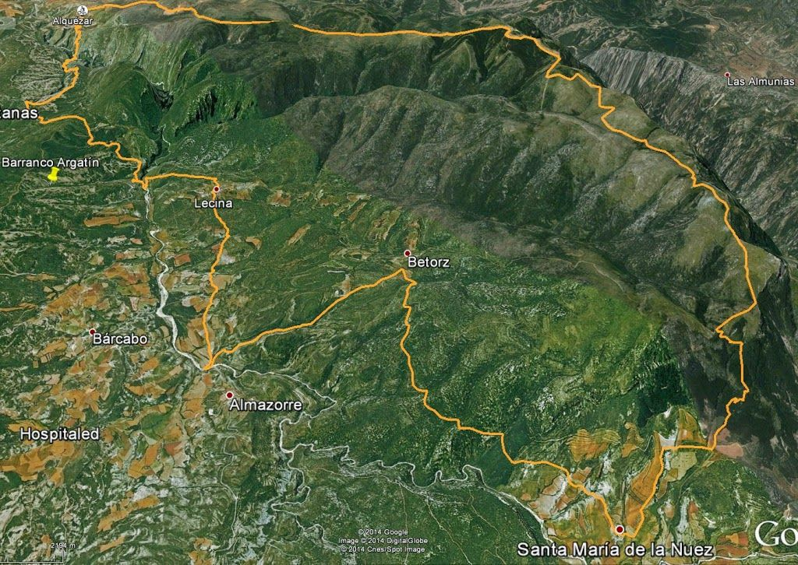
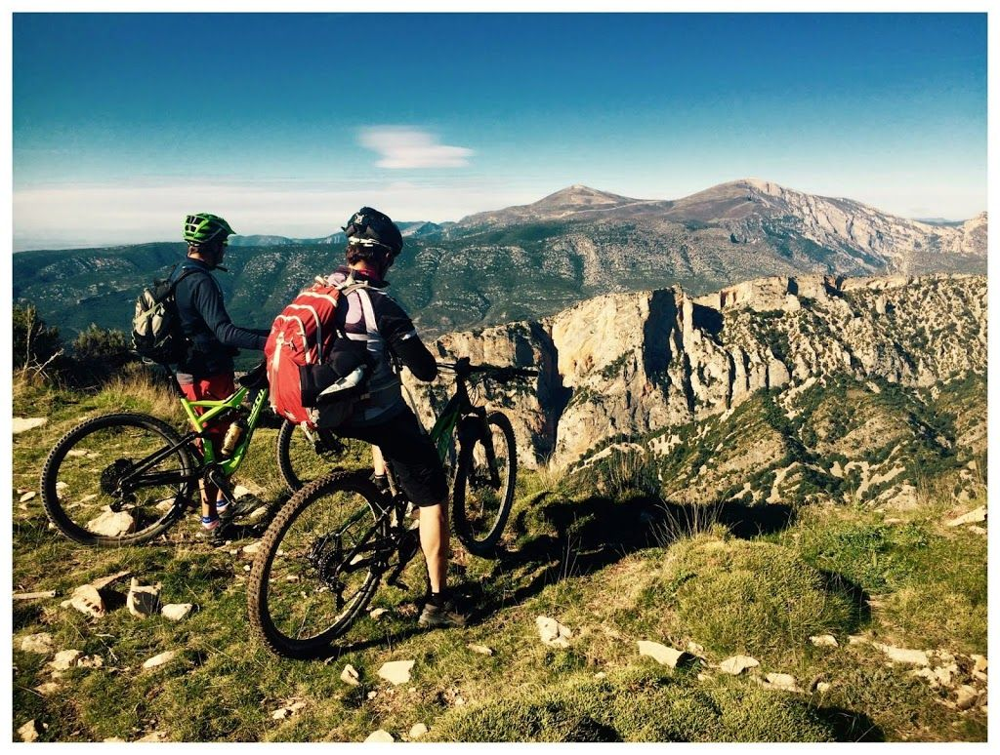
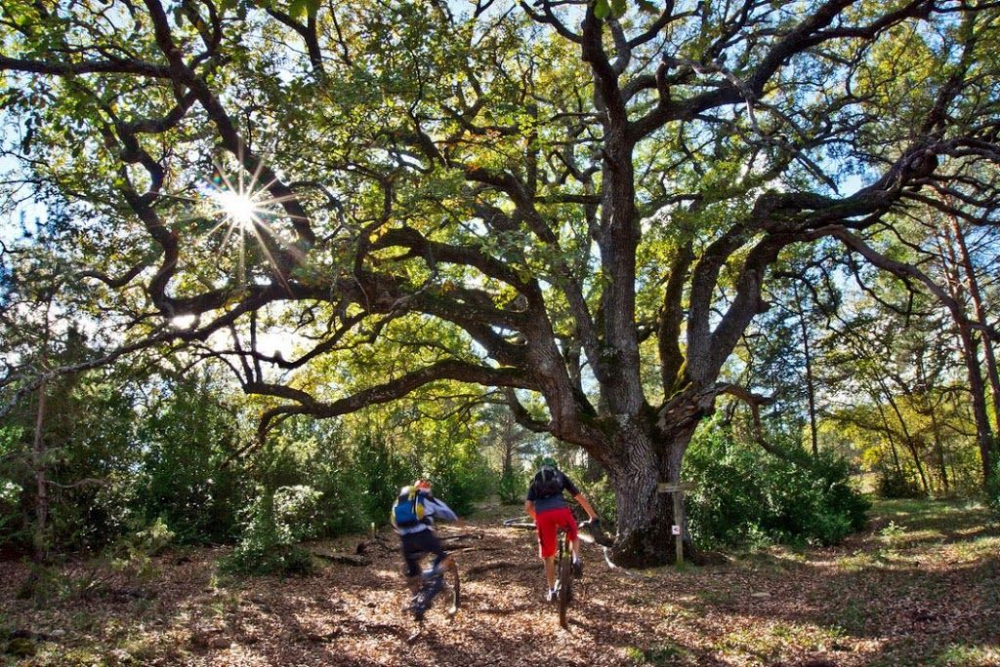
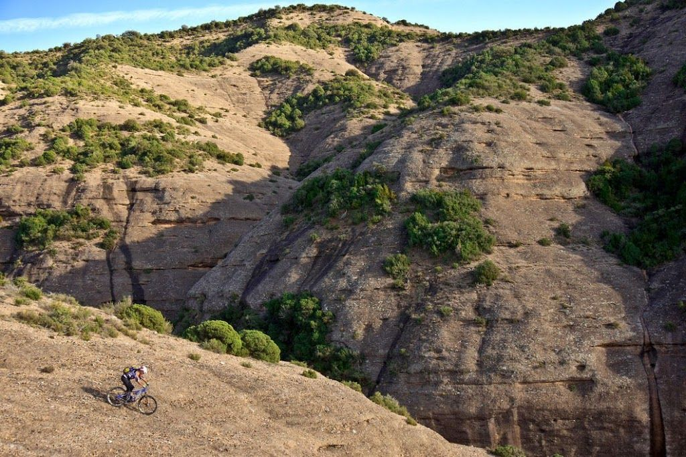
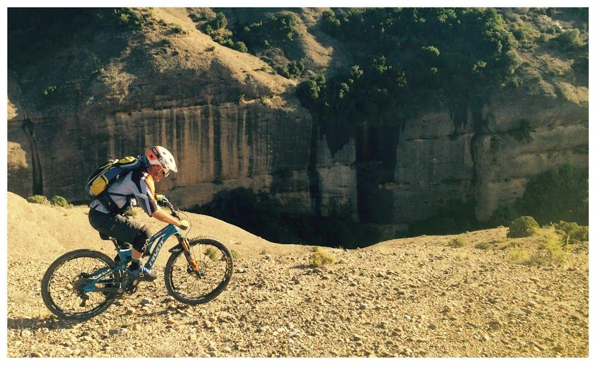
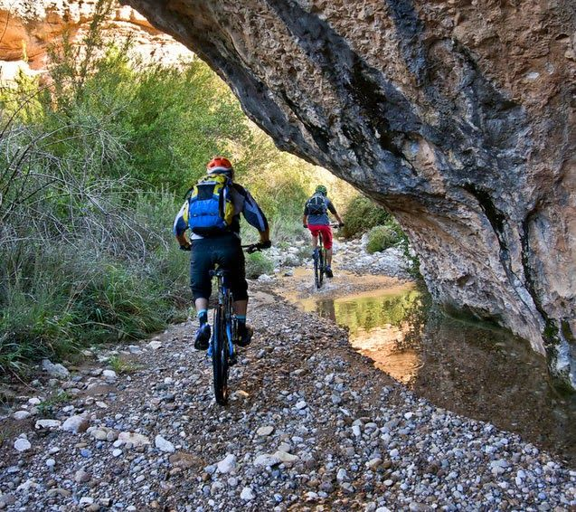
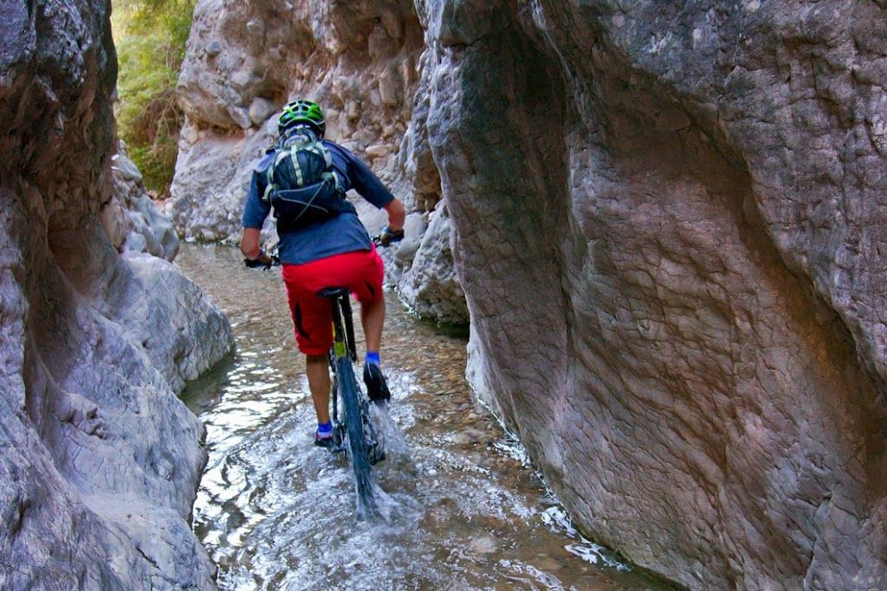
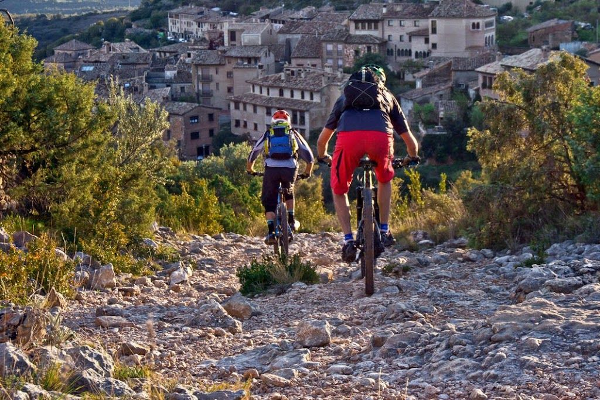
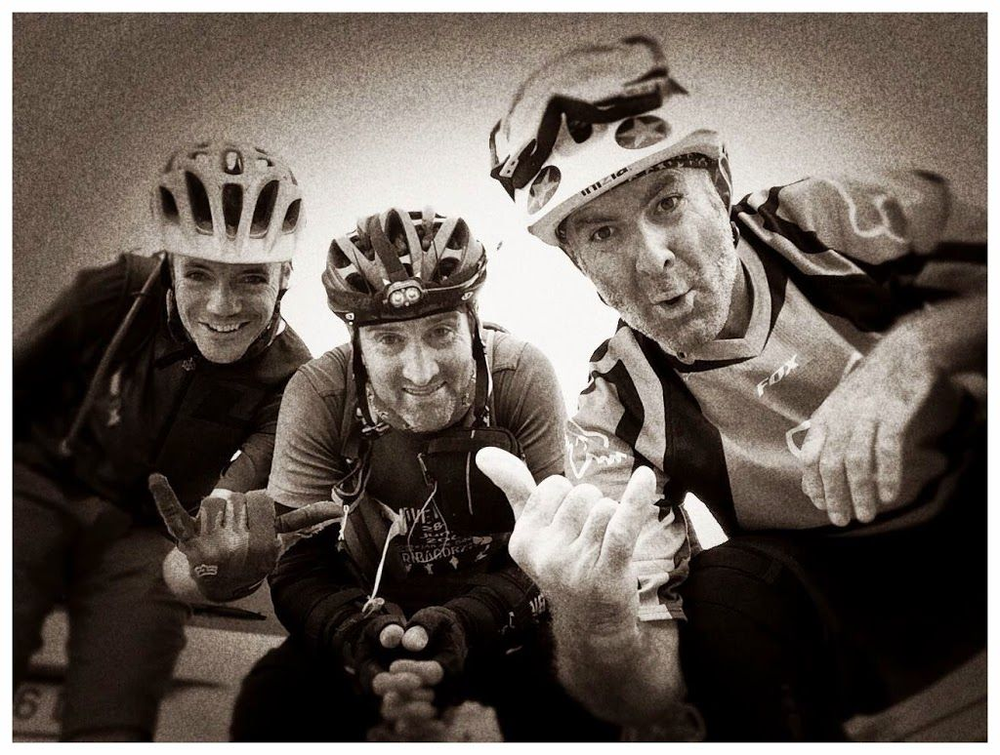

Alguna vez has terminado una ruta de BTT con un porteo cuesta arriba? Posiblemente sí­. Pero, ¿alguna vez te daba igual lo largo y duro que fuera ese porteo, porque esa ruta merecí­a la pena de cualquier forma?

El otro dí­a tuve el privilegio de experimentar tales sensaciones, acompañado de dos mí­ticos: Quiri, famoso por sus incendiarias entradas semanales en Facebook, y Rafa, el culpable de la concepción de esta ruta mí­tica, MíTICA (Y ojo, digo 'mí­tica' con mayúsculas).

El asunto empieza gris, con una subida desde Alquézar al Mesón de Sevil, pero poco después todo cambia: se entra en una embriagadora sucesión de senderos rápidos que, a pesar de estar ya reventado, no dejan que se te pase por la cabeza el terminar ya, sólo quieres seguir y seguir!
Ruta totalmente recomendable, eso sí­, que te pille en forma y habilidoso...
## El Track
Puedes ver el track de la ruta aquí: [http://es.wikiloc.com/wikiloc/view.do?id=8201867](http://es.wikiloc.com/wikiloc/view.do?id=8201867)

Itinerario de la ruta, circular desde Alquézar.

## Las fotos
Y a continuación, unas pocas fotos para que te hagas una idea del entorno:

Pasado el Mesón de Sevil. (Foto: Quiri)

Un matojo elegante... (Foto: Rafa)

Descenso al fondo del barranco de Lumos. (Foto: Rafa)

Quiri sobre el barranco de Lumos. (Foto: Rafa)

Barranco de Lumos. (Foto: Rafa)

'Ciclobarranquismo' en el Lumos... (Foto: Rafa)

Llegando a Alquézar, fin de la ruta. (Foto: Rafa)

Fin de la ruta, ya tenemos nuestra ración de endorfinas para aguantar otra semana más... (Foto: Quiri)
