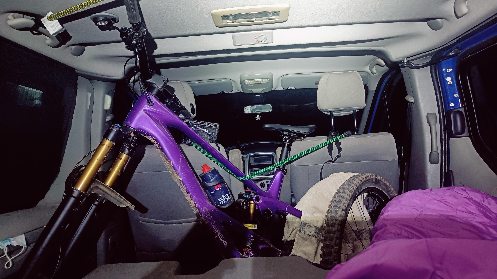
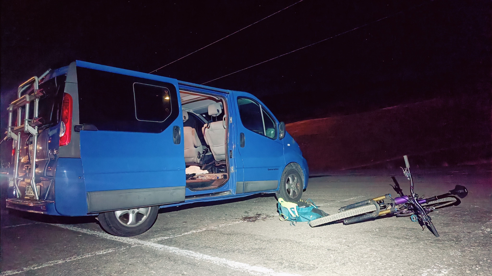
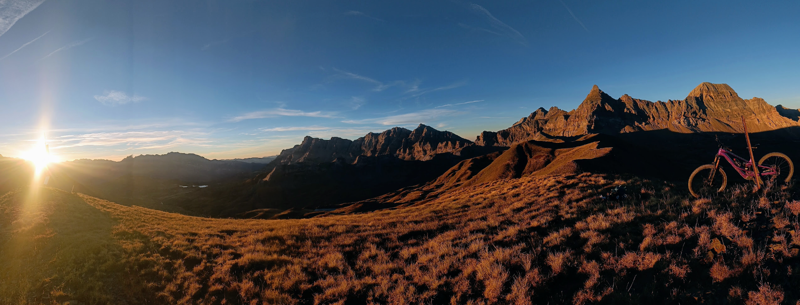
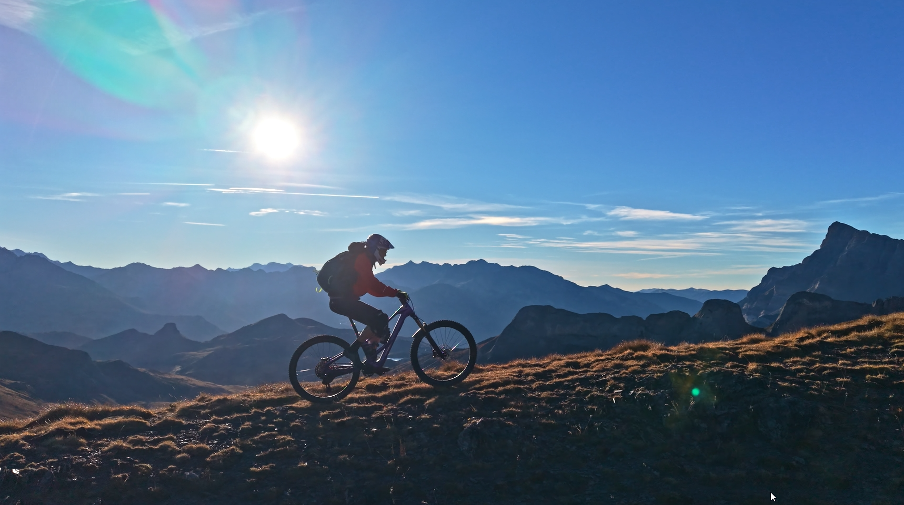
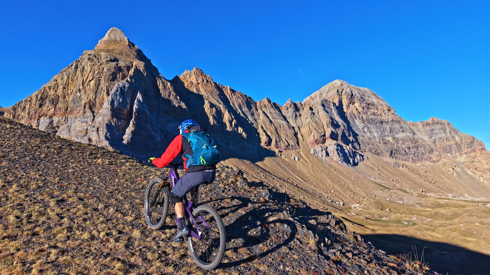

## La idea
Dentro de la serie 'Desayunando en...' nuestro especialista AlbertoEpic se subió a desayunar y recibir el sol del nuevo día en la cima del Pico de Las Tres Güegas.
Como novedad, en esta ocasión tuvo que madrugar menos de lo habitual porque subió a bordo de su nueva EMTB...

## El Vídeo
Te dejamos con un videoreportaje del evento:

Para redondear la jornada, desde esta cima partió por el cordal en dirección al pico Porrón, ibón de la Sierra, Embalse de Escarra. Desde allí, subida hasta el Cuello del Pacino y mítico descenso hacia Sallent de Gállego.

## Las Fotos

Después de cenar en casa, tocaba subir con la Albertoneta a dormir al parking de Sextas de Formigal. A las 0:45am AlbertoEpic tomaba esta foto, ponía el despertador a las 5:30am y se acostaba un ratito...

La alarma suena en un visto y no visto. Vestirse, sacar y montar la bici, y para arriba sin perder un segundo, que el sol no espera y tenemos una cita en la cima...

10min antes de la salida del sol por el horizonte... ya ya esperando al sol arriba con el desayuno. En el parking soplaba bastante viento, pero aquí arriba todo está en calma.

	

Por el cordal en dirección al pico Porrón.

Punta Escarra y Pala de Ip, espectacular telón de fondo.

## El Track
Si te interesa seguir los pasos de nuestro especialista, a continuación tienes el mapa con el track:
