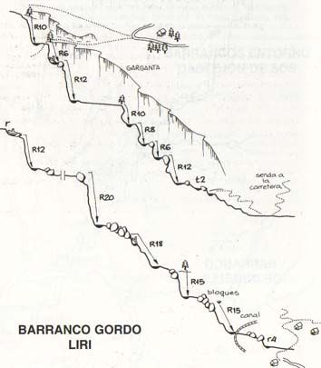
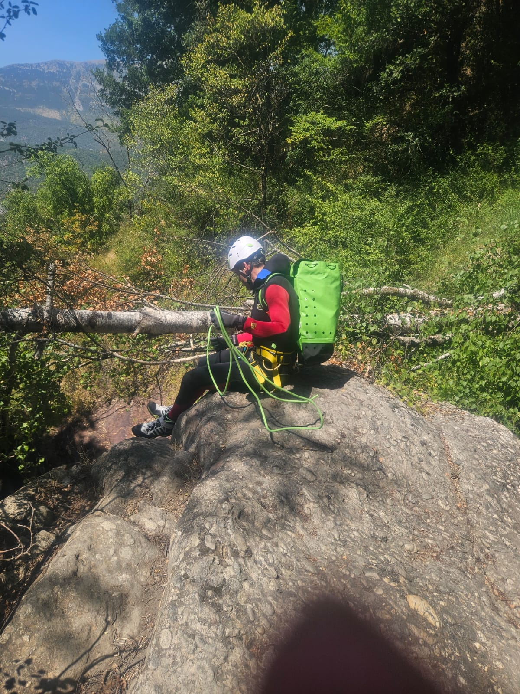
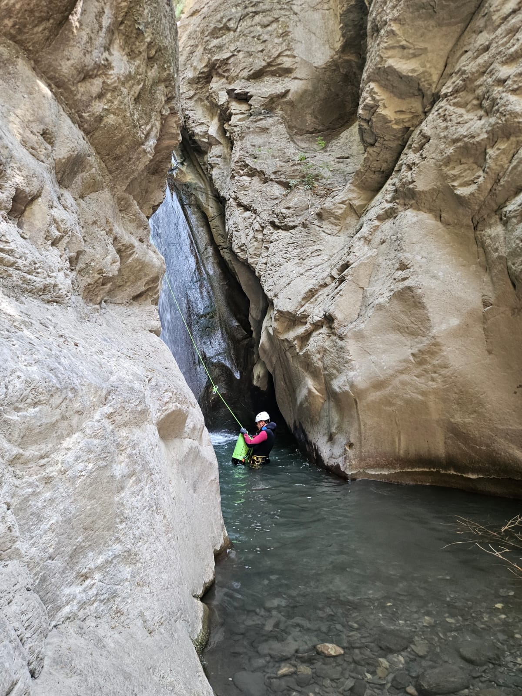
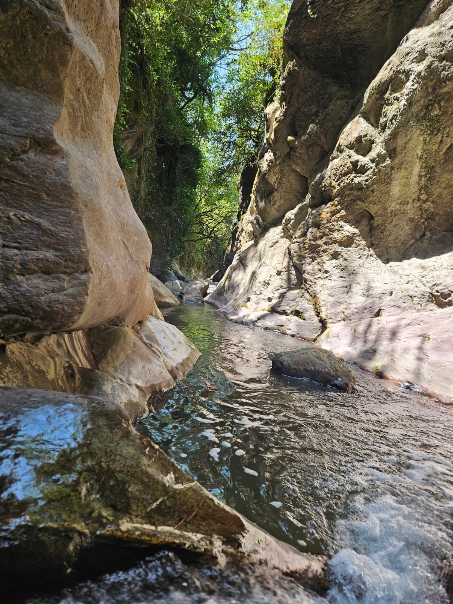
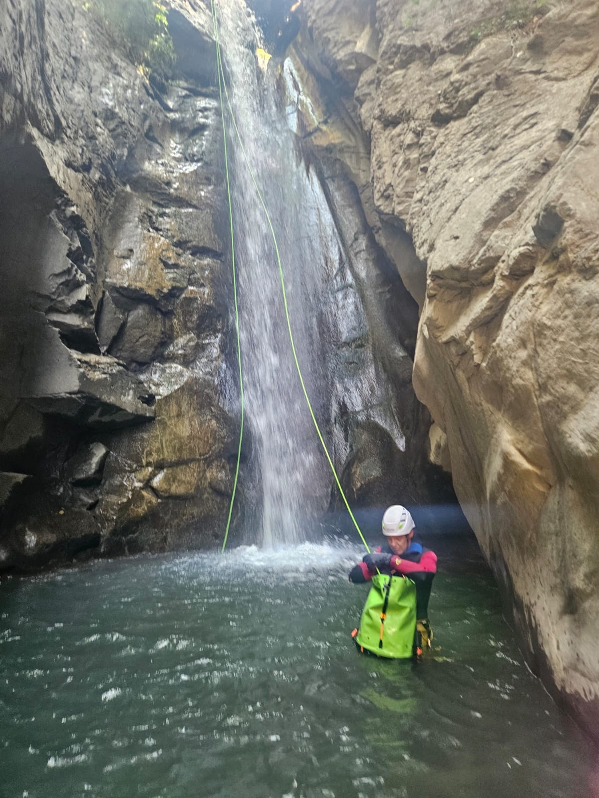
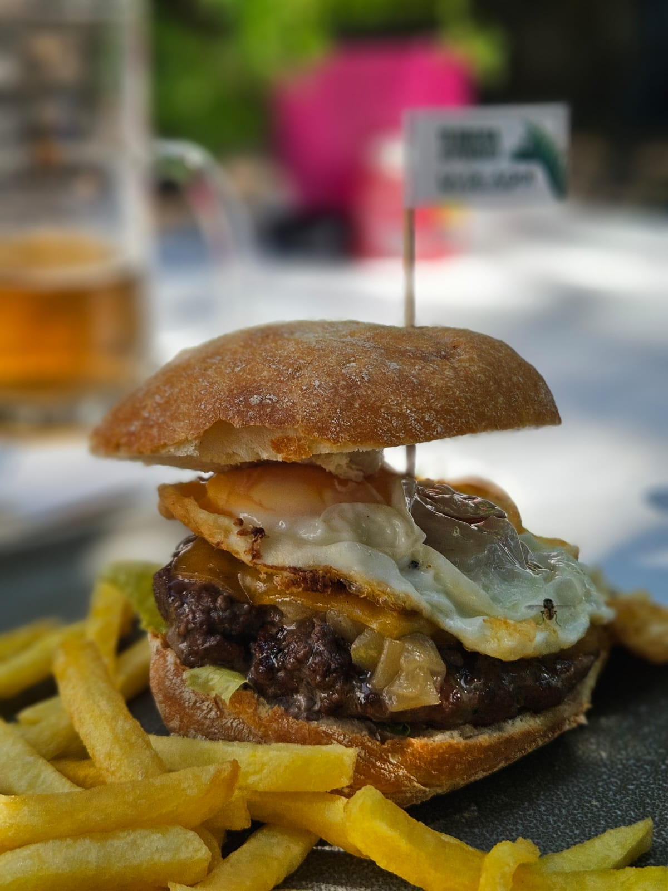

## El Plan 'B'
Vivimos un verano raro, marcado por el calor y los incendios. El otro día, los especialistas del equipo SQLP-TeRReXtreM planearon ir a refrescarse al divertido barranco de la Aigüeta de Barbaruens. Una vez allí, resulta que estaba prohibido el paso a toda la zona por miedo al riesgo extremo y la posible propagación del incendio de Plan.
Total, que tocó recalcular sobre la marcha. El plan B terminó siendo el barranco de las 12 Cascadas de Liri, pero sólo el tramo superior porque para uno de los rápeles de la segunda mitad hace falta una cuerda más larga de la que llevaban...

## El croquis

Nuestros especialistas realizaron el tramo superior reseñado, hasta salir por un sendero semi-perdido a la carretera.

## El Vídeo
A continuación puedes ver un vídeo de la actividad

## Las Fotos

## El Track
A continuación tienes el track con el escape a mitad del barranco: