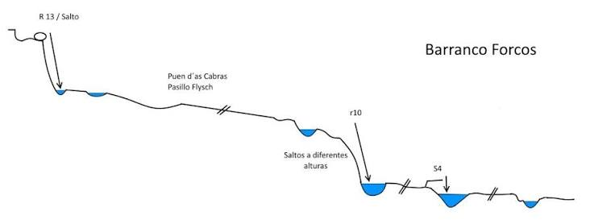
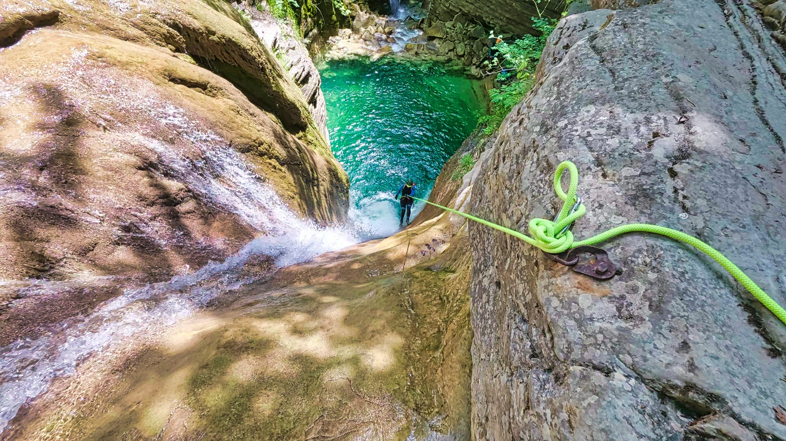
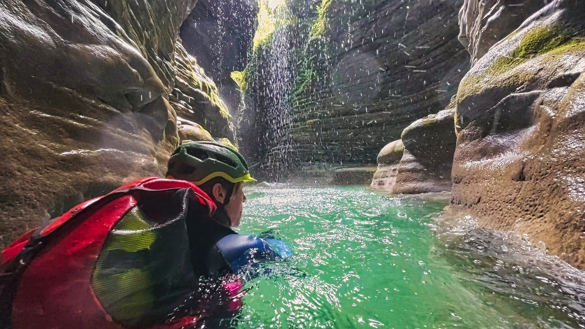
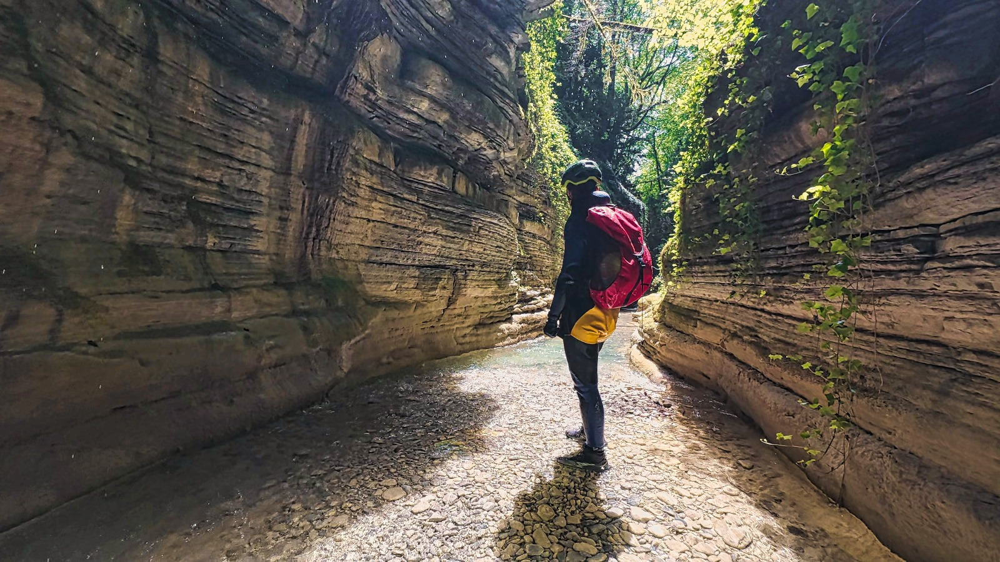
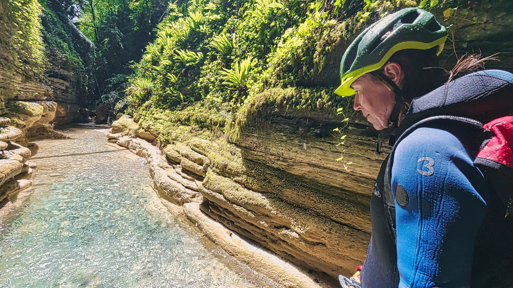
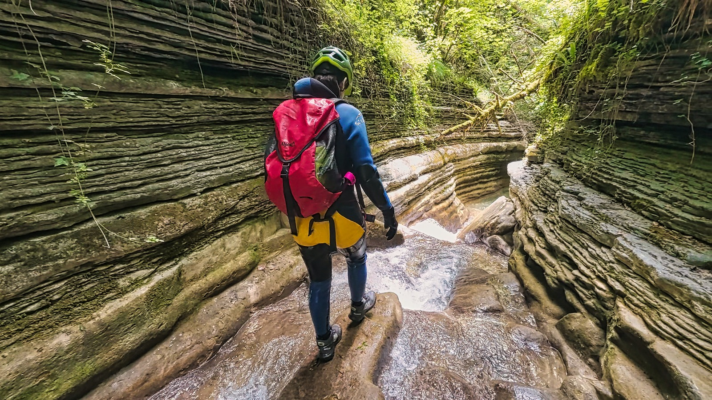

Este barranco es, para mi gusto, uno de los barrancos sencillos más fotogénicos de la provincia de Huesca. 

## La Reseña

Puedes ver toda la **[info en este enlace](https://www.docuwiki.infobarrancos.es/doku.php?id=barrancos:huesca:forcos)**.

## Las Fotos

Y aquí simplemente te dejamos con algunas fotos del otro día, en el que el equipo SQLP se dio un fresco paseo fluvial en medio de estos calores inhumanos ya en junio...

Este barranco comienza a lo grande: rápel/tobogán/salto de 13m, a gusto del consumidor!

Posteriormente, un corredor 'encantado', un pasillo de flysch con cubierta vegetal y una lluvia constante de gotitas...
El barranco concentra lo más impresionante en el primer tramo, y posteriormente va bajando la intensidad, hasta llegar al segundo rápel/salto/destrepe. Luego se convierte, básicamente en un paseo fluvial.

## El vídeo

Y si te gusta más verlo en movimiento, aquí va un breve vídeo:

## El Track

En este mapa puedes situar el Forcos en el mapa, y descargar el track para la actividad.
