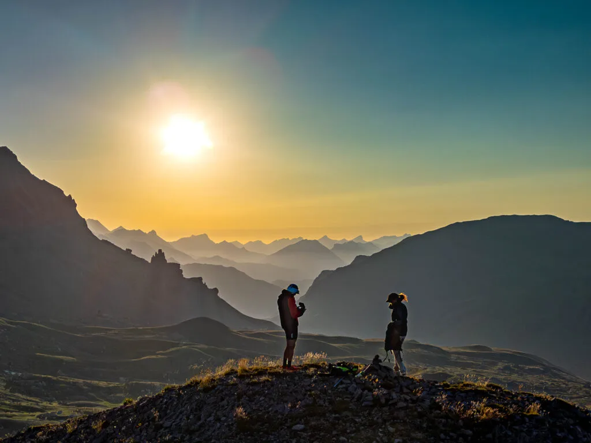
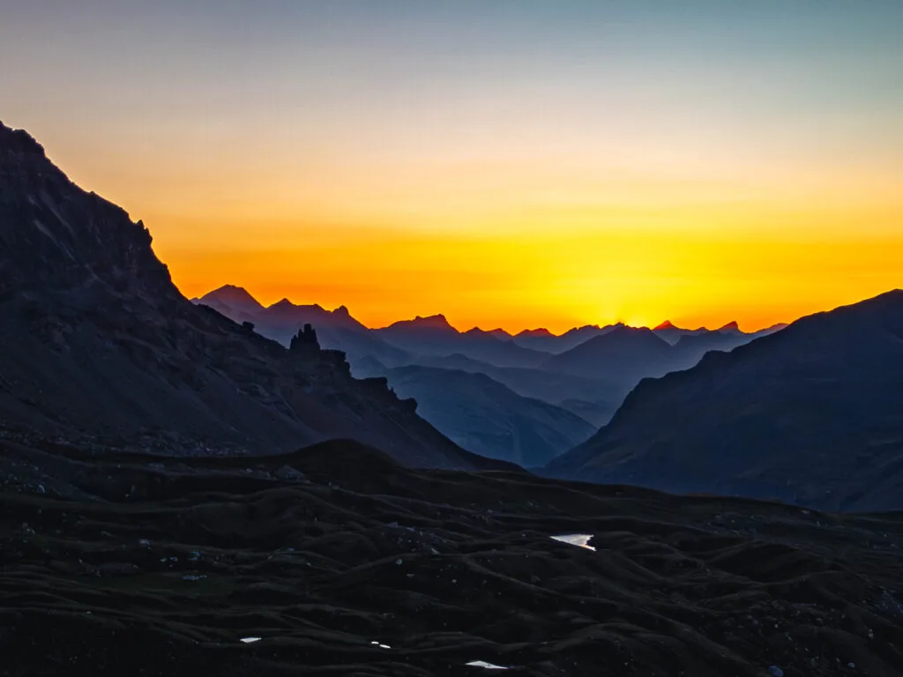
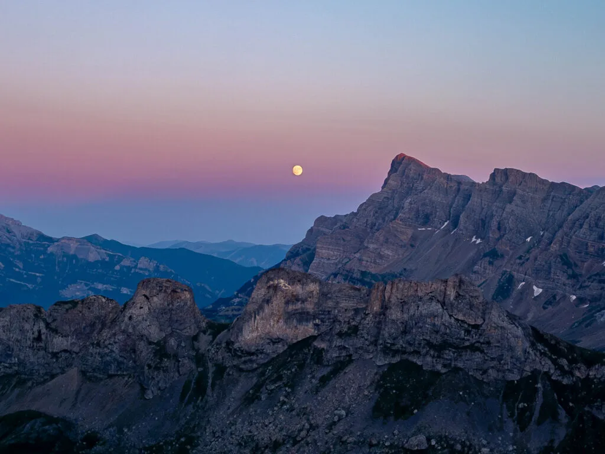

## Puesta de sol desde esta magnífica atalaya...

El pasado 9 de julio, los especialistas de SQLP Myriam&AlbertoEpic buscaban un lugar elevado desde donde disfrutar de una mítica puesta de sol. Barajadas posibles opciones, y siendo la condición indispensable que estuviera permitido volar el Alberdrón, al final se decidieron por contemplar el atardecer desde la cima del pico Porrón.

Puedes ver el vídeo resultante de la experiencia a continuación:

<iframe width="560" height="315" src="https://www.youtube.com/embed/YamMQnOcvag" title="YouTube video" frameborder="0" allow="accelerometer; autoplay; clipboard-write; encrypted-media; gyroscope; picture-in-picture" allowfullscreen></iframe>

Por si te ha gustado y quieres repetir la actividad, debajo tienes el mapa con el track. Comenzaron subiendo en BTT desde Sandiniés, recorriendo todo el camino ciclable hasta el final de la pista (Waypoint 1 en el mapa). Desde allí, a pie hasta la cima.

Tras la puesta de sol, regreso con frontales hasta las bicis, y bajada a Sandiniés tras remontar el mini puerto hasta el embalse de las Paúles.

<iframe class="alltrails" src="https://www.alltrails.com/es/widget/map/map-d0f5eda-26?scrollZoom=ó&u=m&sh=w4k06q" width="100%" height="400" frameborder="0" scrolling="no" marginheight="0" marginwidth="0" title="AllTrails: Trail Guides and Maps for Hiking, Camping, and Running"></iframe>

En esa subida, a velocidad más lenta, se veían observados por multitud de ojos que brillaban en la oscuridad a la luz de los frontales...

Un par de fotos a continuación:

*Recién llegados a la cima del Porrón, con 1h por delante para ir viendo cómo el sol se ocultaba tras las montañas...*

*Tras la puesta de sol llega el festival de tonos anaranjados en el cielo.*

*Y mientras el sol se ponía por el W, la luna llena aparecía a nuestras espaldas, por el E...*

También puedes ver una foto esférica con cimas etiquetadas desde el Porrón realizada durante el día, en otra ocasión anterior, [haciendo click aquí](https://pano360.soloquedalopeor.com/panorama/el-porron-2-311m/).

