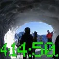

[Que en Huesca se quiera hacer un sendero vertebrador de la región es una iniciativa genial. Que se destine una cantidad ingente de dinero a este proyecto, con la que tenemos encima, pues bueno, más se despilfarra en otras cosas.

Pero lo que veo una INCONGRUENCIA ABSOLUTA, bestialidad, burrada, tomadura de pelo, sinsentido, destrozo natural, impacto ambiental, deberí­an rodar cabezas por ello, es lo que se está haciendo con esa partida presupuestaria.  Con el dinero de todos se están destrozando los lugares por donde pasa el supuesto camino 'natural' para convertirlos en una especie de parque temático. Con la excusa de hacerlo accesible a todo el mundo lo están 'urbanizando', de manera que los que ya no iban seguirán sin ir por allí­, y a los que ya í­bamos antes nos duele en el alma y nos pone de muy mala leche... Escalinatas que convierten suaves pendientes en fatigosas subidas, barandillas de madera sin ningún sentido, sirgas para evitar caí­das donde no hay ningún peligro...

De momento, el máximo exponente de este delirante proyecto sin pies ni cabeza se encuentra en Vadiello: [http://caracolesmajaras.blogspot.com.es/2012/03/el-camino-natural-arrasa-vadiello.html](http://caracolesmajaras.blogspot.com.es/2012/03/el-camino-natural-arrasa-vadiello.html)

[http://guaravertical.blogspot.com.es/2012/03/denuncia-por-la-realizacion-de-la-nueva.html](http://guaravertical.blogspot.com.es/2012/03/denuncia-por-la-realizacion-de-la-nueva.html)

Pero está por todo el trazado. Acabo de regresar de dar un paseo por el Peiro, y lo que han hecho allí­ es una auténtica tomadura de pelo. Imagino que la empresa que aporte la madera y las sirgas para el equipamiento del sendero será propiedad de algún sobrino del polí­tico de turno que ha aprobado esta historia...

Aqui puedes ver algunas fotos:

[El maravilloso hayedo del Peiro, convertido en la atracción 'Recorre el bosque' de Port Aventura...

[¿Eran necesarios tantos palitos?

[Ya veremos la pinta que tiene esto en un par de años, con todos los troncos podridos, rotos y sin mantenimiento.

[El precipicio al otro lado de las sirgas es espeluznante...

[Este punto es famoso por haberse despeñado una o ninguna personas antes de instalar  las sirgas...

[Y metros y metros inútiles de sirgas...

[

[El sendero en pendiente era muy aburrido. Sin embargo, esta escalera será un punto muy resbaladizo y divertido cuando lleguen las humedades del invierno.

[¿Esto no es impacto medioambiental?

