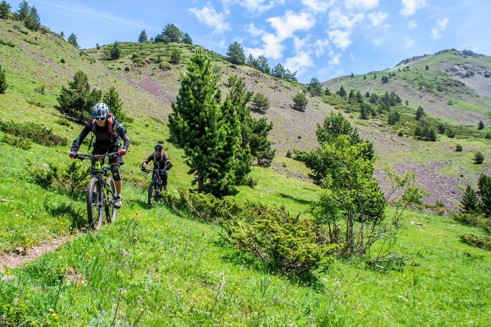
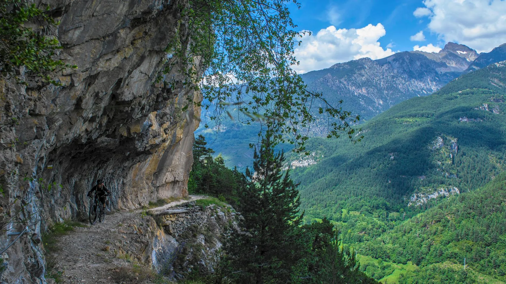

El pasado domingo, tuvo lugar una jornada de convivencia globero-vulkanera: Bati y Lola, de la estirpe de los Vulkanos, se juntaron con Morenetti y AlbertoEpic, del linaje de los Globeros., en el Mesón de Salinas con sus BTT's. La idea era hacer el Canal del Cinca, pero dada la alergia que presentan estos curiosos seres al asfalto, el camino más corto y lógico no serví­a.

Así­ pues, la combinación elegida fue: Mesón de Salinas, Sin, Serveto, collado de la Cruz de Guardia, Bielsa, Canal del Cinca, Mesón de Salinas.

- 47km
- 2.270m desnivel+

En SQLP seguimos sin tiempo disponible para editar videos, así­ que aqui van unas fotos de Bati (En el facebook de Lola), y el track de Rafa...

Subiendo por la pista de las Bordas.

Llegando al collado de la Cruz de Guardia.

1000m de bajadón a Bielsa nos esperan...

Qué grande es poder bajar por las sendas de alta montaña!

Siempre una mirada atrás para ver desde dónde has bajado.

Cerca ya de Bielsa, con los discos al rojo!

En el Canal del Cinca. Impresionante paisaje y ambiente!!

<iframe frameborder="0" height="500" marginheight="0" marginwidth="0" scrolling="no" src="http://www.gpsies.com/mapOnly.do?fileId=wkajwwmwspopmroa&mode=kmlTour" width="657"></iframe>

