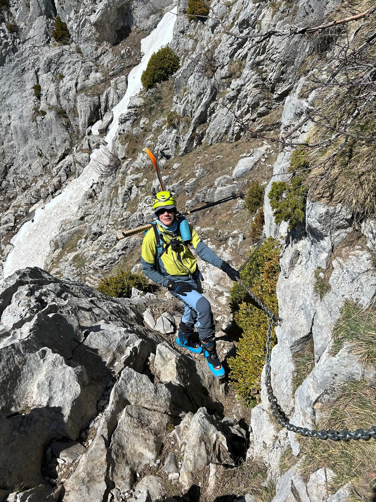
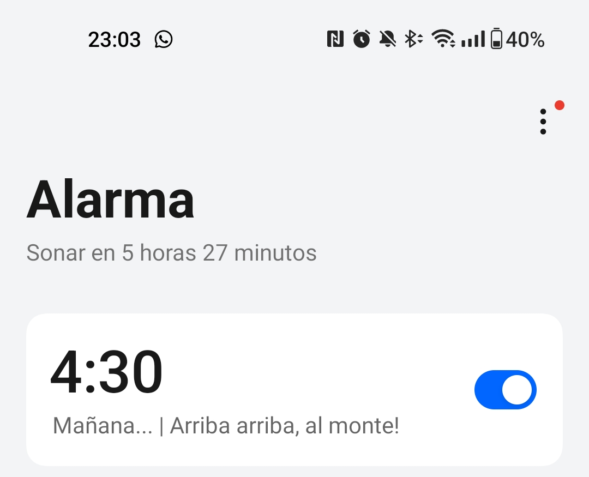
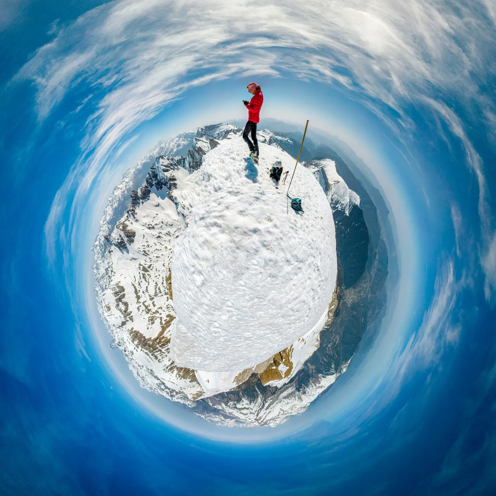

¿Sabes cuando te enteras de que cierto pico reúne unas condiciones ideales para el skimo? ¿Que esa cima figura en tu lista de deseos? ¿Pero que por una cosa o por otra, van pasando los días, y cuando al final vas ya no es como decían?
Pues algo así es lo que les pasó a nuestros especialistas favoritos, Myriam y AlbertoEpic, con la ascensión a Collarada. Estuvieron esperando al momento preciso para subir la pista en 4x4 hasta la nieve donde calzar esquís. Llegó ese momento, pero por sucesos de la vida moderna no pudieron ir hasta que la cota de nieve hubo ascendido peligrosamente, de forma que ya casi no compensara subir con esquís.

AlbertoEpic a la bajada, en el paso de la cadena.

## La Misión

Pero para nuestro equipo, siempre todo es bien! ¿Hay que portear más? Pues se portea!
En esta ocasión, debían llevar a cabo esta misión: subir al Collarada documentando la ascensión con la cámara de acción (Allí no está permitido volar el dron, qué lástima!) y conseguir material para dos facciones de SQLP:

- [Producciones SQLP](https://www.youtube.com/@AlbertoEpic) - vídeos para la realización de un videoreportaje del evento.
- [Miniplanetas](https://miniplanetas.soloquedalopeor.com/) - material fotográfico para la creación de otro miniplaneta.
- [Pano360](https://pano360.soloquedalopeor.com/) - para la realización de otra fotografía esférica con cimas etiquetadas.

El despertador de AlbertoEpic, en la víspera del evento...

## El Vídeo

A continuación puedes ver un pequeño montaje con el vídeo de la actividad:

## El Mini-planeta

Haciendo **[click en este enlace](https://miniplanetas.soloquedalopeor.com/planetas/planeta-collarada/)** podrás ir a ver el miniplaneta Collarada. No olvides leer los detalles e indicar si te gusta…

## Pano360

**[Haciendo click aquí](https://miniplanetas.soloquedalopeor.com/planetas/planeta-collarada/aterrizar/?img=%2Fpano360%2FPANO_Collarada.jpg)** accederás a la foto esférica con cimas etiquetadas…

## El track

A continuación tienes el mapa con el track por si lo quieres descargar para seguir los pasos de nuestros especialistas.