## Primera aparición en sociedad
Después de unas cuantas salidas en intimidad, en las que tocaba conocerse mejor y afianzar la dupla 'humano-máquina', toca dar un paso más y hacer la primera aparición en sociedad!
AlbertoEpic se reunió con dos experimentados e-especialistas, Morenetti y Luispa, y confió en su sabiduría para lanzarse a una ruta cuyo recorrido le ofrecía pocas garantías de terminar con algo de batería... Gracias a los dioses, y sobre todo al buen ojo de sus amigos, las baterías de los tres individuos aguantaron sin problemas.
Ahí van algunas fotos:

## Las Fotos

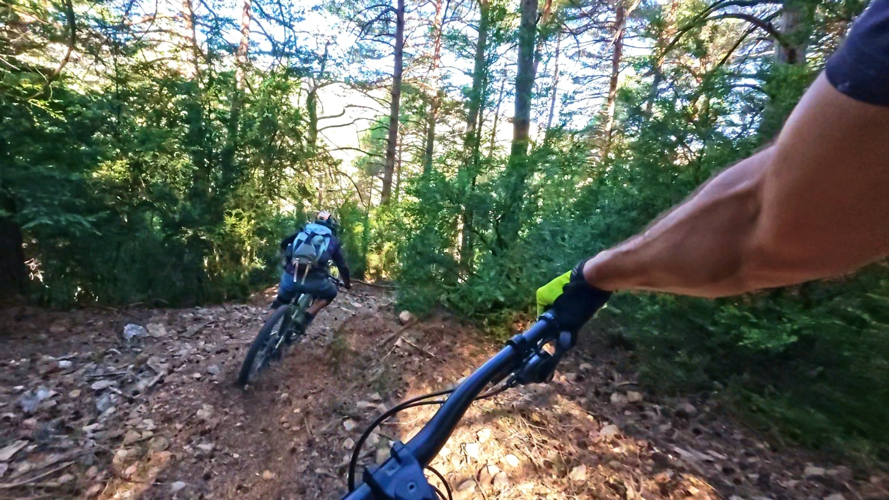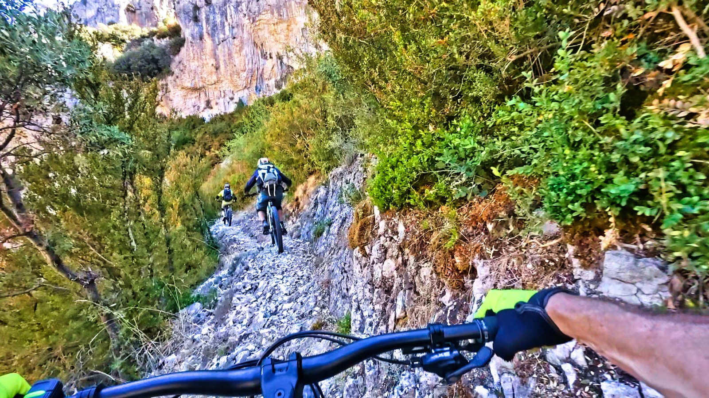

En la bajada del collado de las Paúles a Cienfuens

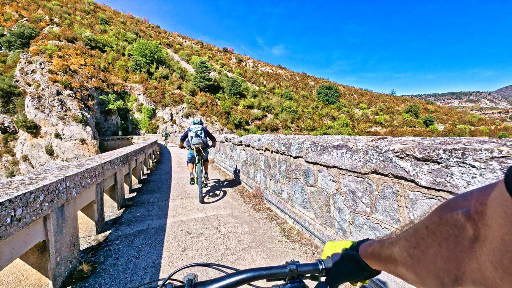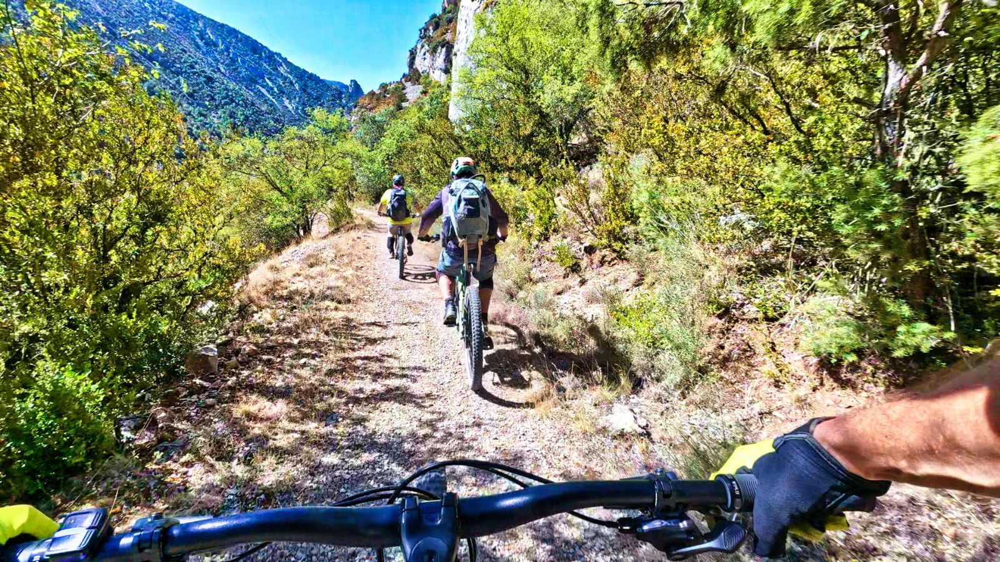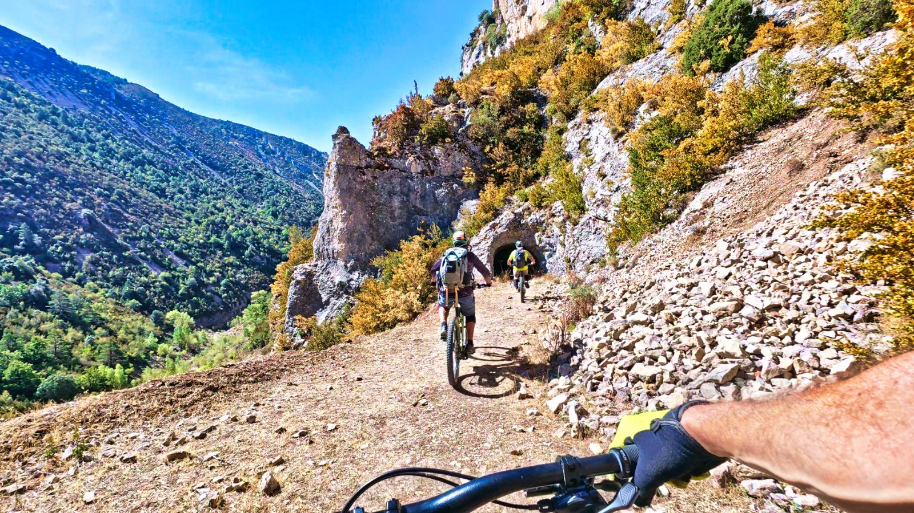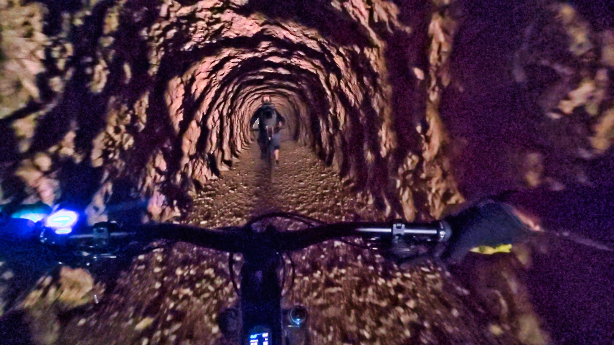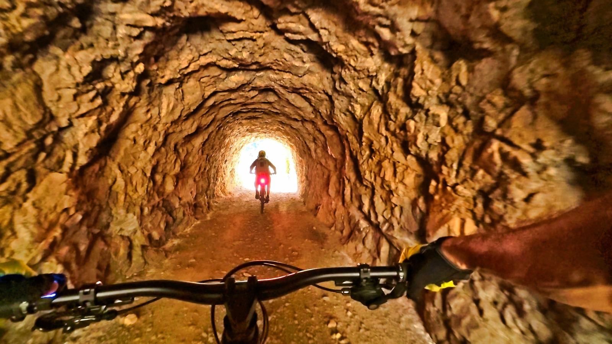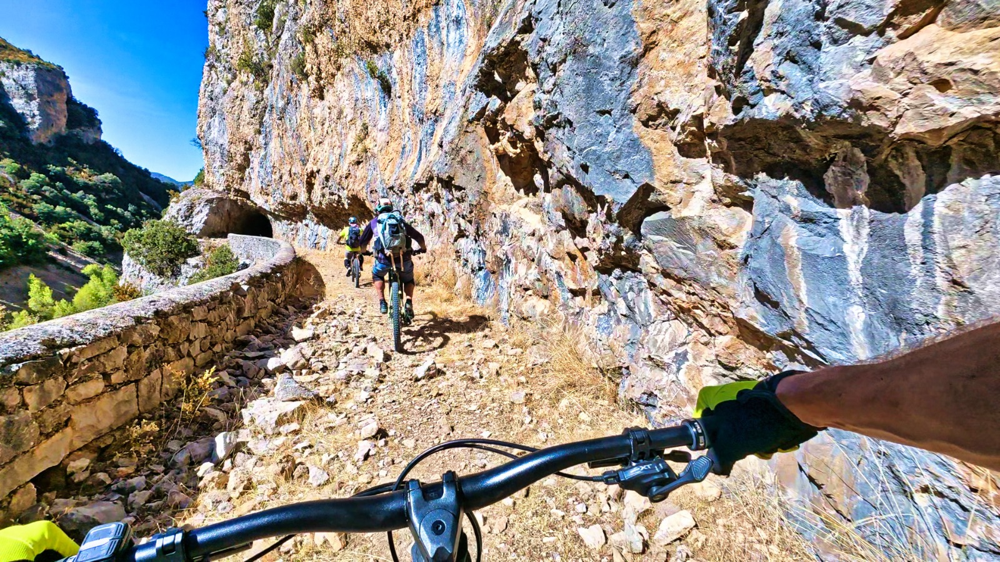

De la presa de Belsué a la de Cienfuens

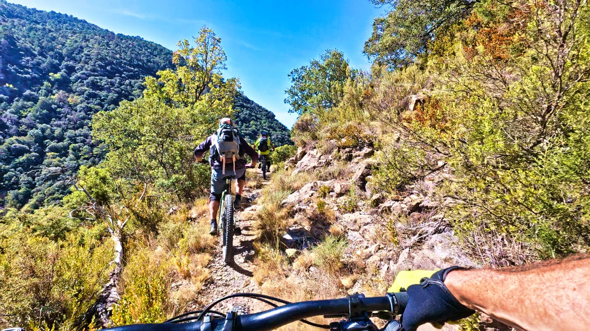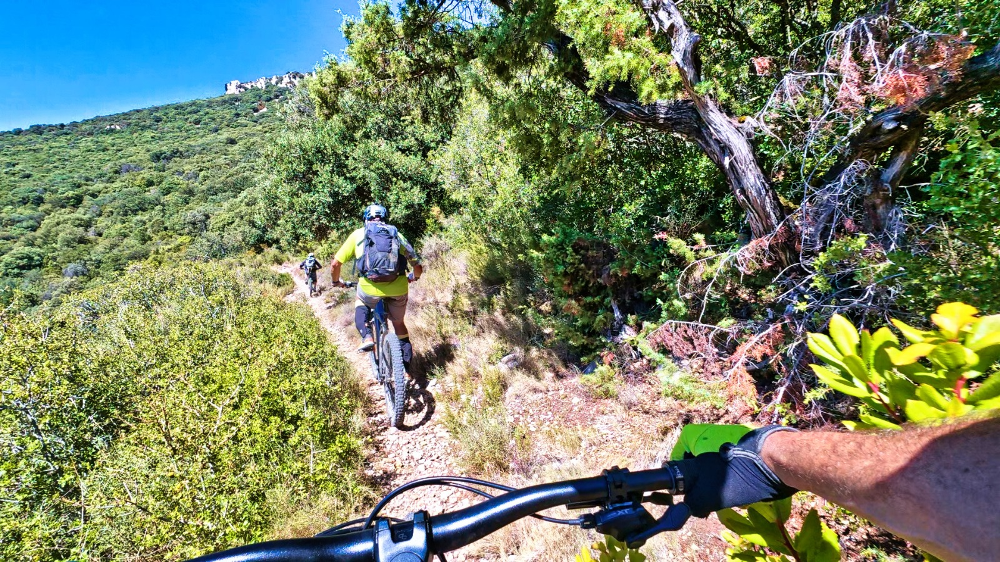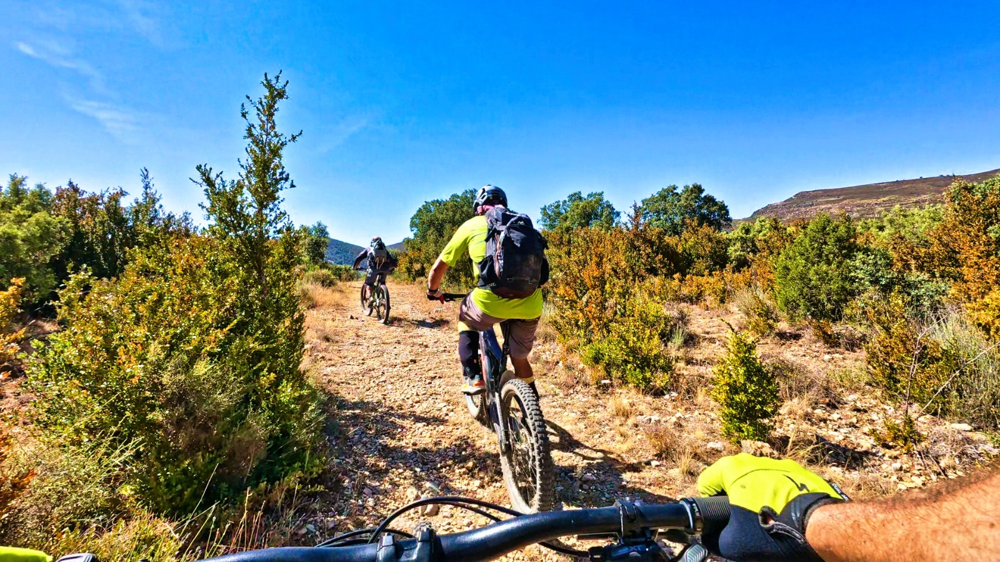

Remontando hacia el dolmen, camino de Salto Roldán.

## El Track
Como curiosidad, a continuación tienes el track de la ruta sobre el mapa: