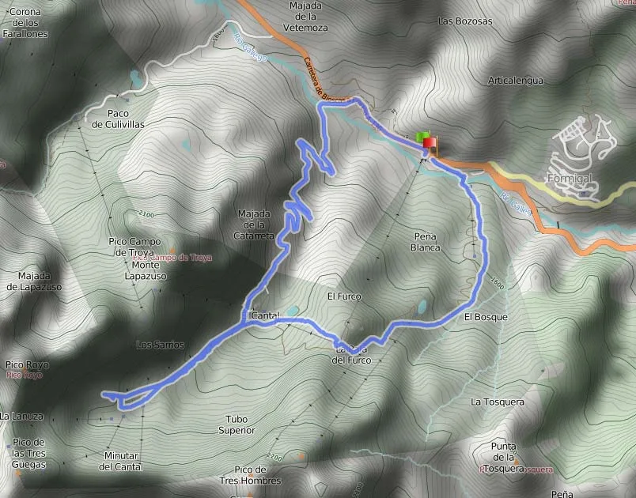
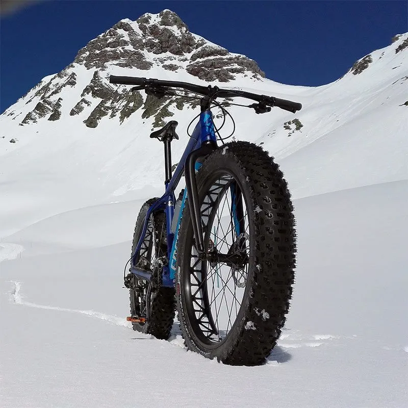
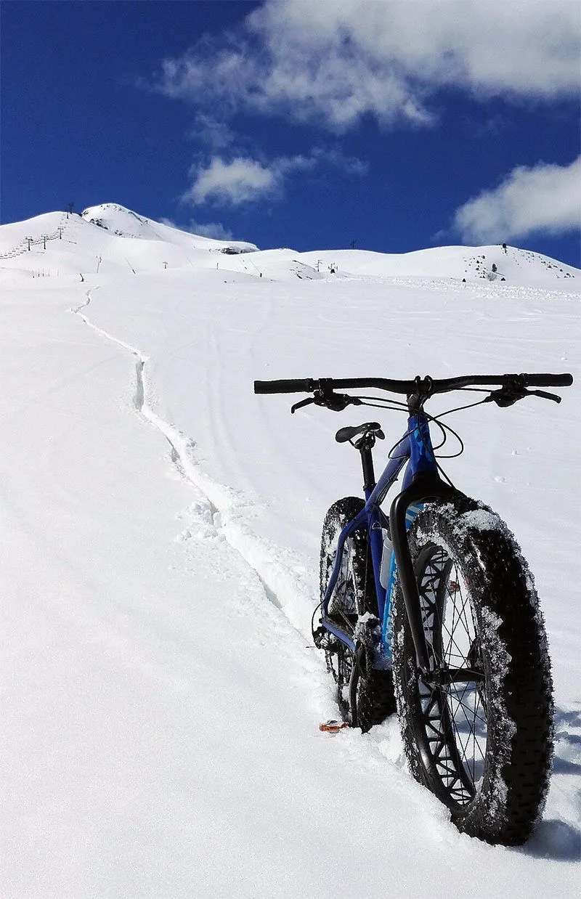

En el equipo SQLP innovamos hoy un poco en cuanto a disciplinas/material se refiere. Vamos con una variedad de la BTT: las FatBike. cualquier parecido de una fatbike con una mountainbike es pura coincidencia... Realmente no se pueden comparar unas con otras. Es como comparar un Ferrari con un tractor. Cada uno en su campo supera al otro por goleada.

Hoy AlbertoEpic ha salido del parking de Sextas (Formigal) y ha subido por la carretera hasta el parking de Sarrios. Allí­ comienza lo divertido: subida por nieve aprovechando que la estación está cerrada. La idea era subir hasta el pico Tres Huegas. Se suponí­a que iba a haber buen rehielo... pero ha sido como un espejismo. La primera parte todo iba como la seda, pero antes de llegar al remonte de Lanuza, AlbertoEpic ya empujaba la bici hundiéndose en la nieve casi 50cm.

Ante el temor de llegar arriba cargando la bici y tener que bajar andando arrastrando la bici, ha decidido dar la vuelta al llegar a las últimas rampas de mayor inclinación. Las horas de sol seguí­an reblandeciendo la nieve, que ahora ya era profunda y resbalosa. Para poder bajar, era sencillo: ha comprobado que la velocidad de flotación era >30km/h. Según AlbertoEpic, "la bajada ha sido muy divertida, consistiendo en buscar la lí­nea de máxima pendiente, arrastrar la bici y pedalear a trancas y barrancas hasta lanzarla y superar los 30km/h. Entonces, como por arte de magia, la bici comienza a flotar sobre la nieve, emitiendo un suave silbido... Todo muy divertido hasta que intentas cambiar de dirección o frenar!"

De esta manera ha bajado por la nieve hasta la furgoneta, en el parking de Sextas. Con una sonrisa de oreja a oreja que todaví­a le dura, y hace que le empiece a doler la cara...

A continuación puedes ver el recorrido: 12km, algo menos de 2h y muchas, muchas risas!!!

Después de darse la vuelta, bajo el pico Royo. Con unas ruedas de 4.6', es muy fácil plantar la bici en el suelo... :-)

[

En la segunda mitad de bajada, la nieve estaba exageradamente sopa... Para poder flotar un poco, la presión de las ruedas era ridí­cula: 0'3bar delante y 0'4bar detrás.[attachments/itinerario.webp](attachments/itinerario.webp) [

Y eso ha sido todo por hoy... Como decí­a AlbertoEpic, "olví­date de rendimiento, una FatBike es el colmo de la diversión".

