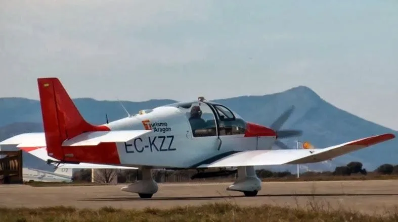

[Alguna vez te ha pasado recibir una llamada en la que se te pregunta si quieres pegarte un vuelo en avioneta por el Pirineo al dí­a siguiente? Pues a mí­ sí­! :-)

Mi amigo Jorge Garcí­a-Dihinx ([La Meteo Que Viene](http://lameteoqueviene.blogspot.com.es/)) estaba trabajando en sus fantásticos libros de [Esquí­ de Montaña por el Pirineo Aragonés](http://lameteoqueviene.blogspot.com.es/2013/11/libro-rutas-con-esquis-pirineo-aragones.html) (A dí­a de hoy el Tomo I ya está a la venta. ¿Todaví­a no lo tienes? No te lo pierdas, en SoloQuedaLoPeor pensamos que es una publicación muy recomendable!) y hací­a un vuelo para tener fotos aéreas de las rutas. Y claro, como está muy feo rechazar ofrecimientos así­, no tuve más remedio que aceptar y correr a casa a poner a cargar la baterí­a de la cámara.

<iframe allowfullscreen="" frameborder="0" height="370" src="https://www.youtube.com/embed/ZoFVplRNSz0?list=UUWB8R8yorwPLJPMwVQdB4Hw" width="657"></iframe>

