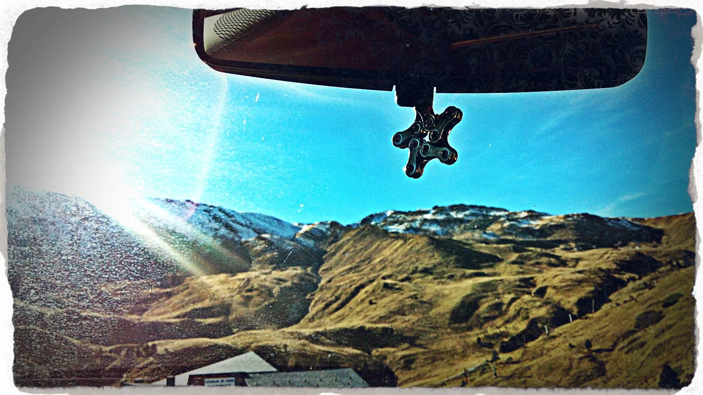
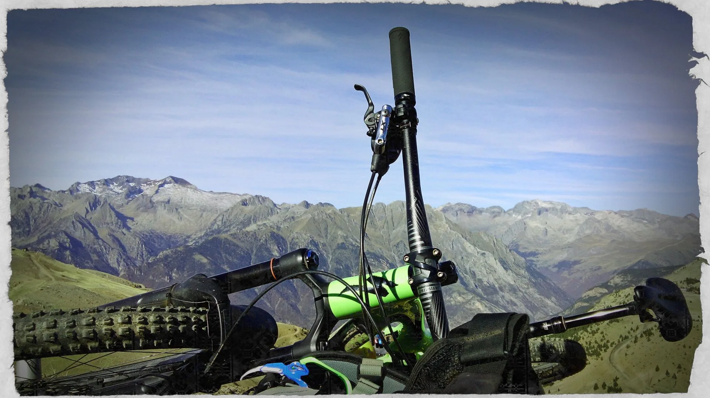
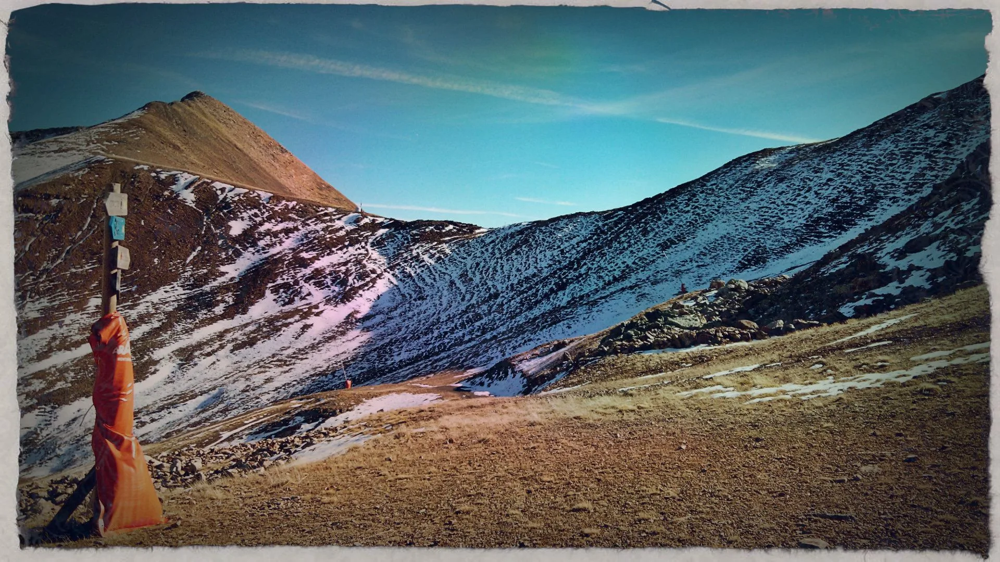
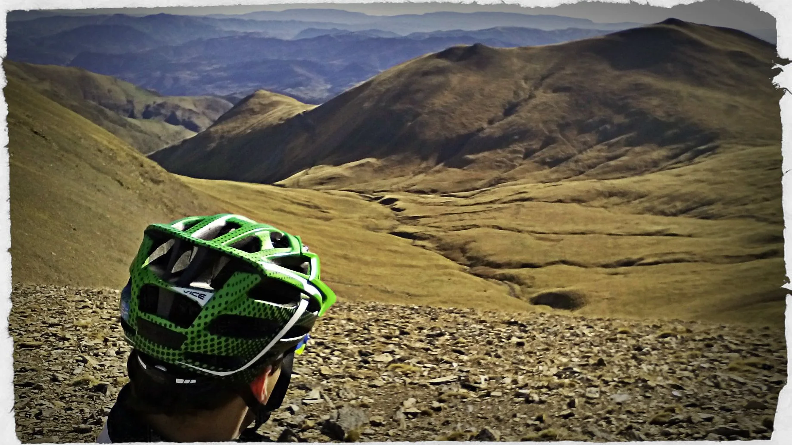
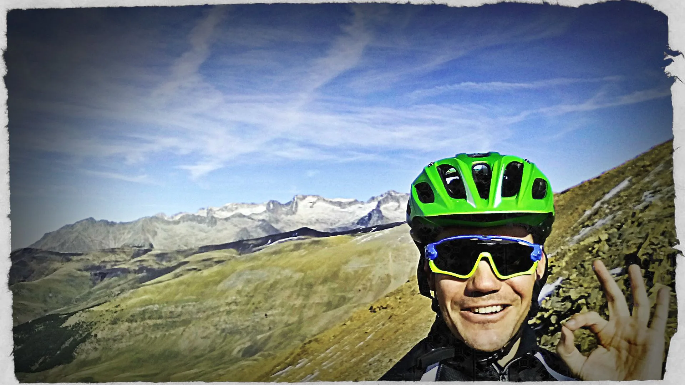
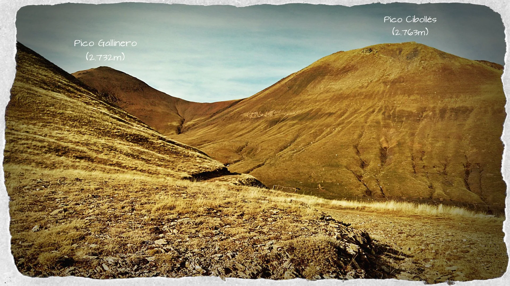
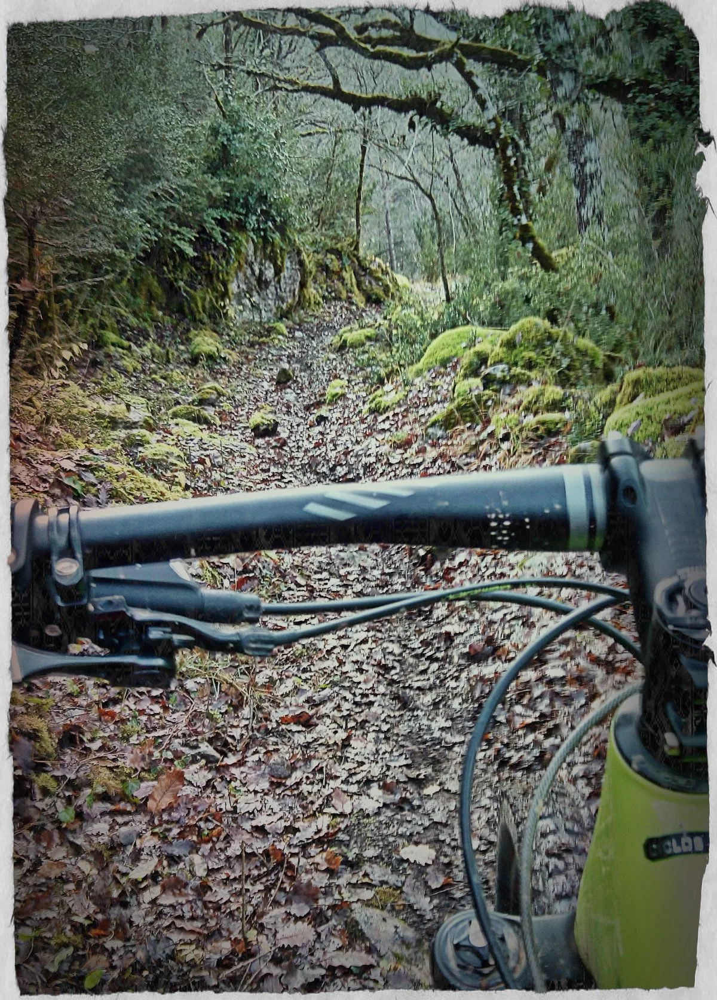

Una idea rondaba por la cabeza de AlbertoEpic hace tiempo: desde Castejón de Sos (PuroPirineo) está marcada la ruta nº 15 'Integral del Gallinero'. OK, pero siempre que oye Gallinero le viene a la mente la estación de esquí de Cerler y el Ampríu. ¿Por qué no hacer el descenso hasta Castejón desde más arriba, desde la cima del pico Gallinero?
Como el tiempo es oro, la vuelta completa queda para mejor ocasión. En este caso cuenta con la inestimable colaboración del resto del equipo SQLP (Luzia&Sami&Tai), que le hacen un porteo hasta el Ampríu.

[Ya en el Ampríu, se ve el Gallinero con nieve en las zonas altas... A ver qué tal. De momento, pechugazo gigante para llegar allá arriba. Hasta la Colladeta, el 70% ciclable. A partir de allí la cosa se pone peor... tal vez un 40% ciclable. (Por cierto, ¿te has fijado? Es cierto, es cierto, llevamos la [cicloestrella SQLP](https://soloquedalopeor.com/tienda/#!/CycloStar-la-cicloestrella-de-SQLP/p/55956097/category=14959189) en el retrovisor de la furgo!)

[Breve parada para disfrutar del paisaje y abrigarme. Llego a la nieve, a la sombra, y hace frío. Falta unos 200m+ para el collado.

[Llegado a este punto, necesito modificar ligeramente la estrategia... Olvido la idea de subir hasta la cima del Gallinero. Cada vez hay más nieve, y está helada, como el cristal. Mi reino por unos crampones! Así que decido perder altura por la pista hasta el cañón que se ve bajo el collado, y remonto con mucho cuidado (De piedra en piedra, sin tocar la nieve) hasta el collado entre el pico Cibollés (A la izquierda) y el Gallinero (Derecha).

[Consigo llegar al collado. Lo que en la otra cara era frío y hielo en esta es calorcito, tasca y sol. Identifico claramente la pista a la que tengo que llegar para acceder al comienzo de la ruta nº 15 de Puro Pirineo (En la foto, visible al fondo del barranco, en el último prado al sol de la margen derecha). Tras una primera parte de descenso algo 'al límite' por piedras, luego la pendiente disminuye y llegamos a los prados.

[Un tentenpié, viento cero, calorcito de 'veroño' y un descenso de 2.000 metros de desnivel por delante llenan de optimismo a cualquiera! Whatsapp al resto del equipo SQLP: 'Todo OK. Castejón me espera!'

[Echando la vista atrás: he bajado desde el collado, por la margen orográfica derecha del barranco, hasta desembocar en esta pista, que ahora rodea por el E la Tuca de Urmella y desciende en unas cetas hasta el comienzo del descenso de la Integral del Gallinero. Prueba superada! :-)

[Del descenso de la Integral del Gallinero ya hay demasiadas fotos en la red, no pierdo tiempo en sacar más... Luego Bisaurri y una pequeña subida por pista hasta llegar al último descenso hasta Castejón, muy húmedo y resbaladizo, pero muy disfrutón. Y para soltar, un poco de pedaleo hasta Sesué...

AlbertoEpic hace pocas de estas, con 1.000m de subida y 2.000m de bajada... pero ha merecido la pena!

A continuación puedes consultar el track:
<iframe src="http://www.gpsies.com/mapOnly.do?fileId=vpbnormhgfsiswhi" width="100%" height="400" frameborder="0" marginwidth="0" marginheight="0" scrolling="no"></iframe>

