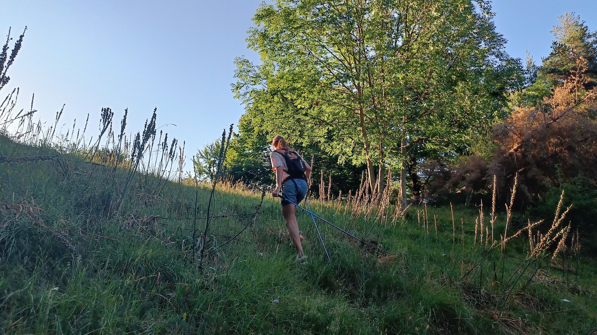
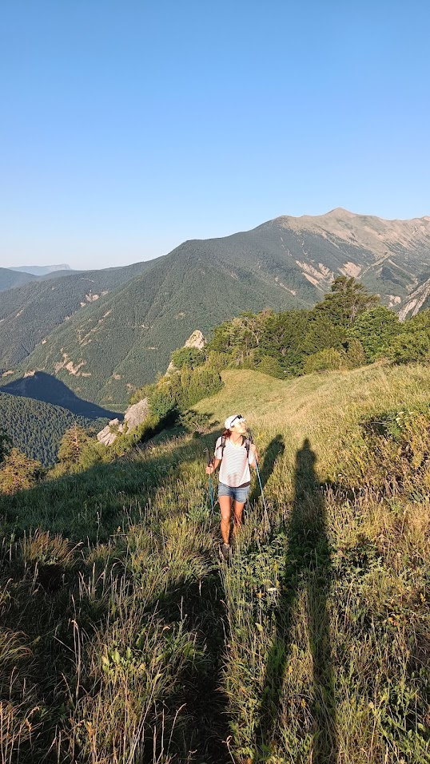
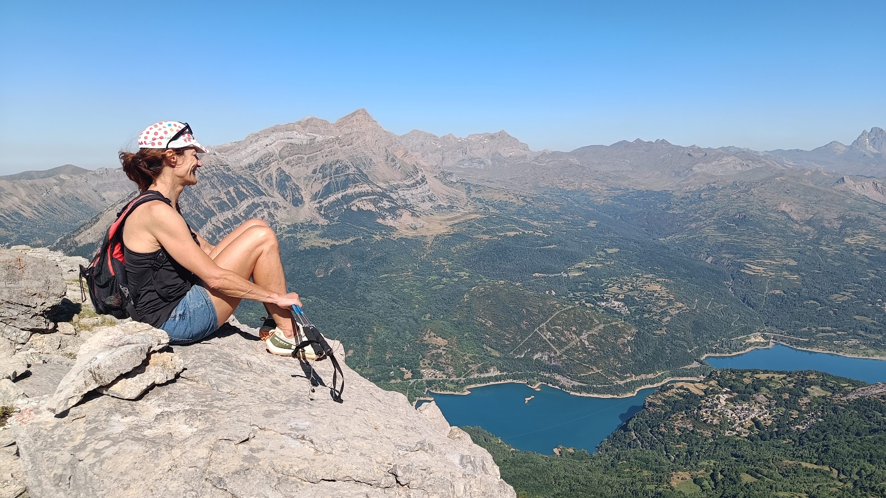
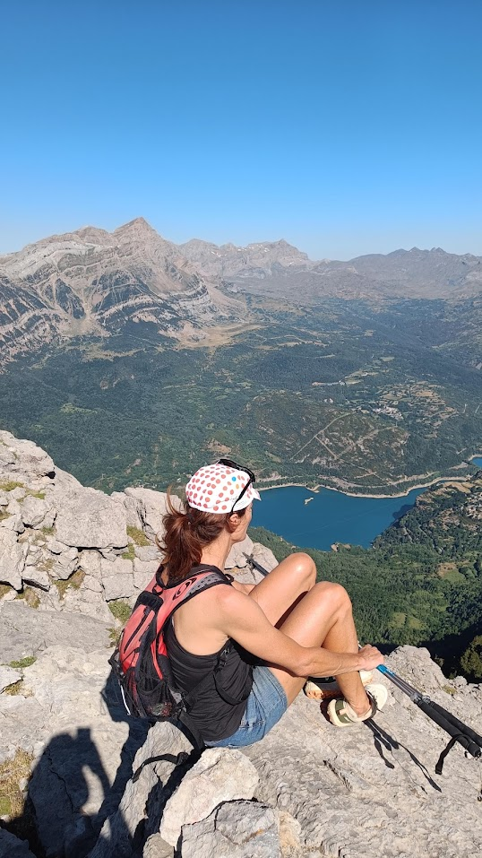
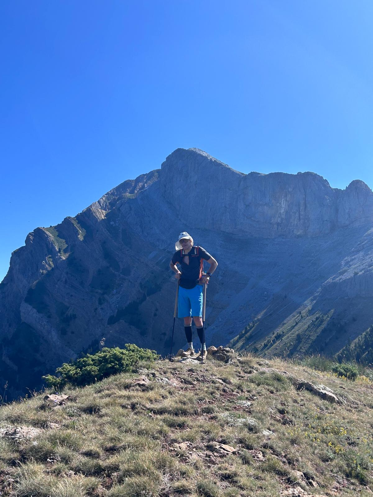

## Fajalata, no te masifiques!
Parece mentira, pero todavía es posible encontrar en el valle de Tena rincones que se mantienen al margen de las multitudes. Senderos que hay que adivinar, perdidos entre la maleza. Sin cartelería, sin pintadas de PR, sin gente,... y con muchas telarañas!!!
La ascensión que realizaron el otro día nuestros especialistas Myriam y AlbertoEpic encaja muy bien en lo expuesto arriba. Una ruta con sabor añejo.
Simplemente la reseño en este blog siendo consciente de que esto lo ven cuatro gatos (En efecto, amig@, si estás leyendo esto, siéntete especial) y esta ruta es para coleccionistas: ni tiene un sendero cómodo, ni tiene dónde tomar un refresco o algo al terminar.

## El Vídeo

Arriba tienes unas imágenes a vista de dron de la incursión de nuestros especialistas.

## Las Fotos

## El Track
Por si te ha interesado, aquí tienes el mapa con el track. Te avisamos que varios tramos el track es meramente informativo, siendo además la cobertura satelital algo deficiente en algunos momentos debido  la cercanía de paredes de roca...

