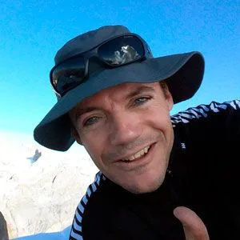

Reseñamos a continuación la última actividad de Fatpinismo (Alpinismo en fatbike) de AlbertoEpic. Se encontraba en Benasque y tenía que llegar a una comida familiar en Huesca. Pero antes quería 'homologar' el prototipo de cadenas de nieve para su fatbike, y un invento para portear la bici más cómodo...

¿La solución? Despertador a las 5:15am, salir pitando con la furgo hasta el parking del vado de los Llanos del Hospital, y allí montar en la fatbike y hacer probatinas, teniendo en cuenta que a las 10am toca ducha, desayuno y regreso a Huesca.

Comienza a pedalear a las 6:20am. Todo el primer tramo es a la luz del frontal. Cuando el sol empieza a acariciar las cimas, ya ha superado el desvío hacia La Renclusa y ha comprobado las buenas condiciones existentes gracias a la nieve totalmente helada.

Sin prisa pero de manera fluida se planta en el plan d'Aigualluts. En sus cálculos pensaba llegar sólo hasta aquí, pero lleva adelanto sobre el horario previsto y decide reconocer el valle de Barrancs. Las condiciones son algo mejores que cuando estuvo aquel [1 de enero en el Mulleres](fatpinismo-invernal-1a-mundial-al-pico-tuc-de-mulleres-3-011m/)...

Remonta sin problemas el valle de Barrancs, la capa de nieve cubre el barranco y los caos de rocas.

En lugar de recorrerlo hasta el final, se desvía a la derecha para encarar el lugar de la bajada clásica del Aneto con esquís.

Tic tac, tic tac,... El tiempo va pasando irremediablemente, y ha llegado el momento de darse la vuelta. AlbertoEpic mira con resignación hacia el Aneto: "si tuviera más tiempo..."

Pero son las 8:40am. Con las condiciones tan buenas que hay, todavía no hay prisa, pero ya no se puede perder más tiempo. En la primera pala más pendiente comprueba que las cadenas funcionan de maravilla, aportando algo así como un 70% más de poder de frenada.

"Hoy las condiciones eran perfectas. Si hubiera tenido más tiempo... el Aneto me llamaba!"

AlbertoEpic
Superhéroe de todo a 100

Tras un regreso sin prisa y disfrutón, bajo la sorprendida mirada de numerosos traveseros y raqueteros (incluyendo alguna entrevista :-p) en 30min AlbertoEpic estaba desmontando la fatbike para meterla en la furgo. 2min antes de las 10am en la ducha, luego desayuno y a comer a Huesca. Prueba superada!!!

A continuación puedes ver el itinerario seguido en una animación 3D:

https://video.relive.cc/9749909122_strava_1552838302918.mp4

