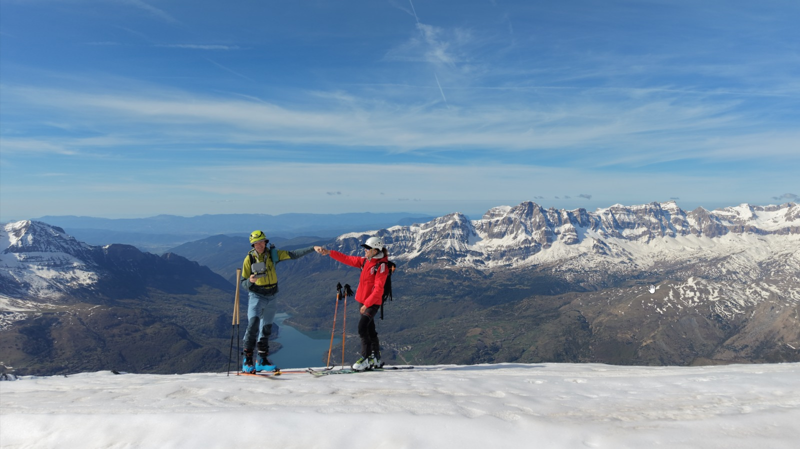
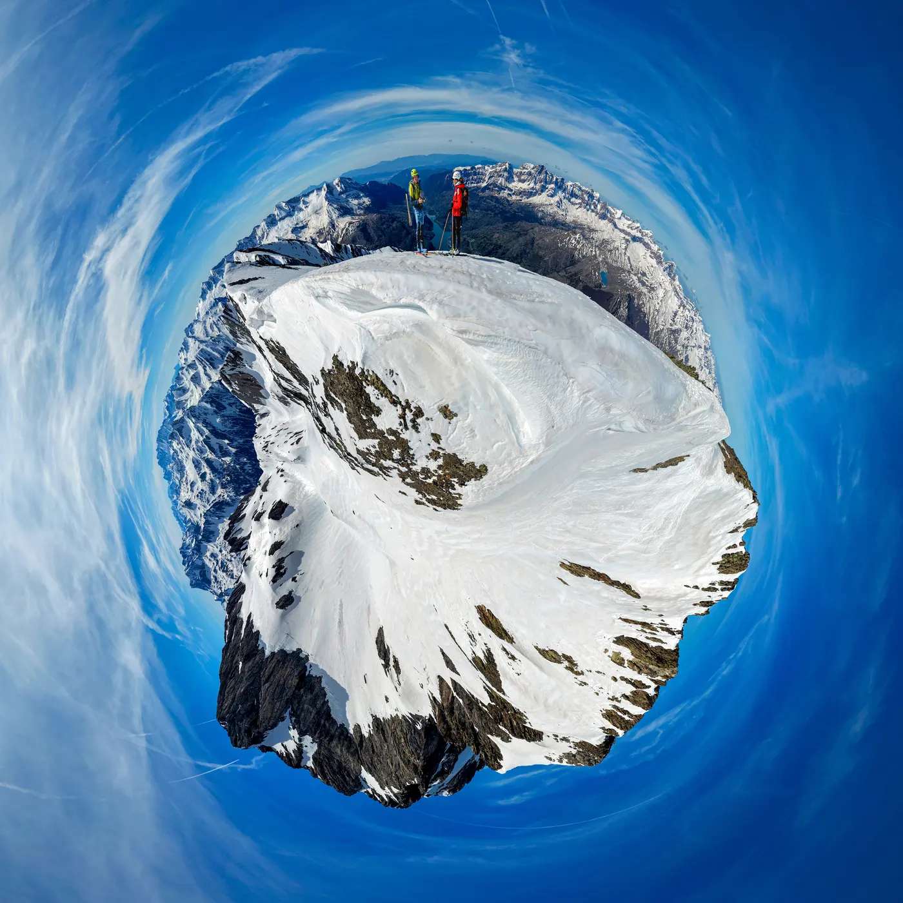

La temporada primaveral de skimo ya es una realidad: toca ir restringiendo escenarios a los lugares que mejor guardan la nieve, y generalmente portear un buen ratico hasta llegar a la nieve donde calzarse los esquís.

## La Misión
En esta ocasión, la mítica especialista de SQLP, Myriam, se alió con AlbertoEpic para llevar a cabo esta misión: debían subir al Feniás para despegar allí el dron y conseguir material para dos facciones de SQLP:
- [Producciones SQLP](https://www.youtube.com/@AlbertoEpic) - vídeos para la realización de un videoreportaje del evento.
- [Miniplanetas](https://miniplanetas.soloquedalopeor.com/) - material fotográfico para la creación de otro miniplaneta.
- [Pano360](https://pano360.soloquedalopeor.com/) - para la realización de otra fotografía esférica con cimas etiquetadas.

Myriam y AlbertoEpic: misión cumplida!

## El Vídeo
A continuación puedes ver un pequeño montaje con el vídeo del dron:

## El Mini-planeta

Haciendo **[click en este enlace](https://miniplanetas.soloquedalopeor.com/planetas/planeta-fenias/)** podrás ir a ver el miniplaneta Feniás. No olvides leer los detalles e indicar si te gusta...

## Pano360

**[Haciendo click aquí](https://pano360.soloquedalopeor.com/panorama/punta-fenias-2-846m/)** accederás a la foto esférica con cimas etiquetadas...

## El track

A continuación tienes el mapa con el track por si lo quieres descargar para seguir los pasos de nuestros especialistas.