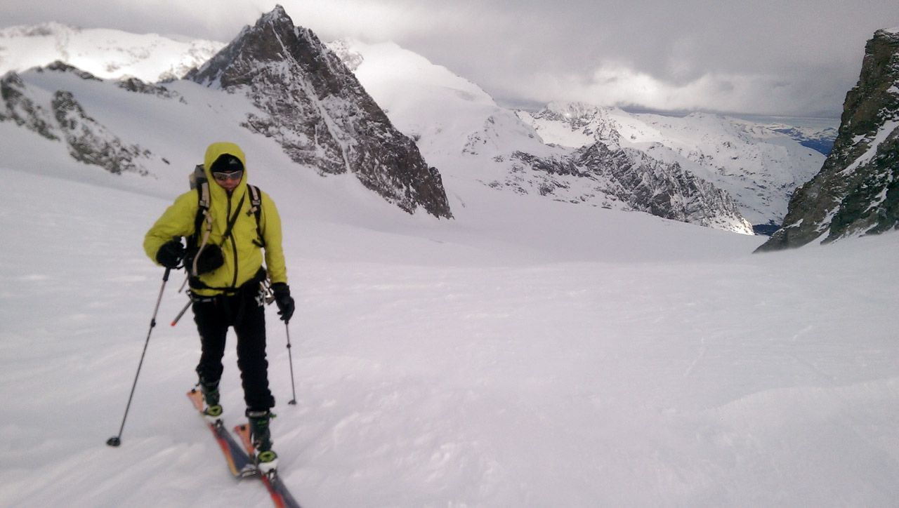

Último episodio de la serie Haute Route 2015...

En las horas finales de nuestra Chamonix-Zermatt, la meteo lo decide todo:
para el último día se pronostican fuertes vientos, copiosas nevadas (Riesgo de aludes) y visibilidad nula en altura, especialmente en el momento de tener que cruzar un gran glaciar agrietado, tras el Col de Valpelline... El día amanece perfecto ¿Se habrán equivocado? Nuestros especialistas foquean con ganas hacia Zermatt, pero desde el ascenso al Col de l’Evêque el cambio de tiempo es claro. :-(

Entra por el norte rápidamente un frente de nubes negras, y en altura el viento es demasiado fuerte. Mala suerte. Otra vez será. No quieren tener tantos boletos en la rifa de los problemas para hoy, y se bajan a Arolla. Varios grupos con guías que salieron del refugio detrás, deciden hacer lo mismo. El resto, se habían quedado en Vignettes. Impresionante bajada también hasta Arolla. Desde allí, en bus, tren y coche (Gracias, í‚ Daniel) para llegar a Zermatt.

Os dejamos con el vídeo...
<iframe width="560" height="315" src="https://www.youtube.com/embed/5F-hggSXxBk" frameborder="0" allowfullscreen></iframe>

Puedes descargar el track de este episodio en la sección correspondiente de SQLP, ['Tracks gpsí¢â‚¬â„¢](https://soloquedalopeor.com/tracks-gps/)...

