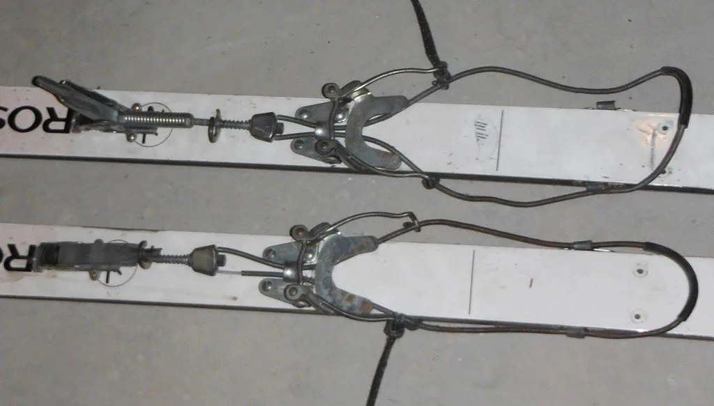

Gracias a Inazio, nos llega del blog [Las Focas Majaras](http://lasfocasmajaras.blogspot.com.es/) una joya histórica, una vista a los comienzos del esquí­ de travesí­a por estos lares.

En este post, Inazio vuelve la vista atrás y nos cuenta cómo era el material por aquel entonces.

Y además, lo remata con un testimonio gráfico totalmente mí­tico: un video correspondiente a la segunda edición de la famosa Travesí­a Altos Pirineos de Peña Guara. Puedes ver el video aqui, pero no debes perderte todo el post ['Maladetas-78' en Las Focas Majaras](http://lasfocasmajaras.blogspot.com.es/2014/02/maladetas-78.html)...

<iframe allowfullscreen="" frameborder="0" height="370" src="https://www.youtube.com/embed/Whi5W4Ri13o" width="657"></iframe>

