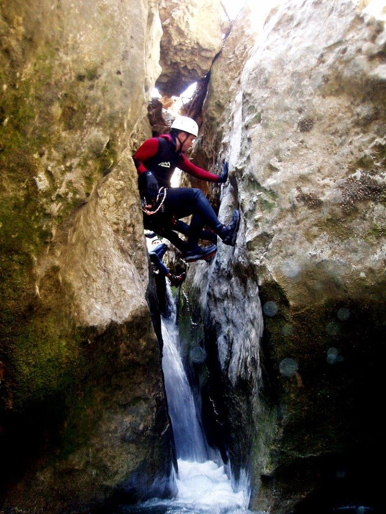

El pasado finde un grupito de globeros estuvo realizando la 'trilogí­a' de dos barrancos en el mismo dí­a. Para abrir boca, los oscuros del Balcés. Y luego, para dar un poco más de emoción al asunto, siguieron con el Gorgonchón.Hay algunos videos, pero ahora no me da tiempo. Será próximamente. De momento, aqui tienes una foto (Cortesí­a de Morenetti) del Gorgonchón.

