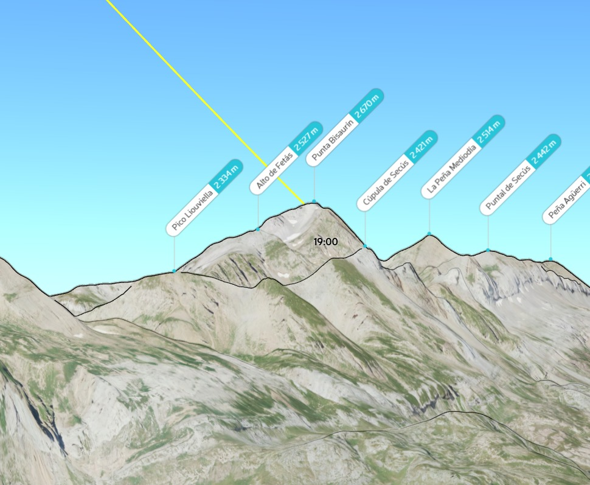
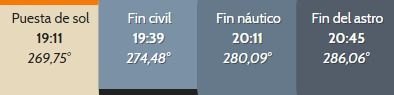
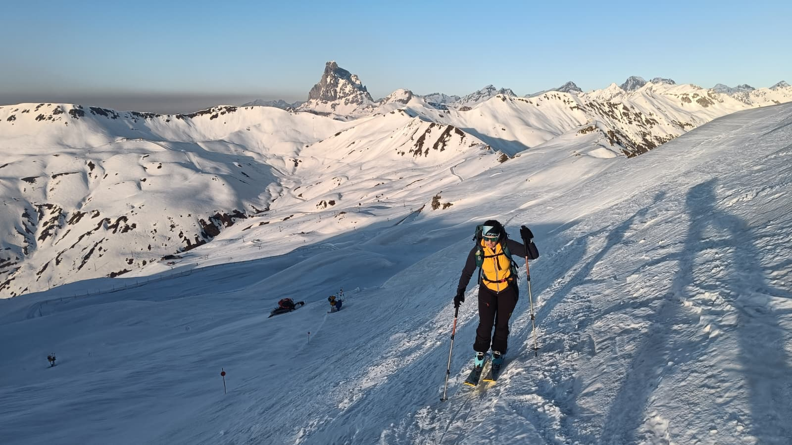
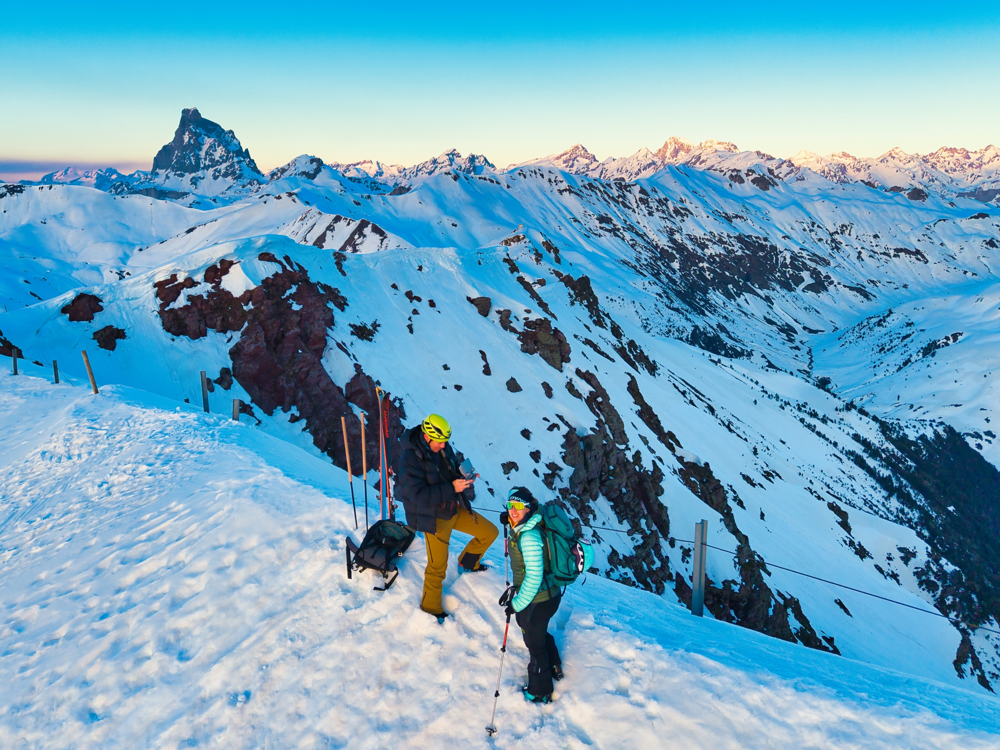
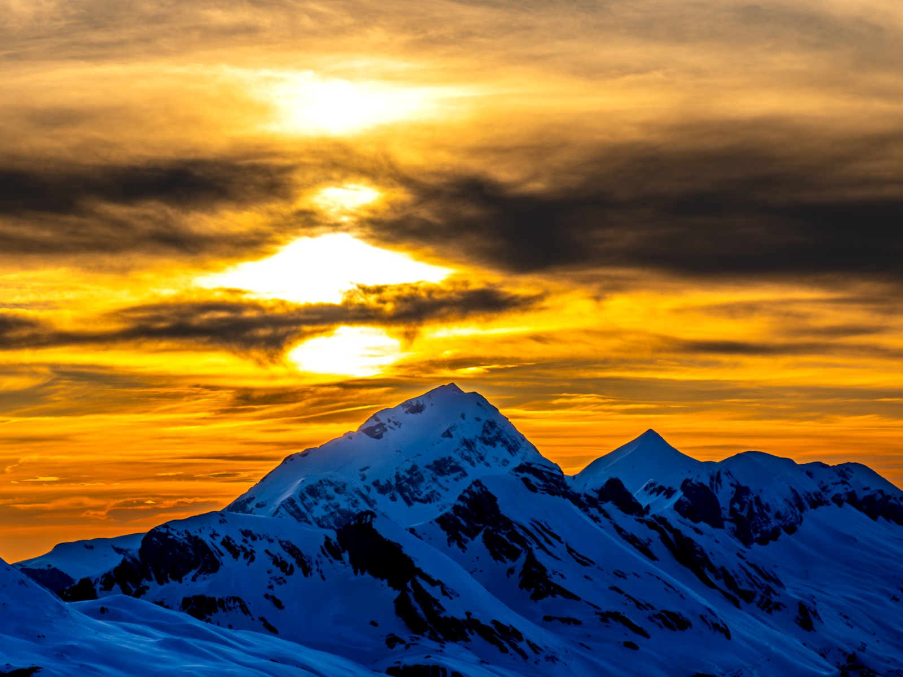
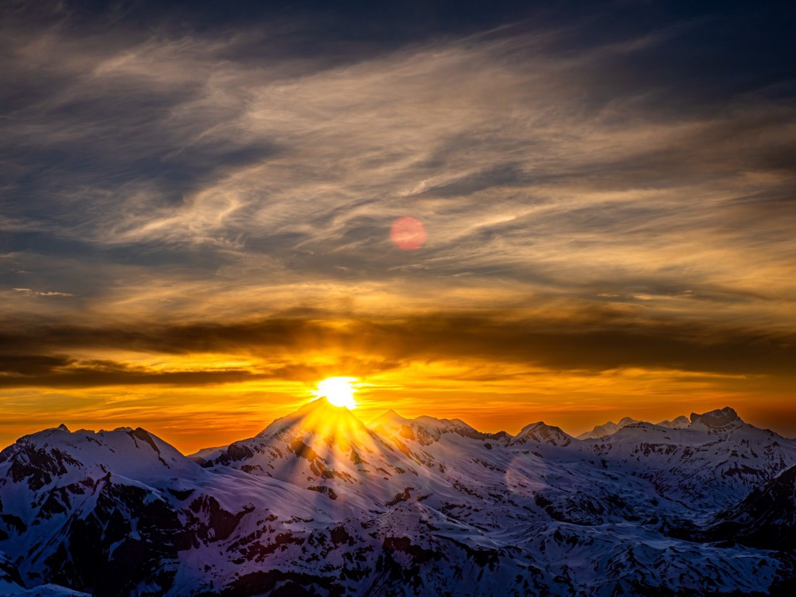
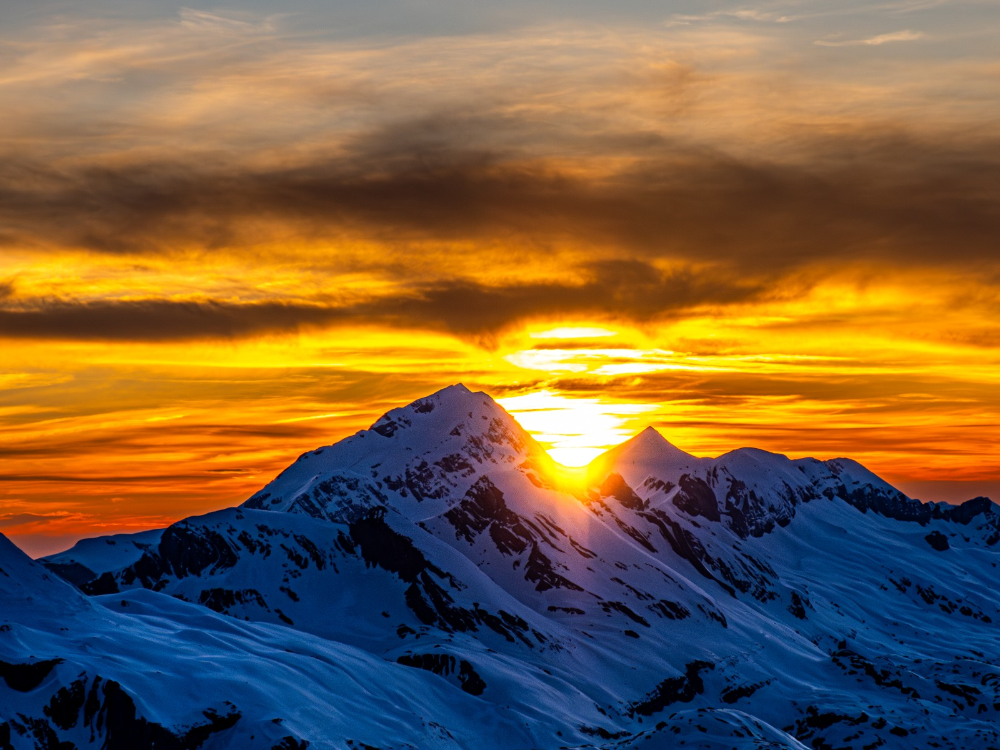
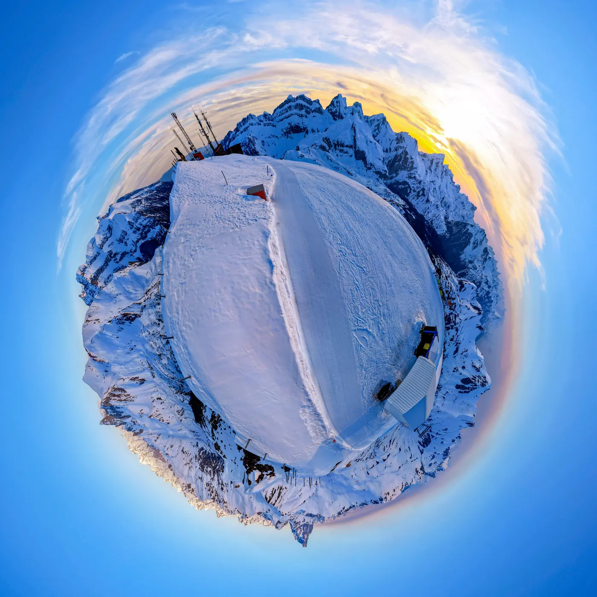

## Seguimos buscando una vertiente más artística que deportiva de la montaña...
Subir hasta lo alto de La Raca, en la estación de esquí de Astún, no supone demasiado desafío físico. Con la excusa de entrenar... bueno, puede estar bien, pero se queda corto. En SQLP intentamos añadirle algo de valor a la actividad: la idea es subir a disfrutar de la puesta de sol desde la cima.

Además, según nuestros cálculos para esa fecha, teníamos el bonus de que el sol se pondría por detrás del Bisaurín... Tal vez AlbertoEpic consiguiera una buena foto!

Estas eran las horas para el 18 de marzo:

El plan sería sencillo: subir a la Raca por la tarde, estar allí sobre las 6:30pm para jugar con el dron y la cámara, despedir el sol, esperar al momento 'cielo naranja' y salir pitando para abajo antes del 'Fin del astro', que obliga sí o sí a utilizar el frontal.

## Las Fotos

En esta ocasión, además, SQLP se congratula por el fichaje de la nueva especialista, Susana, que seguro protagoniza nuevas y épicas aventuras!

Susana con el Midi al fondo, ya próximos a la cima de La Raca.

AlbertoEpic y Susana en la cima de La Raca, desde el dron.

## La Puesta de Sol
Y llegó la puesta de sol, y éste tocó la cima del Bisaurín y 'bajó rodando' por su perfil derecho...

## El Mini-planeta
Por supuesto, AlbertoEpic no perdió la oportunidad de conseguir material fotográfico para aumentar nuestro catálogo de mini-planetas con el **[Planeta La Raca](https://miniplanetas.soloquedalopeor.com/planetas/planeta-la-raca/)**

## El Track

A continuación puedes ver/descargar el track de la actividad, aunque no creo que lo necesites para subir a lo alto de una estación de esquí...