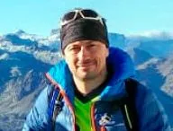

##

Por más resacas como esta!
(Crónica de un puente ciclo-alpiní­stico que pretendí­a ser endurero€¦ 12/13 octubre 2018)

José Orte
a‰l es el autor
de esta mí­tica crónica...

Brindo por más resacas como esta, brindo por resacas que dejan pequeñas a las que se curan con agua y paracetamoles€¦ que no dejan dolor de cabeza y sequedad en la boca, sino magulladuras, roces de vegetación, algún moratón ligero y sobre todo un torrente de endorfinas que dura dí­as€¦ con la memoria saturada de imágenes gloriosas y el cuerpo doliente como testigo permanente de que lo has vuelto a poner a prueba, yendo un pasito más allá de lo que suele ser lo normal y acostumbrado. Brindo por levantarme el dí­a de mi cumpleaños media hora antes de haber quedado con mi familia a comer, porque el tiempo de actividad era alto, y nos hemos podido permitir un tiempo de desplazamiento acorde, y por ello la primera comida del dí­a fue a las 9 de la noche y la llegada a casa de madrugada€¦ Brindo, por haber vencido la medianoche y arrancado mis 41 conduciendo camino a casa, con esa cara cansada y relajada en la que no puedes dejar de sonreí­r como cuando alguien te hace tilí­n. Brindo por haber pasado hasta casi las 2 de la tarde de un dí­a de celebración, en los reparadores brazos de Morfeo€¦ imagino que mientras una frenética actividad interna se afanaba en recomponer fibras, reparar micro lesiones€¦ Brindo por poder devolver a todos los mensajes atrasados en mi bandeja de entrada un €œgracias€¦ me estaba recuperando de esto€¦€ y mandar un torrente de imágenes que no pueden hacer justicia a lo que vivimos.

Brindo por seguir contando entre mis compañeros de aventuras con amigos capaces de improvisar rutas soñadas sobre un plano manoseado mil veces, retales de información extraí­da de conocidos y la tan engañosa web€¦

En fin, el origen que ha dado para tanto brindis fue simplemente que durante estos Pilares 2018, necesitaba una excusa para poder huir del ruido y el follón de la ciudad, así­ que me puse en las manos de los mí­ticos Globeros Dr. Latrek y el €œinfluencer€ Alberto Epic€¦ En mi inocencia, mi cabeza se imaginó lo que querí­a ser un puente endurero por Francia, ya sabéis, una excusa de rutas con poca subida, mucha bajada para terminar pronto en una terraza con una cervecita fresca y un buen pedazo de carne en el plato. En el fondo de mi ser ya sabí­a yo que€¦ que no se llama al Dr. Latrek para terminar una ruta descansado y temprano€¦

Del Dr. Latrek siempre he dicho un dí­a alguien deberí­a hacerle justicia, porque contar sus andanzas darí­a para un libro, una novela, o incluso una serie de televisión. Estamos acostumbrados a ver super héroes con capa y antifaz que dudo que pudieran seguirle el ritmo€¦ Porque hay personajes reales que exceden los parámetros de lo humanamente posible y este puente empezó con un ejemplo más€¦

Durante las semanas anteriores habí­amos estado comentado el plan, y habí­amos acordado hacer rutas por la zona francesa cercana al Midi de Bigorre. A la hora de concretar alojamiento, buscamos un lugar para dormir por debajo de Lourdes, en Argelas Gazost.

El miércoles 11 yo trabajaba hasta las 3 en Zaragoza y Alberto podí­a salir por la tarde desde Huesca, pero David trabajaba hasta las 9 de la noche€¦ en Lérida!!!, y nos dijo que desde ahí­ hasta Argelas tení­a unas 4 horas de coche€¦ con esos datos, di por sentado, (imagino que vosotros habrí­ais pensado lo mismo), que estaba descartado salir ese 11 por la tarde y que saldrí­amos agrupados los tres desde Huesca el dí­a 12, para hacer algo más corto, dejando el plato fuerte para el sábado 13€¦ (Error€¦ ) Así­ pensarí­a cualquier ser humano€¦ salvo el Dr. Latrek€¦ que veí­a únicamente dos opciones: que nosotros fuéramos antes a Francia y él ya llegarí­a de madrugada, o salir a eso de las 4 am de Huesca para poder hacer lo que tení­a en la cabeza€¦

Con estos mimbres€¦ y que yo tení­a ya plan para la tarde del 11, Alberto Epic y servidor, decidimos dejar al Dr. que hiciera de las suyas y tirara por su cuenta, así­ que durmiendo plácidamente en casa y saliendo a una hora razonable, quedamos con él en Luz-Saint-Sauveur el 12 sobre las 4 de la tarde€¦ con algo de luz todaví­a para poder hacer algo de provecho€¦
Dí­a 12: Luz-Saint-Sauveur €“ Luz Ardiden €“ Cauterets
Pese a lo desahogado de nuestro plan de viaje, casi llegamos tarde a Luz, con un dí­a impresionantemente bueno para ser mediados de octubre€¦ í­y Francia! Nos dio tiempo sobrado a sacar las bicis, vestirnos y esperar a David€¦ que sí­, efectivamente se habí­a levantado a las 4 de la mañana para llegar hasta Cauterets, dejado el coche allí­ y empezado con las primeras luces del alba una ruta mucho menos ciclable de lo que previó, así­ que un pelí­n tarde, €œalgo€ cansado, se tomó en un suspiro un botellí­n de zumo, una quiche€¦ y nos dijo, adelante!

La distracción de la tarde consistí­a en salir de Luz-Saint-Sauveur, cruzar el rí­o y subir hasta la estación de esquí­ de Luz Ardiden. Yo que vení­a pensando sólo en el enduro y resulta que he terminado por conocer unos cuantos puertos del tour de Francia en el mismo finde!!!

<iframe src="https://www.gpsies.com/mapOnly.do?fileId=svnjoecqejgxdccn" width="100%" height="400" frameborder="0" scrolling="no" marginheight="0" marginwidth="0"></iframe>

Empezamos a buen ritmo, charlando sobre el dí­a, pero€¦ algo debí­a llevar la quiche de David€¦ o quizá no estaba tan cansado como decí­a€¦ (total sólo llevaba 8 horas de cicloalpinismo en las piernas y en pie desde hací­a 13h)€¦ porque mi pulsómetro se acercaba peligrosamente de continuo a las 160 pulsaciones y no me quedaba más desarrollo€¦ no sabéis lo que jode ir viendo esos cartelitos que te ponen€¦ 11 kilómetros a meta€¦ desnivel 9%. Así­ que bajé un poco el pistón y tomé mi propio ritmo, disfrutando del dí­a y las vistas. Al llegar a la estación, nos quedó portear un poco hasta el collado que nos daba acceso al valle donde estaba en el fondo Cauterets.

Como el sol declinaba, nos dimos prisa por empezar a bajar€¦ ya se sabe que esos bosques son muy umbrí­os, así­ que mejor no esperar a sacar frontales!

Como prometido por David, un montón de herraduras anchas y francas sin apenas dificultades eran nuestro premio, rápidamente perdimos de vista el collado, y tras ellas, nos internamos en un bosque de esos tan abundantes en el lado norte del pirineo, tupido, con un suelo perfecto, rápido y divertido, donde parece que tras un árbol vaya a salirte un elfo o una hada€¦ y tras un pequeño repecho para que no todo fuera diversión€¦ una vaguada a modo de tubo peraltado de infarto que harí­a las delicias de cualquiera con un poco de tino a la hora de tumbar y confiar en eso de las inercias€¦ a estas alturas de la tarde apenas se veí­a, pero en seguida llegamos a Cauterets, y conociendo los horarios franceses€¦ abrigándonos con la poca ropa que llevábamos, nos sentamos en una terraza a cenar y a disfrutar esta vez sí­â‚¬Â¦ de nuestra merecida cerveza€¦

Como habí­a combinación de coche, a servidor le tocó esperar con las bicis hasta que David y Alberto llegaron hasta Luz-Saint-Sauveur para recuperar la furgo y volver a por mí­. En estos valles tan profundos y a estas alturas del año las temperaturas cayeron de lo lindo, así­ que me tocó hacerme una bola y esperar paciente a ser rescatado. Una vez en el hotel, ducha bien caliente y a dormir lo posible€¦ el plato fuerte del finde estaba por venir.
DIA 13: Pico MIDI de BIGORRE - PIERREFITTE
<iframe src="https://www.gpsies.com/mapOnly.do?fileId=frsodicxsuhmlcdu" width="100%" height="400" frameborder="0" scrolling="no" marginheight="0" marginwidth="0"></iframe>

Tras un muy tempranero y potente desayuno nos encaminamos rumbo La Mongie-Tourmalet, dejando uno de los coches en el final de la ruta, en Pierrafitte. Coronamos otro puerto mí­tico, Tourmalet, y bajamos hasta la estación de la Mongie, de donde si coges el primer teleférico a las 9:30 puedes subir las bicis hasta la cima.

Bamboleándonos de un cable en una caja de metal y con un trasbordo intermedio, disfrutamos de las impresionantes vistas al vací­o, llegamos sin el más mí­nimo esfuerzo hasta el complejo que decora los 2.877 metros de esta mole, reconocible desde la distancia por la presencia un observatorio astronómico y una antena de televisión, además de un museo, cafeterí­a, refugio€¦ vamos, todo un resort!

Nos hacemos las preceptivas fotos en los miradores y balcones al vací­o, así­ como nos damos una vuelta rápida por el complejo, y por el museo, viendo los documentales que nos descubre qué diferente era la vida en este lugar en sus orí­genes€¦

Pero no nos habí­amos vestido así­ para tomar un café olé y posturear en instagram sobre lo cool del lugar€¦ Tení­amos faena€¦ de sobra.

Así­ que por una portezuela entre un transformador de recambio y material de mantenimiento, conseguimos salir del hormigón y el tramex y pisar por fin la roca€¦ Unos operarios nos miran extrañados. Nos asomamos al sendero que cruza una de las originarias vagonetas cremallera que subí­an material€¦ esto está pino€¦ pero€¦ ya sabéis, culo atrás y control de velocidad€¦ y empezamos perder altura€¦ Algún nevero, mucha laja suelta, algún caminante que nos mira extrañado€¦ y dejamos atrás el sendero para tomar la cómoda pista que nos lleva hasta el derruido edificio del antiguo teleférico en el Col de Sencours.

Desde ahí­ tomamos dirección al Lac de Oncet, donde empezamos a saborear jugosas sendas con la vista del observatorio a nuestras espaldas. Vamos bordeando a media ladera el Pic Bonida, enfilando el primer porteo de la mañana: Col d€™ Aoube. Para ser sinceros, David habí­a dicho que abandonáramos cualquier esperanza que pudiéramos albergar de pedalear algo en alguna subida€¦ Pero hasta ahora la cosa no me estaba pareciendo ser tan trágica€¦

Tras corregir una pequeña deriva de rumbo y cota€¦ (cosas de llevar varios GPS), y ya con la bici en los hombros desde hace rato, tenemos el primer Col casi a vista. Alberto Epic reconoce que está fundido€¦ y que no se ve porteando las próximas 6 horas€¦ Reunión de pastores€¦ y decidimos separarnos€¦ (Creo que Alberto estaba salivando con una senda que vimos el dí­a anterior y que cortaba Luz Ardiden y tiene más ganas de bajarla aunque eso le suponga subirse Tourmalet hasta la furgo y luego de nuevo subir Luz Ardiden), luego nos contará que bajando de donde estaba descubrió que no le quedaba una peseta de frenos€¦

Convertido esto en un €œtate a  tate€, y pensando mucho en si no tendrí­a que haberme ido con Alberto ya que mi pulso sigue extrañamente alto€¦ seguimos porteando por la senda cada vez más empinada que nos hace ganar altura de nuevo hasta los 2350 metros en el Col d€™ Aoube y empieza a mostraros lo que será la tónica de la jornada: ganar un collado trabajosamente para ser deslumbrados con un precioso valle jalonado de lagos.

El dí­a ya se confirma espectacular, de verano, cielo azul, laderas verdes, y en el fondo, el lac Vert y la cola del enorme Lac Bleu, que hace honor a su nombre€¦ de un azul como pocos he llegado a ver.

Un poco condicionado por lo que comentaba David sobre la falta de la ciclabilidad de la jornada, me sorprendo ya que salvo en lugares muy puntuales en la bajada todo es ciclable, (entiéndase para los avezados en estas lides), y disfrutón€¦ si ya hablamos de las vistas€¦

En una represa en la cabecera del lago nos encontramos decenas de excursionistas que disfrutan de este dí­a tan benigno. Como es normal, a mucha gente le extraña que vengamos de donde venimos€¦ y que enfoquemos la siguiente tachuela y subamos una pina tasca de hierba hasta el Col de Bareilles, (unos 2240m).

De nuevo se cumple la máxima de que a cada collado, un nuevo valle con colores espectaculares y más lagos y riachuelos se abren a nuestra vista. Y de nuevo la bajada se hace mucho menos complicada de lo que podí­amos prever.

En este caso el Lac d€™Ourrec, nos recuerda a Aguas Tuertas, pero con unos prados verde intenso espectaculares.

Ya sólo queda un último remonte para que comience la bajada final que se promete gloriosa€¦ Aunque este porteo es el más corto de todos, (30 minutos aprox), y en apariencia no es demasiado pendiente, ganar los 1870 metros dejando a mano derecha el pequeño Pic de Barran, a mí­ me empieza a costar€¦

Al llegar David departe animosamente con un paisano que conoce bien la zona y se sorprende de lo que acabamos de hacer€¦ nos dice que está todo hecho y que ahora sólo nos queda disfrutar€¦ Espero que sea así­, porque mis gemelos ya acusan las aproximadamente 3 horas de porteos, y algo menos de bajadas intensas y medias laderas bordeando lagos, y demás€¦

Lo cierto es que ya estamos viendo el aparcamiento de Hautacam, nos queda una senda fácil y tendida que haciendo media ladera por una tasca que pronto estará cubierta de nieve, se aproxima a la estación de esquí­, y desde allí­, enlaza con una senda de bajada por bosque que nos irá llevando hacia Pierrefitte.

Dicho y hecho, tal y como nos han dicho, la senda está para darle zapatilla y vamos jugando con las diferentes trazadas, sin mucho más, hasta llegar al Lac d€™Isaby donde la cosa cambia, hay que estar atentos para no seguir bajando y perderse la entrada al bosque, donde€¦ en fin€¦ hubiera sido pecado mortal perderse rodar por aquí­. ¿Os acordáis de lo de los elfos y los enanos?

Pues seguro que en este bosque hay una colonia bien surtida de ellos€¦ El bosque es espectacular, los colores del otoño mezclados con la humedad tras prontas nieves ya fundidas y bien iluminadas por este dí­a tan veraniego nos hacer recrearnos por una senda perfecta, un bosque que parece que un jardinero de Versalles haya despejado para garantizar simetrí­a y majestuosidad. Curvas divertidas, buen piso€¦ David va soltando chillidos de éxtasis a ratos y yo hace rato que he olvidado que hace media hora me terminé el agua€¦. en fin, babeando salimos a una pista descendente alfombrada de hojas de la que sabemos hay un desví­o a mano derecha que nos reserva más€¦ aún más...

En efecto, tras pasar por una borda y unos prados sencillamente encantadores, tomamos una pista colgada a media ladera con vistas a todo el valle que se asemeja al canal de Bielsa, una conducción cerrada de agua cubierta por hierba perfectamente mantenida, que nos lleva a una toma de agua para un salto hidroeléctrico y de ahí­ a una senda que nos devuelve con creces el esfuerzo gastado durante el dí­a.

Nuevo tramo rápido y divertido, con algún murete y más vestigios humanos, que presagian que pronto entraremos en la pura civilización y la diversión se habrá acabado€¦

Y así­ es€¦ entramos en urbanizaciones y ya sólo queda descolgarnos por carretera hasta el coche€¦ Exhaustos pero más que satisfechos por los 1300 metros de bajadón casi continuo que acabamos de disfrutar€¦ nos ponemos en contacto con Alberto para agruparnos de nuevo. Furtivo remojo en el rí­o cercano, pantalones vaqueros€¦ y tras unas 8 horas de actividad y unos 40 km de ruta, (a saber porque tanto el pulsómetro como el strava no registraron correctamente la actividad), sólo nos queda lo más difí­cil todaví­a€¦ encontrar un sitio donde comer algo a en Francia a las 6 de la tarde€¦

Tratamos de ir a una feria en Argeles, de la que David ha oí­do, pero no hay manera, (esto es así­) así­ que o esperamos un poco más para cenar en Francia o tiramos a España y ya pararemos por ahí­â‚¬Â¦ Gana la segunda opción, así­ que nos ponemos en ruta y tras una decepcionante parada en Formigal, cenamos/comemos como generales a eso de las 9 en Escuer€¦

Y el resto€¦ pues ya está más que explicado!!! €¦ carretera, madrugada, cumpleaños, rescaca€¦ y brindis, muchos más, por conservar la salud y las fuerzas para vernos en muchas más de estas!!!í­ Que todas las resacas sean como esta!

