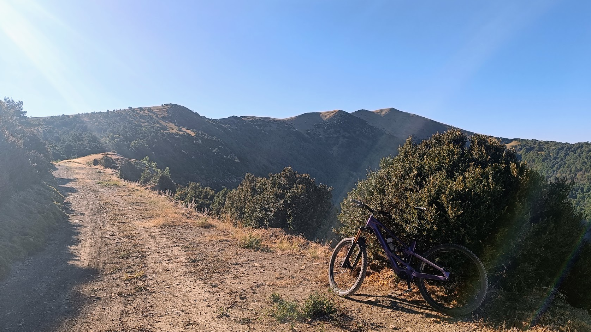
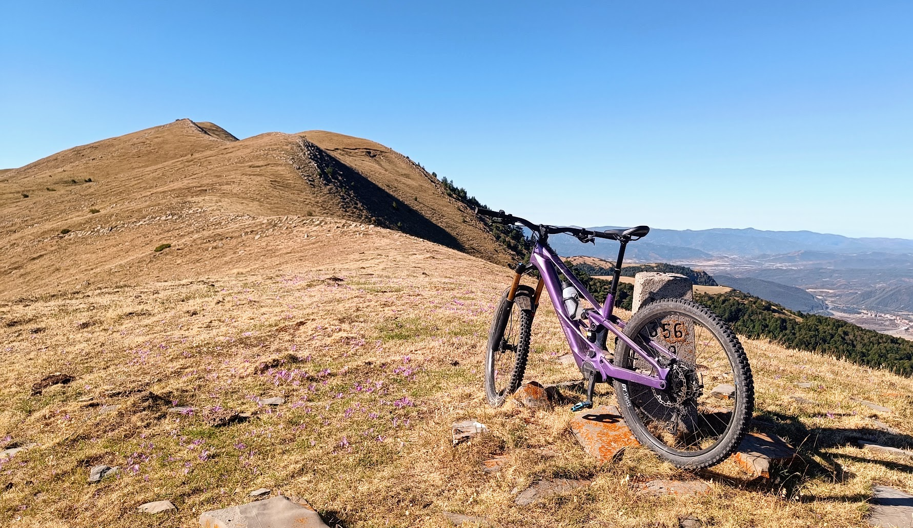
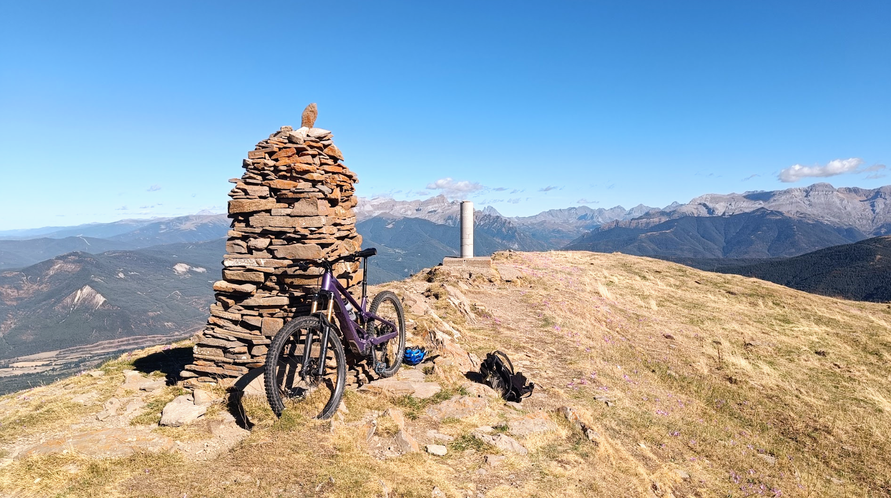
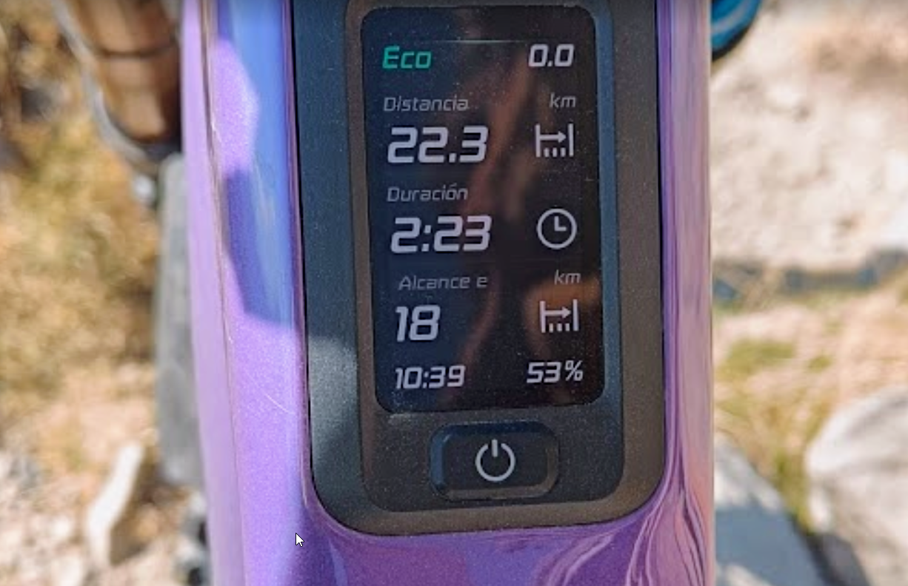
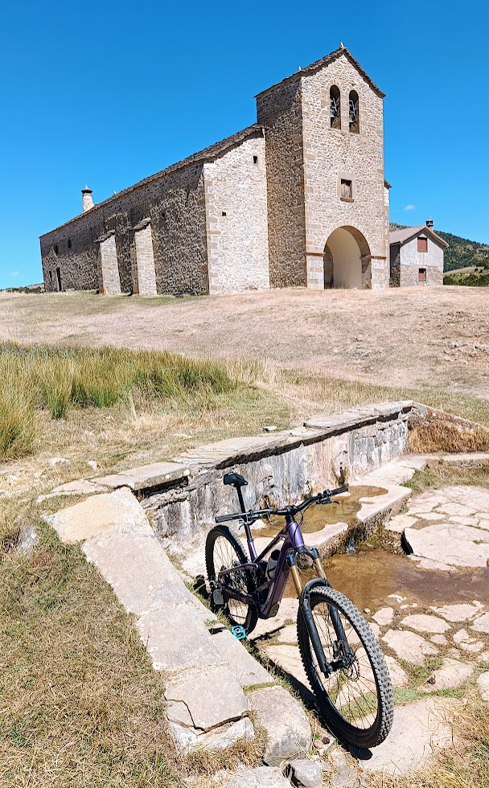
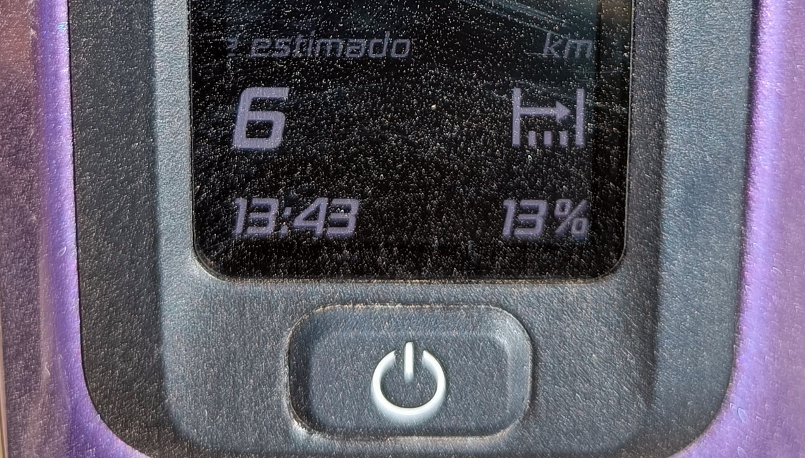
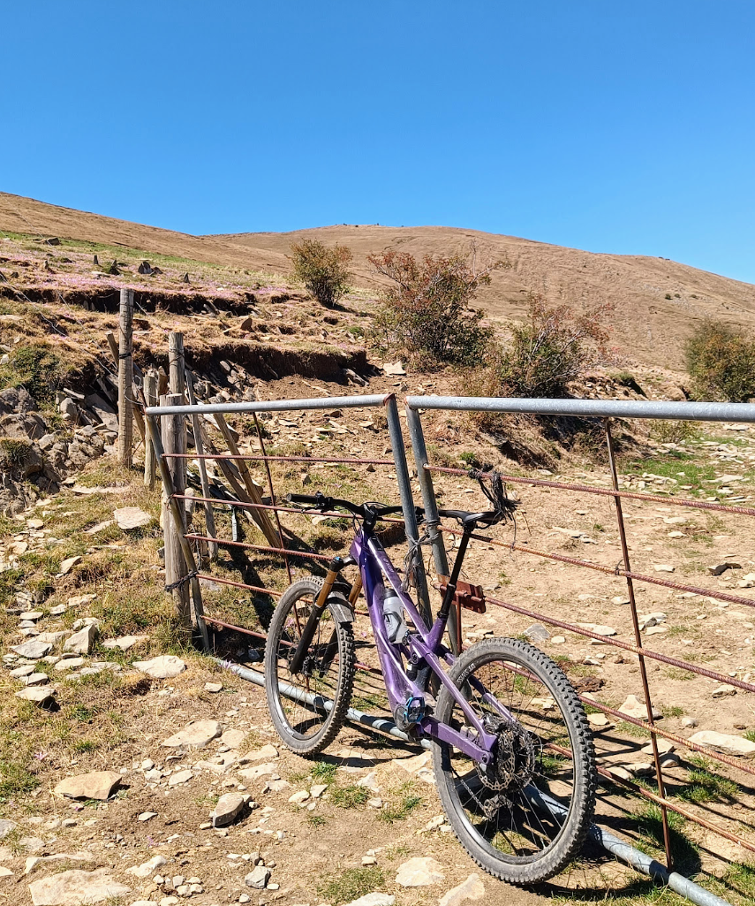
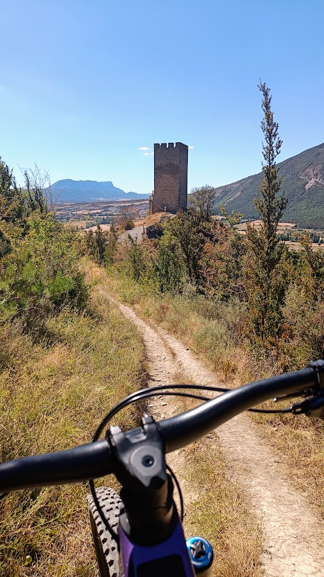
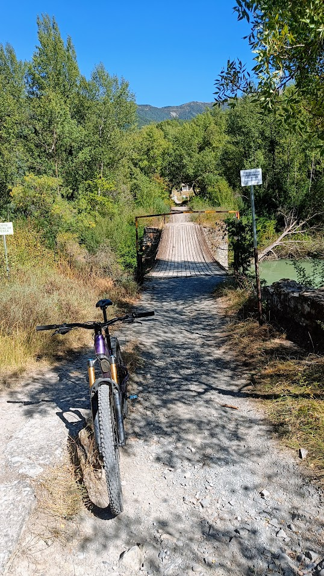

## Tremendo anuncio!
Hoy hacemos un importante anuncio en SQLP: nuestro especialista AlbertoEpic acaba de incorporar a su parque móvil una e-bike! Que nadie se escandalice, su afanación por alcanzar el punto de 'petacióntotal' sigue ahí. Simplemente ha añadido un nuevo juguete a sus actividades por el monte.

## Reflexiones
Te dejamos con algunos retazos de sus pensamientos tras las primeras pruebas:

> Cuando tienes un nuevo juguete ([[BTT]] a pilas) te asomas a un mundo totalmente nuevo. Es imposible asemejar una bici eléctrica a una bici 'acústica'. Es un deporte totalmente diferente. Cualquier parecido entre las dos es pura coincidencia, como que las dos coinciden en el número de ruedas...
> Desde el punto de vista del ciclismo como deporte, como búsqueda del rendimiento físico personal, una e-bike es una abominación: ¿cómo es eso de que puedes subir un puerto sin sudar? Donde antes subías durante horas a más de 160ppm, ahora paseas en la mitad de tiempo ¡sin pasar de 110ppm!
> Está claro que puedes limitar el nivel de asistencia a un mínimo para que pedalear con motor se asemeje a pedalear en una bici real (Que la ayuda elimine el sobrepeso extra del sistema eléctrico), pero entonces... ¿Qué sentido tiene la inversión económica extra que supone una e-bike?
> - Si quieres disfrutar de las ventajas de una bici normal (Ligereza, simplicidad, polivalencia, autonomía, autosuperación...), cómprate una bici normal.
> - Si quieres disfrutar de las ventajas de una bici a pilas (Ponerte donde quieras un bike-park con remontes gratis, ser capaz de hacer rutas que te superan por nivel físico, ya sea por edad, falta de entrenamiento, no-hay-ninguna-necesidad-de-tanto-sufrir,...), cómprate una e-bike.
> 
> Las dos opciones con compatibles, y por supuesto complementarias. La e-bike ayuda a fortalecer el tren superior para el pilotaje en las bajadas, y multiplica el factor diversión. Además, facilita la interacción social al poder compartir rutas con mucha gente de niveles físicos dispares.
> Por otro lado, si vienes del ciclismo, sigue motivando entrenar y esforzarse, por dos motivos:
> 1. Podrás alargar la autonomía de la batería en la e-bike.
> 2. Esa sensación de entrar en casa total y ABSOLUTAMENTE vacío después de haberlo dado todo en una ruta... No tiene precio! 😅

## El experimento
Y claro, en un juego nuevo, siempre está bien experimentar y definir dónde tienes los límites. Es por eso que nuestro especialista se lanzó a realizar este experimento, para comprobar la autonomía del motor de la bici. La idea: intentar exprimir la batería de la e-bike para hacer desde Senegüé dos ascensiones a Oturia (Primera desde Oliván, segunda desde Yebra de Basa) con sus respectivas bajadas por senderos. 
Tienes a continuación el vídeo con el itinerario en 3D:

<iframe class="embedly-embed" frameborder="0" scrolling="no" allowfullscreen src="https://cdn.embedly.com/widgets/media.html?src=https://www.relive.com/view/vNOPLrQLEYO/widget?r=embed-site&url=https://www.relive.com/view/vNOPLrQLEYO?r=embed-site&image=https://www.relive.com/view/vNOPLrQLEYO/png?x-ref=embed-site&key=f1631a41cb254ca5b035dc5747a5bd75&type=text/html&schema=relive" width="1024" height="801" style="position: absolute;top: 0;left: 0;width: 100%;height: 100%;"></iframe>

## Las Fotos

Después de mucho rato de ascenso por pista boscosa, por fin la vegetación disminuye y aparece al fondo Oturia.

Superada la larga subida por pista desde Oliván, ya sólo falta el campo a través por la loma hasta la cima de Oturia.

En la cima de Oturia (Teóricamente la primera subida de dos, pero...)

Los datos del ordenador de a bordo no anuncian nada bueno: prácticamente la mitad de batería gastada en la primera subida. Toca bajar hasta Satué con el motor apagado para ahorrar, pero luego falta hasta Yebra de Basa un sendero lleno de sube-bajas donde la batería será necesaria... glups! 

Seguimos estirando el chicle... Desde Yebra de Basa, subida lenta, apagando el motor en los tramos más favorables (Para ser consciente de que una e-bike sin batería es un ancla!), con la mente puesta en la parada de la foto: la providencial fuente de Santa Orosia.

Allí, la cosa pinta mal, muy mal! Con el motor al mínimo de los mínimos, la batería al 13%, la bici se va a convertir en un ancla en menos de 6km... cuando todavía me faltan 23km de ruta. Pero que 'no panda el cúnico': si consigo llegar a la barrera de la pista (4km más), estaré salvado! 

Así es como apurando, apurando, lo doy todo para conseguir llegar a la barrera. A 2m de ella, el motor muere definitivamente. Misión cumplida: queda registrado que una batería me da para un desnivel de 2.400m+.
El tonelaje de la bici me hace olvidar cualquier atisbo de idealismo. A ver cómo salgo de aquí. Modo supervivencia 'ON'. Por lo pronto, renuncio a la segunda cima (200m más arriba) y continúo por la pista horizontal. Me queda un largo y gozoso descenso...

El aplomo de una e-bike en los descensos es impresionante. Y si a eso le añades el silencio de llevar el motor apagado, te eleva a un estado Zen... del que caes de bruces cada vez que aparece un pequeño repecho en el sendero!
Pero bueno, sin mayores contratiempos, y con unos cuantos sofocones, la bajada hasta Lárrede y el icónico Puente de las Pilas está hecha. Mira tú por donde, ironías de la vida, atravieso el Puente de LAS PILAS con una bici A PILAS... **SIN PILAS!!!**

Ya sólo quedan menos de 2km para remontar hasta Senegüé. Prácticamente llanos, 40m de desnivel+... Una auténtica odisea, cuando llevas más de 7h pilotando, hace calor y arrastras un peso muerto de más de 20kg!

---
Y esta ha sido la aventura de hoy. Si has llegado hasta aquí, muchas gracias por tu interés!
Hemos añadido en SQLP una nueva categoría, e-bike, donde encajar las nuevas aventuras que vendrán a bordo de estos cacharros. Nos asomamos a un mundo nuevo...

## El Track
Si te ha gustado el recorrido, puedes descargarte el track a continuación: