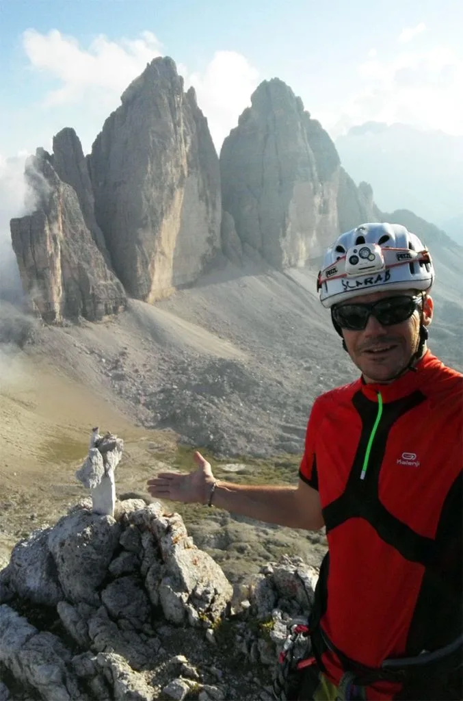
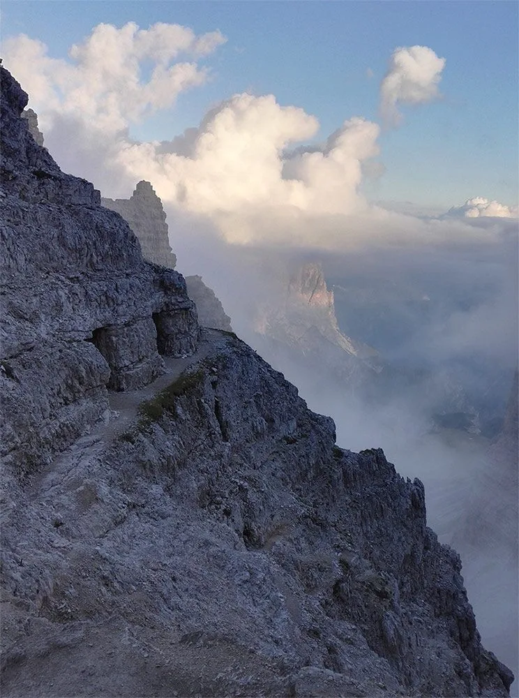

## Ferrateando el Monte Paterno (2.746m) y vuelta a las Tres Cimas de Lavaredo

Los dí­as en los Alpes se acaban para el equipo SQLP, y las actividades se comprimen para exprimir al máximo las últimas horas...

Sami, Tai, Luzia y AlbertoEpic se plantan en Cortina d'Ampezzo a mediodí­a, y por la tarde suben al parking del Rifugio Auronzo, al pie de las Tre Cime di Lavaredo. Esa misma tarde le toca el turno a AlbertoEpic:
Echando cuentas, tengo el tiempo justo para hacer la ví­a ferrata de Luca-Innerkofler[^1] al Monte Paterno y bajar al Rifugio Locatelli. Desde allí­, la vuelta es por un sendero muy ancho y sin pérdida, podré volver con el frontal si me pilla la noche.

[^1]: La toponimia de la [ferrata De Luca-Innerkofler al Monte Paterno](http://lagranguerra1914-1918.blogspot.com.es/2012/10/las-misteriosas-muertes-de-sepp.html) guarda una historia ocurrida en la 1ª Guerra Mundial... Uno no deja de sorprenderse de lo que puede llegar a hacer la raza humana para autodestruirse, el sinsentido de las guerras...

Me preparo rápidamente, mochila con material de ferrata, plano, gps, frontal, agua, comida y ropa de abrigo como para pasar la noche, por si acaso...

Salgo corriendo del Rifugio Auronzo, paso por el Lavaredo Hütte, y entro a la ferrata por el extremo sur (Al revés que la mayorí­a de gente). Hasta aquí­, corriendo, ha sido fácil mejorar el horario previsto. Veremos en la ferrata. Arnés, set de ferratas, casco, un trago de agua y adelante... Ups! No, espera, que esto empieza por unos túneles, hay que sacar el frontal.

 

AlbertoEpic en la cima del Monte Paterno, con las Tre Cime di Lavaredo al fondo.

Hasta la cima del Paternkofel, todo marcha mejor de lo previsto: buena meteo, impresionantes paisajes, brutales vistas sobre las Tres Cimas de Lavaredo,... Llego arriba con 1h 30min de ventaja sobre el horario previsto, lo que me da mucha tranquilidad. Puedo llegar a la furgo todaví­a con sol!
A continuación puedes ver una panorámica de la cima.

Pero uno no puede dormirse en los laureles: mientras estoy flipando con los brutales paisajes desde la cima, empiezan a surgir rápidamente nubes de todas partes, que pasan lamiendo las montañas lentamente... Despierto del embrujo de Luca-Innerkofler y salgo pitando hacia abajo! Las primeras nubes se arrastran por la ladera que desciendo. Si te atrapa la niebla en un tramo de ferrata con lí­nea de vida todo es muy simple, la sirga te marca el camino. Pero los tramos sin nada toca esperar a que pase la nube para ver algo y no perderme. Esto hace que vaya mermando mi margen de tiempo con luz del dí­a...

## Sentiero delle Forcelle

Para cuando llego a la Forcella Camosci, soy una duda con patas: unas tablillas indican las direcciones, pero no me aclaro mucho porque los nombres a veces están en italiano y a veces en alemán (Buscaba 'Rifugio Locatelli' pero en la tablilla era 'Dreizinnenhütte'). Con un buen dí­a, desde aquí­ arriba la perspectiva es clara y no habrí­a habido duda. Pero en esos momentos, hacia ese lado la niebla era espesa, y sólo se veí­a una canal vertical, sucia y descompuesta que se perdí­a en la oscuridad. En cambio, hacia la otra vertiente está despejado y el camino me permite progresar rápido... Tengo dos opciones: boca del lobo / bucólico paseo. Así­ que tomo la decisión de bajar por la ferrata Sentiero delle Forcelle.

 Inicio del Sentiero delle Forcelle.

Esta ferrata se dirige al Este, la vertiente más despejada pues las nubes vienen del oeste. Resulta algo más compleja que la anterior, va recorriendo varios nidos de ametralladoras de la 1 Guerra Mundial, y lo más importante, me deja de nuevo en tierra firme, muy lejos de donde me gustarí­a, pero en el 'sendero 101', la autopista que sólo tengo que seguir hasta la furgoneta! :-)

El sol ya se ha ocultado tras las Tre Cime di Lavaredo. En unos minutos tendré que sacar el frontal y la progresión será más lenta, así­ que echo el resto, corriendo todo lo que puedo mientras haya luz. Ya en la penumbra, por fin llego al Rifugio Locatelli. Saco el frontal, una barrita, agua y continúo.

A partir de aquí­, la niebla se puede cortar con un cuchillo. Con el frontal en la cabeza no veo NADA! Recuerdo que los coches llevan los faros antiniebla muy abajo. Me quito el frontal, y lo llevo en la mano, pegado al suelo. Esto ya es otra cosa, tengo un campo de visión de unos 150cm... No hay pérdida, el sendero 101 es como una carretera, pero lo que antes me costó 15min, ahora me lleva casi 1h. Vuelvo a pasar por el Lavaredo Hütte y al rato... las luces del Rifugio Auronzo se adivinan frente a mi, cuando estaba ya a menos de 10 metros del edificio! Necesito sacar el gps para encontrar la furgoneta en el parking, donde me esperan el resto del equipo.

Ha sido impresionante. Mañana le toca a Luzia. Ojalá la meteo la respete.
<iframe src="http://www.gpsies.com/mapOnly.do?fileId=qnyztcebeedmvdya" width="100%" height="600" frameborder="0" marginwidth="0" marginheight="0" scrolling="no"></iframe>

## El turno de Luzia

Tras pasar la noche en la furgoneta, amanece un nuevo dí­a. Los dioses están con el equipo SQLP, y han puesto una ventana matutina de buen tiempo.

Es el turno de Luzia. Se prepara, y comienza su ruta hacia el Paternkofel con la esperanza de ver todo lo que se perdió AlbertoEpic el dí­a anterior...

 Luzia, en la cima del Monte Paterno. Al fondo, las Tre Cime di Lavaredo.

Las condiciones que se encuentra son mucho mejores, alcanza la cima del Monte Paterno sin problemas y desde la Forcella Camosci puede ver claramente el descenso de la ferrata De Luca-Innerkofler hasta el Rifugio Locatelli. Esto le supone un ahorro importante de tiempo, además de recorrer unos largos y empinados túneles excavados por los soldados en la 1 Guerra Mundial.

 Panorámica en el descenso de la ferrata Innerkofler. Tre Cime di Lavaredo, Rifugio Locatelli, Torre di Toblin.

Llegada al refugio, y como todaví­a cuenta con tiempo, Luzia aprovecha para regresar a la furgo rodeando completamente las impresionantes Tre Cime di Lavaredo.

 Cara N de las Tre Cime di Lavaredo.

Comienzan a aparecer nubes en el cielo, pero ahora 'ya está todo el pescado vendido'... Justo al llegar al Col de Mezzo se encuentra frente a frente con Tai, Sami y AlbertoEpic, que habí­an salido de excursión a su encuentro!

<iframe src="http://www.gpsies.com/mapOnly.do?fileId=skwujcbaynvhcmmf" width="100%" height="600" frameborder="0" marginwidth="0" marginheight="0" scrolling="no"></iframe>

Así­, fugaz estancia del equipo SQLP en la zona de las 3 Cimas de Lavaredo, que se salda con la ascensión al Monte Paterno, el recorrido de sus dos ferratas y la vuelta a las Tre Cime di Lavaredo.

Comida en la furgo... y a pasar la tarde en Venecia!

