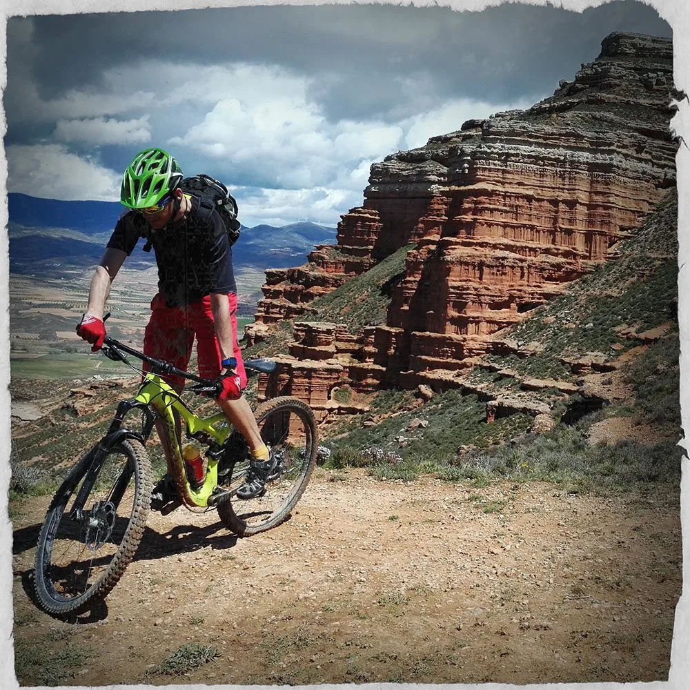

Hací­a mucho tiempo que José hablaba a los globeros de este lugar. Hací­a mucho tiempo que AlbertoEpic la tení­a en su lista de 'pendientes'. Pero también hací­a mucho tiempo que finalmente desechaba la opción frente a otras que no supusieran bajar al sur de Almudévar... ;-)

Este fin de semana se alinearon los astros: época correcta, meteo incierta en el Pirineo pero buena al sur de Zaragoza,... total que ya tenemos a AlbertoEpic enfrentándose a sus prejuicios y partiendo al sur, a la margen derecha del Ebro nada menos, todaví­a más allá, a Calatayud. ¿Colmarí­an sus espectativas las horas de pedaleo por la 'Spanish Utah', de la que tantas maravillas habla la gente en 'intenné'?

A su regreso, AlbertoEpic tení­a claro dos cosas:

- En el aspecto paisají­stico "sí­, vale, hay rincones realmente espectaculares, si sabes abstraerte a veces parece que estés en Utah, pero... estás en Calatayud!". Si sólo vas allí­ pensando encontrar maravillas... tal vez te decepcione. O tal vez no.

- En el aspecto bttero, sin embargo "no será un entorno grandioso, pero si te gusta el pilotaje sin complicaciones con la btt, es brutal. No hay grandes desniveles, pero si tienes buenas piernas puedes pasar horas de mucho flow sin casi tocar una pista, siempre por sendero!"

En internet puedes encontrar varios tracks de itinerarios por esta curiosa zona, a continuación mostramos la ruta de José y AlbertoEpic:
<iframe src="http://www.gpsies.com/mapOnly.do?fileId=osbkoykympmylakg" width="100%" height="400" frameborder="0" marginwidth="0" marginheight="0" scrolling="no"></iframe>

Y a continuación algunas fotos sacadas durante la ruta...

 José pegando un bote...

 Curiosas formaciones...

 El paisaje nos traslada en ocasiones al 'Far West'...

 AlbertoEpic postureando... 'Corre corre, que no aguantaré mucho más!'

En resumen, un lugar, la puerta de atrás de Calatayud, que sin duda te sorprenderá. Tal vez no sea un lugar para ir a menudo, pero si te gusta la BTT, sí­ un lugar para conocer.

