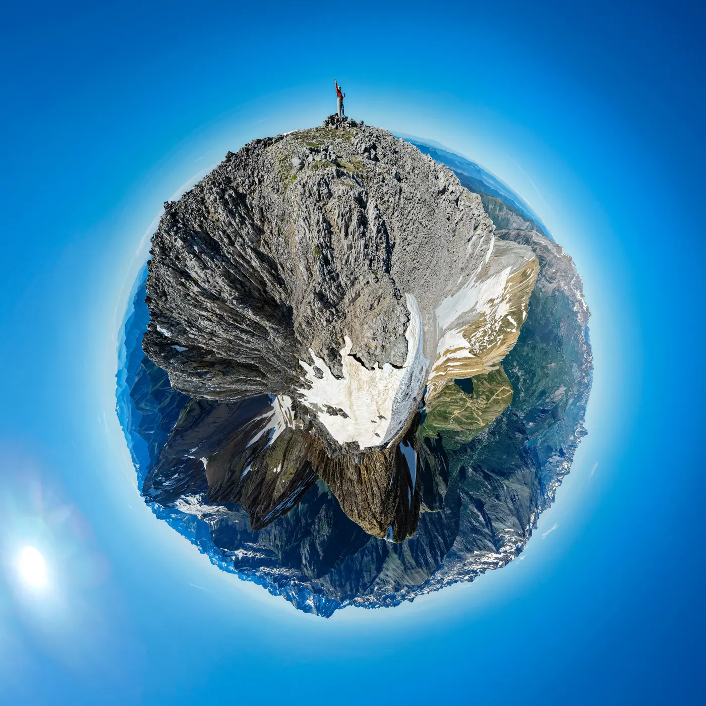
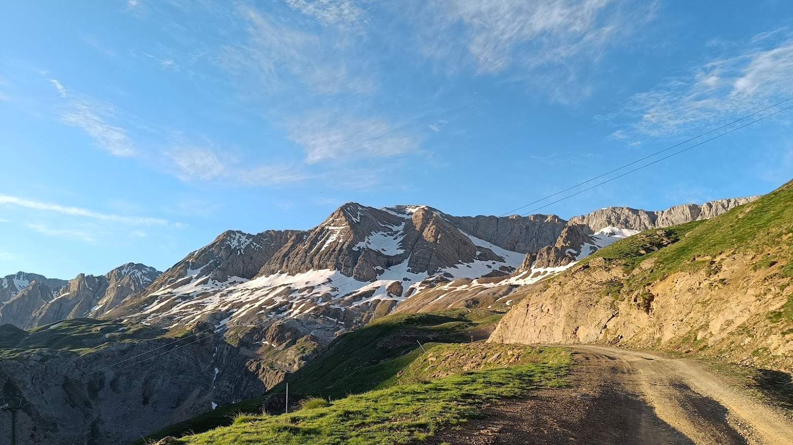
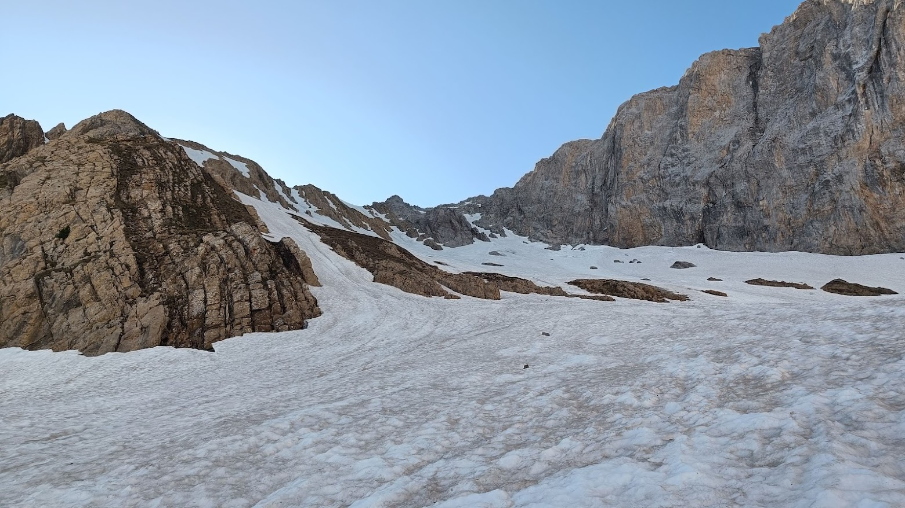
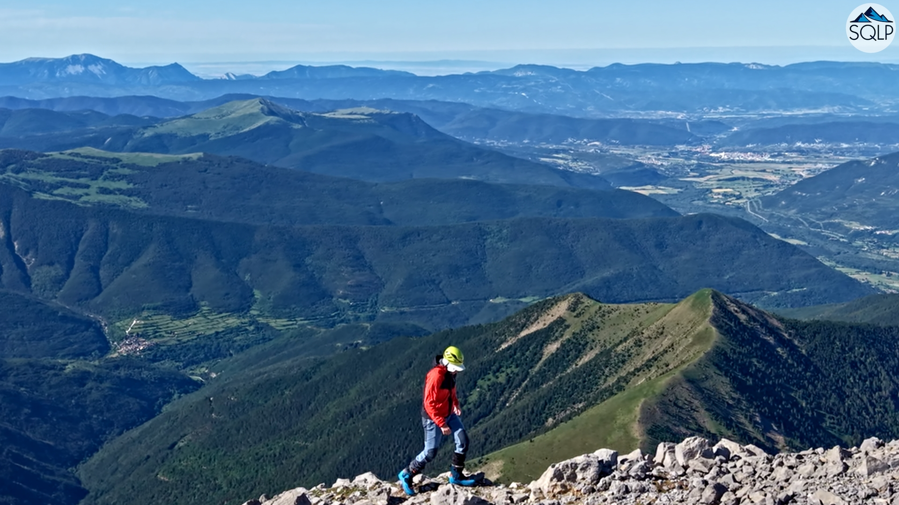

## Un final de temporada extraño
El otro día, nuestro especialista AlbertoEpic decidió poner punto final a la temporada de Skimo. La cota de nieve cada vez más alta implica porteos cada vez más largos, y la meteo hace que cada vez apetezca más cambiar el chip y mirar hacia temas de pedales y barrancos...
Pero bueno, al turrón! Saliendo del ibón de los Asnos (Hasta allí en 4x4 por la pista de Hoz de Jaca, que está algo regulera para coches normales), en escasos 20min de porteo se llega a la nieve para calzar esquís.
AlbertoEpic decide pasar directamente a crampones: la nieve está para cuchillas, y tiene ya la típica superficie de verano, llena de olas, donde va a resultar incómodo foquear. Además, en nada la pendiente será demasiado inclinada.
Así, en un momento se planta en el hombro al final del corredor que da acceso a la cima, donde deja los esquís. Pensaba salir esquiando de la cima, pero ya sólo queda nieve en la 'nevera de Sabocos'...
Hasta la cima queda un paseo, y tiempo para sacar el dron y grabar unas imágenes que Producciones SQLP te ofrece a continuación:

## El Vídeo

Como habrás podido ver en el vídeo, el descenso se realiza sobre nieve todavía muy dura y áspera. Una caída hubiera supuesto terminar con la ropa hecha jirones!!! Habría sido mucho mejor esperar al menos un par de horas antes de bajar para que el sol reblandeciera la nieve, pero AlbertoEpic no disponía de más tiempo...

## El Mini-planeta
Por supuesto nuestro especialista no marchó de la cima sin antes recabar material para seguir con otro de sus últimos caprichos: crear 'mini-planetas' para su nueva web: https://miniplanetas.soloquedalopeor.com/.

Puedes ver el resultado [**haciendo click aquí**](https://miniplanetas.soloquedalopeor.com/planetas/planeta-pe%C3%B1a-sabocos/)

## Las Fotos

Acercándonos en el 4x4 al ibón de los Asnos, el panorama es un tanto desalentador...

Menos mal que tras 20min de porteo, nos metemos en 'la nevera' y la cosa cambia.

Fotograma del vídeo: paseo por la arista cimera, en plan 'robado'...

## El Track
A continuación puedes consultar el mapa con el track de la actividad, el perfil de la ruta,... Y tienes la opción de descargarlo con el botón '**Descargar GPX**'