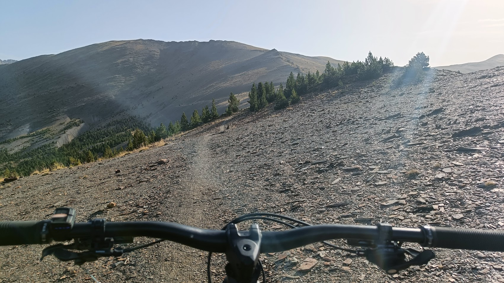
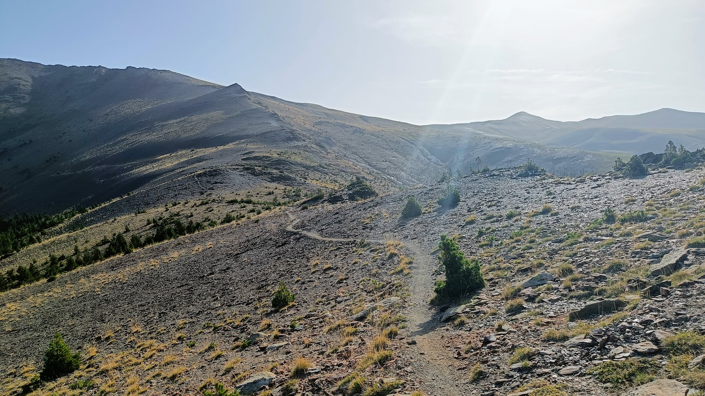
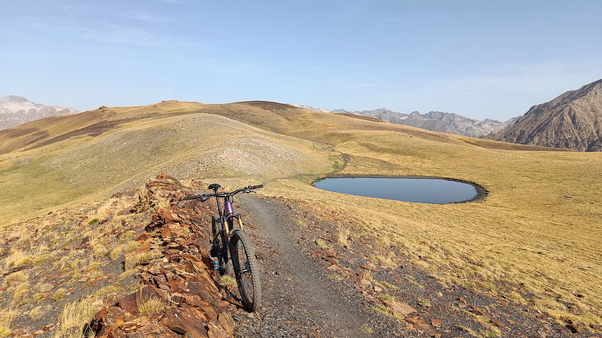
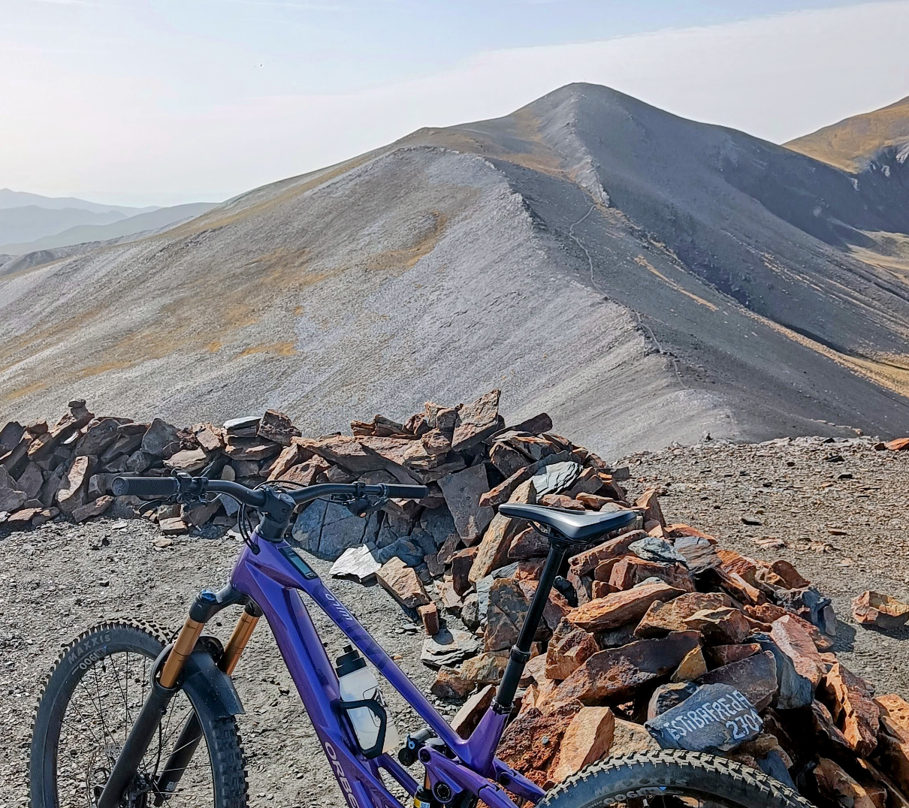
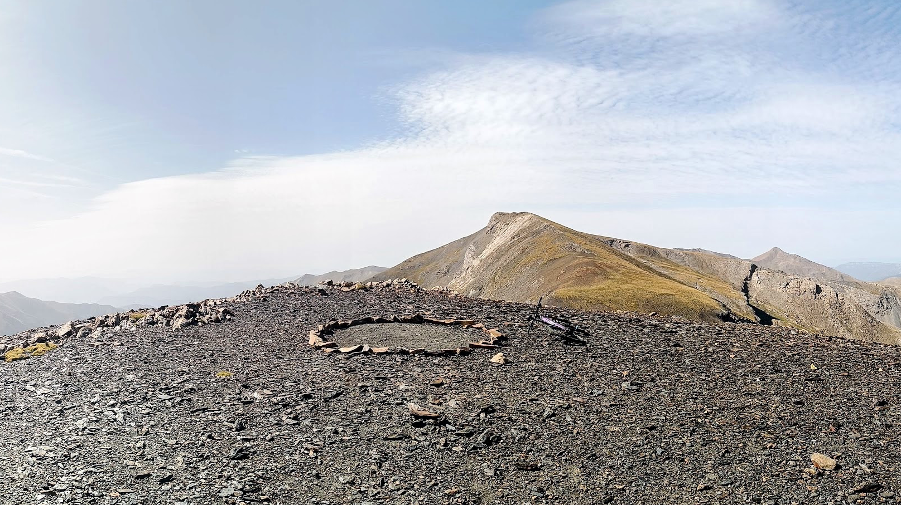
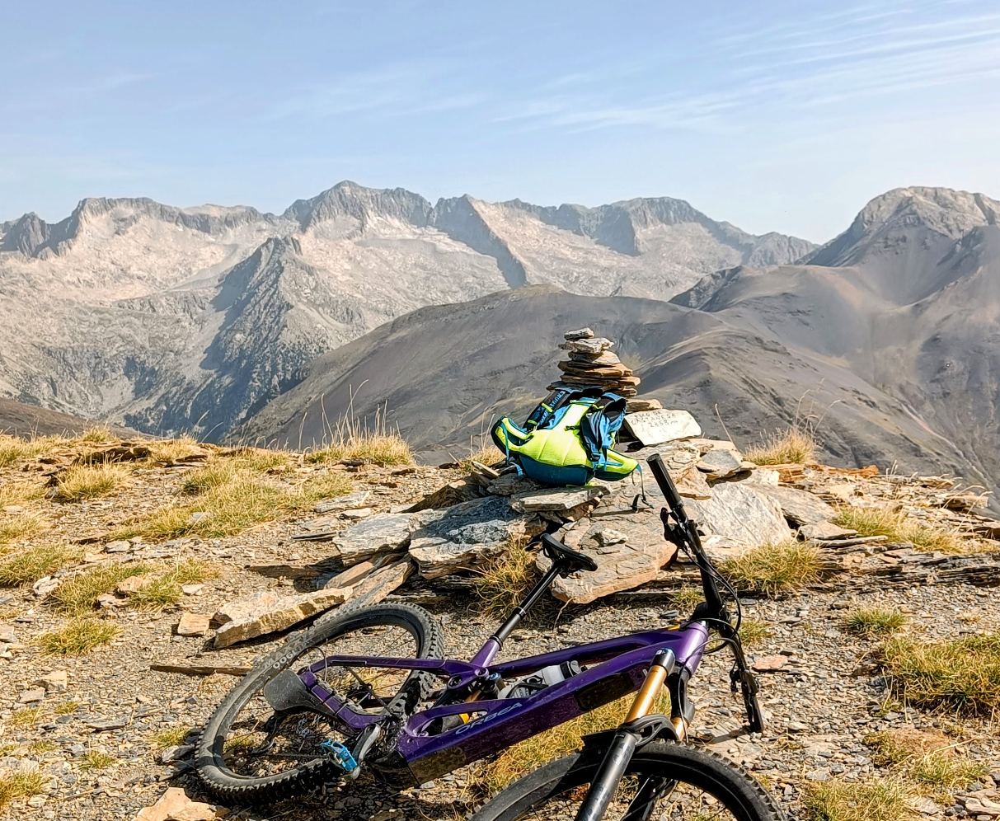
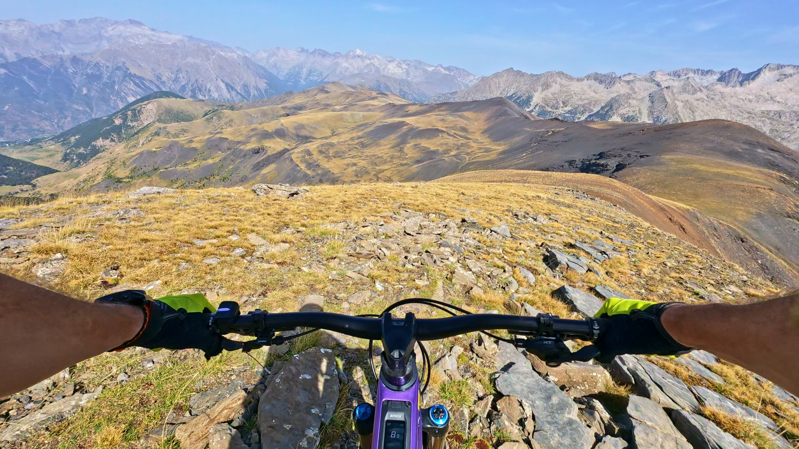

## Acumulando experiencia...
El pasado sábado AlbertoEpic madruga en Benasque y se escapa a quemar la batería de su nueva e-bike. Sigue buscando establecer los límites de la autonomía del nuevo conjunto 'hombre - máquina', 'vitalidad - autonomía', 'fracaso multiorgánico - 0% de batería'... Te dejamos con unas líneas de su relato:

## AlbertoEpic dixit:
> Como todavía no me hago a la idea del consumo de batería de esta bici, decido salir de Cerler, por el sendero de la cascada de Ardonés. La idea es simplemente divertirme por Sierra Negra, a ver qué se puede hacer...
> Paso por la cabaña de Ardonés y continúo hasta Picalvo. De allí, por sendero, asciendo sucesivamente a la Tuca Royero, el Estibafreda y la Tuca de Roques Trencades, donde se plantea la diatriba: originalmente la idea era seguir por la Tuca Arnau, pero... la batería empieza a escasear, y tengo otro nuevo antojo: el pico Castanesa me llama! Con BTT 'acústica' supondría un porteo desde el collado, lo cual no apetece; pero con BTT 'eléctrica' es otra cosa, con la asistencia, un poco de fuerza bruta y técnica es factible subir pedaleando.
> Así llego al punto culminante de la ruta de hoy. Desde aquí se me ocurren unas cuantas combinaciones más para futuras rutas. No me apetece apurar más la batería, después de la experiencia en [Oturia x2: crónica de una paliza anunciada...](oturia-x2-crónica-de-una-paliza-anunciada.md).
> Por el momento, establezco mi límite razonable en rutas de 50km/2.000m+
> Seguiremos experimentando...

## El Vídeo
A continuación puedes ver un vídeo con el itinerario de la ruta en 3D acompañado de las imágenes en primera persona del descenso desde el Castanesa. Por falta de tiempo para editar un vídeo mejor, hemos decidido dejar las imágenes de la cámara de acción de AlbertoEpic en RAW, tal cual. Perdón por el tostón de vídeo! ;-p

## Las Fotos

En la subida, pasado Picalvo, la cosa empieza a ponerse interesante...

El sendero sube hasta el cordal de Sierra Negra y lo recorre hacia la derecha para pasar por la Tuca Royero y el Estibafreda.

Un 'posado' con la Basete de Ardonés, en la Collada d'Ardonés.

La Tuca de Roques Trencades desde el Estibafreda.

Desde la Tuca de Roques Trencades, el Castanesa me llama... (Al fondo a la derecha, el Gallinero, Cerler)

En la cima del Castanesa. Punto culminante de la ruta de hoy. Al fondo, macizo de las Maladetas, con el Aneto. Todos los glaciares de esta vertiente (Coronas, Tempestades,...) ya son historia :-(

En el comienzo del descenso, puede verse todo el itinerario por Sierra Negra hasta Picalvo, Ardonés y Cerler.

## El Track
Si te ha gustado la ruta, puedes verla en el mapa y descargarte el track a continuación: