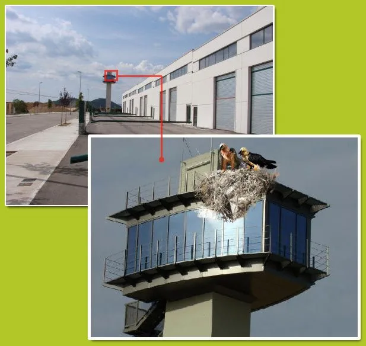

Ultimas noticias del [quebrantahuesos de Peña Rueba](http://caracolesmajaras.blogspot.com/2010/12/la-dga-cierra-pena-rueba.html): finalmente, en el sorteo del programa de nidos toctoc, al quebrantahuesos  le ha tocado un nido en el polí­gono de Ayerbe. En la imagen podemos ver a la feliz pareja tomando posesión de su nuevo nido de protección oficial tras la entrega de llaves, digo de huesos.

Estas fueron las primeras declaraciones de ella: "os dejo, que tengo que poner un huevo".

Debido a ello, todas las empresas establecidas en el polí­gono serán desalojadas en el plazo de una semana.

[La feliz pareja en su nido de protección oficial, todo exterior con mucha luz...

