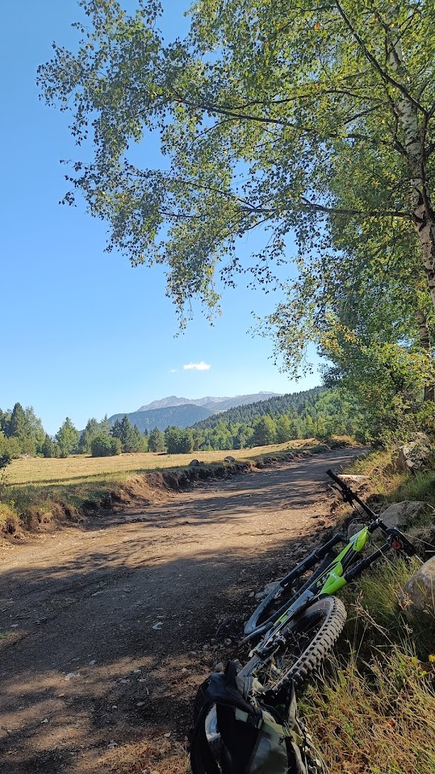
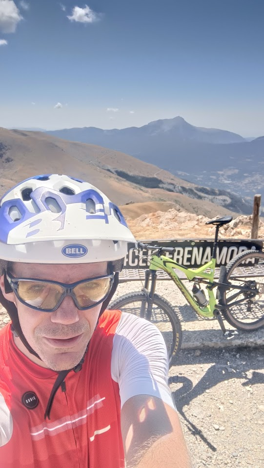
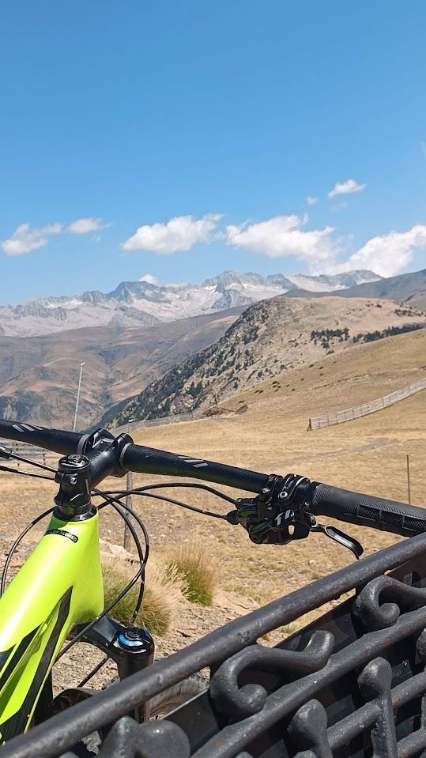
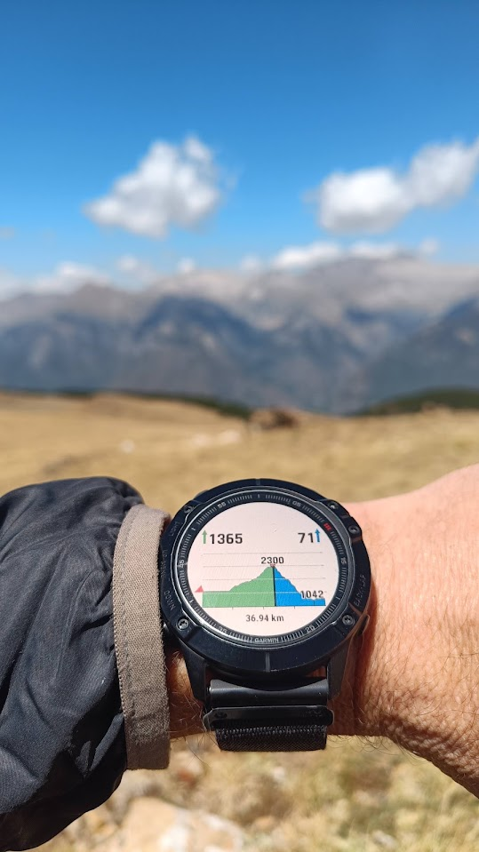
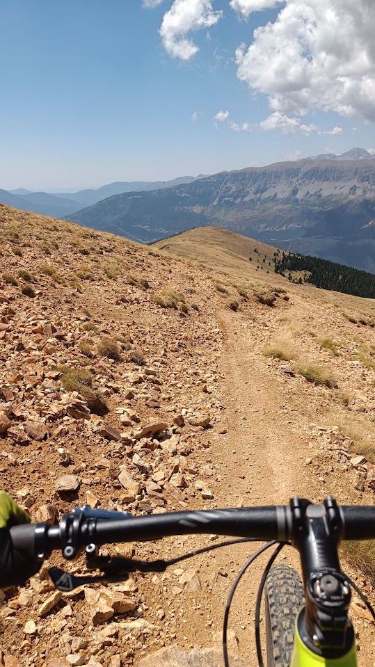
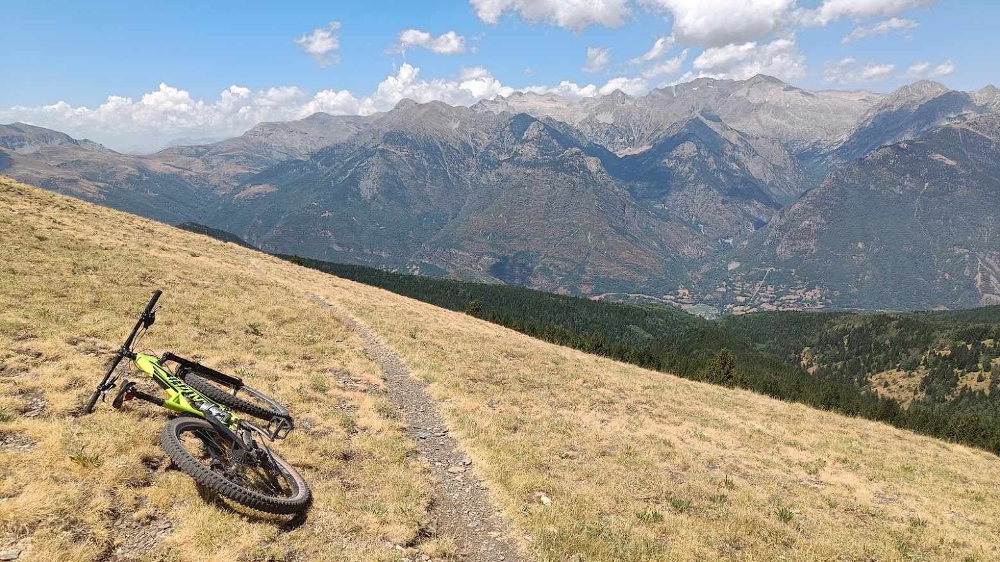
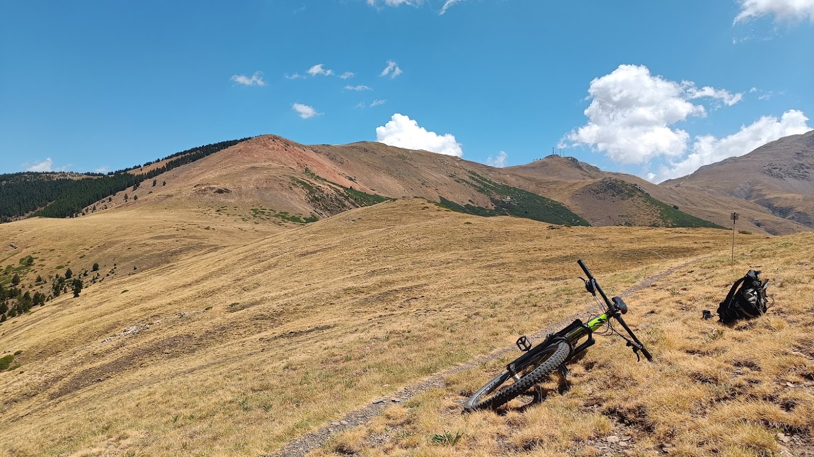

## Benasque + verano + BTT: por fin!

Primera escapada del equipo SQLP a Benasque este verano, y AlbertoEpic echó la btt a la furgo, para intentar recuperar esa forma que perdió en algún desafortunado momento... ¿Dónde estará? ;-p
Tras echar un repaso a las rutas de [Puro Pirineo](https://bttpuropirineo.com/rutas-puro-pirineo/rincon-del-cielo-by-aramon-cerler/), la elegida será esta, la PP30, que pinta bien: una subida 'larga pero dura', y una bajada sin demasiado compromiso para poder ir tranquilo en solitario.

---
## Según Gémini, de Google:
> La **Ruta 30 (PP30) - Rincón del Cielo** es una de las rutas de mountain bike (BTT/Enduro) más espectaculares y exigentes del centro de BTT Puro Pirineo, ubicada en el Valle de Benasque, Huesca. 
> 
>Ficha Técnica de la Ruta:
>-  **Dificultad física**: Alta
>-  **Dificultad técnica**: Media
>-  **Desnivel de bajada**: **1.350 metros**, consolidándose como el mayor descenso continuo de todo Puro Pirineo.
>-  **Tipo de ruta**: Circular, combinando pistas de ascenso y senderos de bajada ciclables al 100%.
---

## Las fotos
Dado el deplorable estado de forma de AlbertoEpic, decidió prescindir de todos sus gadgets! Esta vez ni cámara, ni dron, ni miniplaneta,... Había que aligerar peso para una ruta de cerca de 1.500m+
Así que aquí tienes unas tristes fotos que sacó con el móvil:

## El track

A continuación tienes el track de la ruta seguida por nuestro especialista. En la web de Puro Pirineo puedes descargarte el track original desde Sesué.
