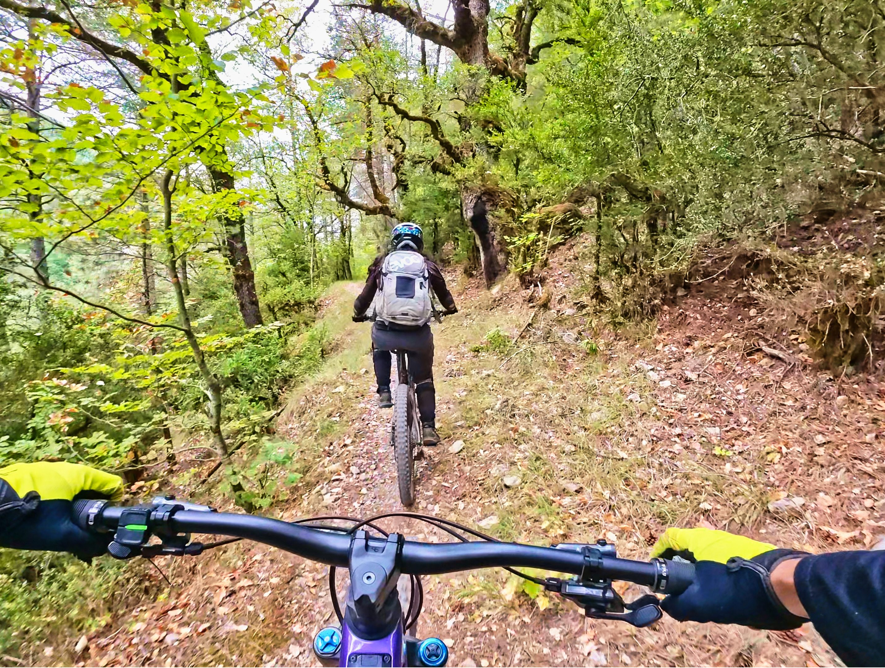
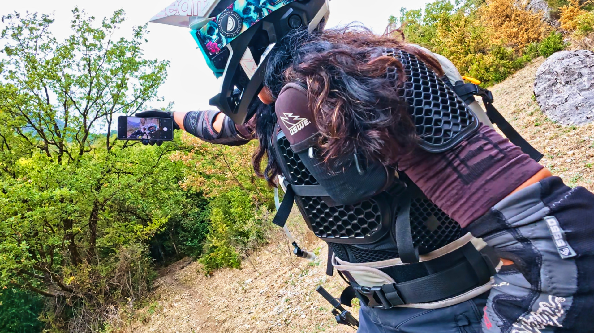
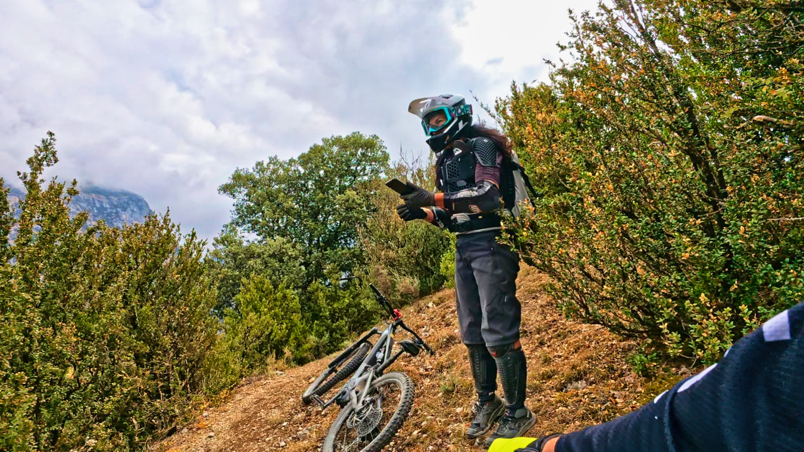
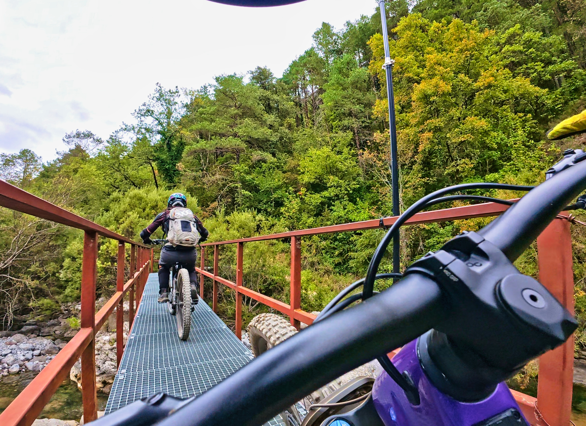
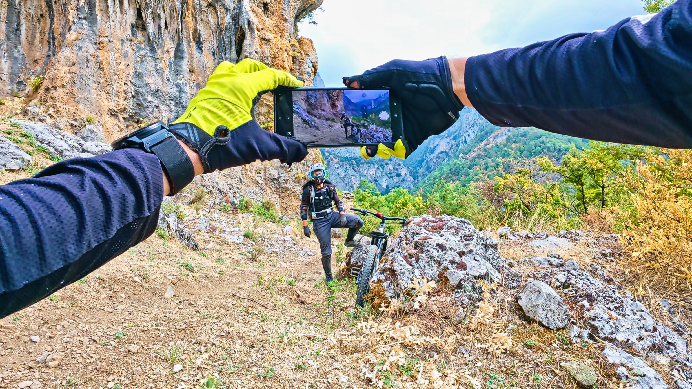
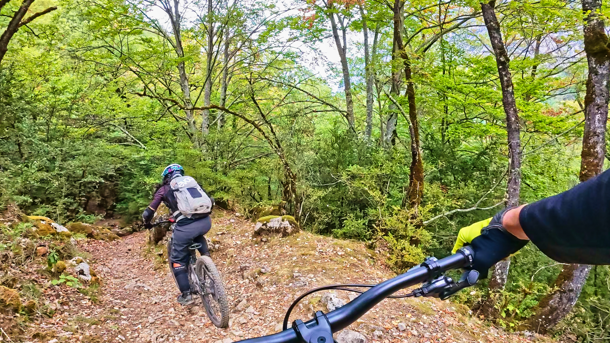
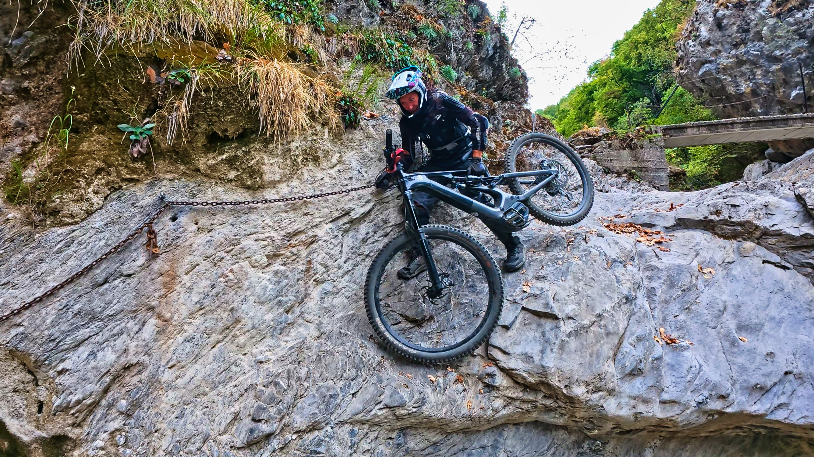
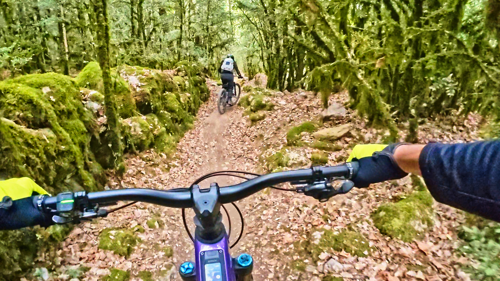

## Intro
La aventura de hoy comienza con AlbertoEpic conduciendo hasta Laspuña, en plena Zona Zero Pirineos, para conocer por fin la ruta Trending Topic del momento: ZZ-067, El Último Onso. Es peligroso crearse expectativas, pero... Con todo lo que cuentan, no hay quien se resista a conocerla!

## El Vídeo
Afortunadamente, la fama era merecida y la vuelta resulta muy chula! Puedes ver el videoreportaje a continuación:

Y por si fuera poco con la calidad de la ruta, además contó con un valor añadido: lo hizo en la inesperada compañía de la especialista Ana (Que baja como una 'instalación'). 

Al finalizar la ruta, de vuelta en Laspuña, le sobraba la mitad de la batería: "¿Cómo voy a volver a casa así?" No tuvo más remedio que aprovechar ese remanente de energía y subirse en un momento a la Collada para divertirse en la bajada de la ZZ-066 Laspuña EWS 2018... Esta vez con el material mínimo, sin fotos ni vídeos!

Definitivamente, esto de las bicis a pilas es otro deporte :-)

## Las Fotos

Algunas fotos de la ruta El Último Onso:

## El Track
Si te ha gustado y quieres seguir los pasos de nuestro especialista, a continuación tienes el track:
