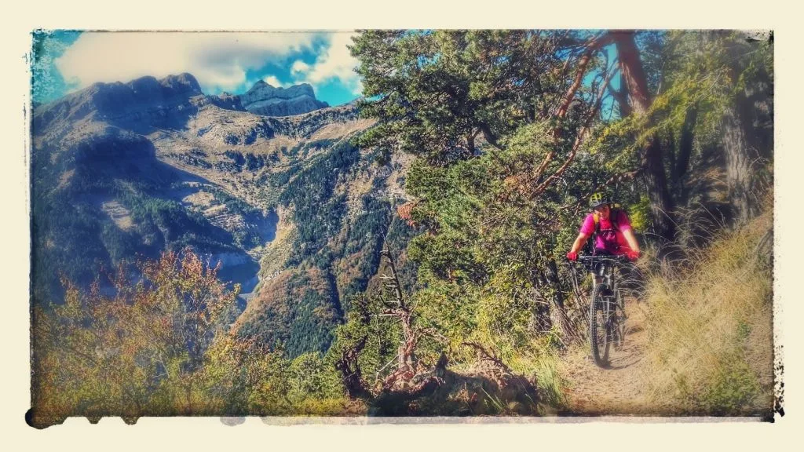

El otro dí­a Luzia y AlbertoEpic gozaron de un permiso paterno perfecto para hacer una incursión rápida en los senderos de Canfranc con sus btt's...
Les habrí­a gustado subir hasta el Carretón de Ip y de allí­ al embalse del mismo nombre, pero el tiempo es limitado y no dio para más. A 150m del Carretón de Ip todaba darse la vuelta.

A continuación puedes ver el track de la ruta. Lo hemos editado para eliminar la parte superior del camino recorrido hacia el Carretón de Ip, de un carácter mucho más severo, y mostramos así­ únicamente la parte más amable y disfrutona de la ruta.

La subida comienza por pista, y luego sigue por un sendero en perfecto estado que va haciendo lazadas por el bosque. Se sube sin problemas las medias laderas, pero cada curva nos presenta un buen reto técnico, la dificultad va aumentando con la altura y la pendiente...
En el descenso te sacas el graduado de Técnico Superior en Curvas de 180 ;-p
<iframe src="http://www.gpsies.com/mapOnly.do?fileId=lxansonptarqqitp" width="100%" height="500" frameborder="0" marginwidth="0" marginheight="0" scrolling="no"></iframe>

