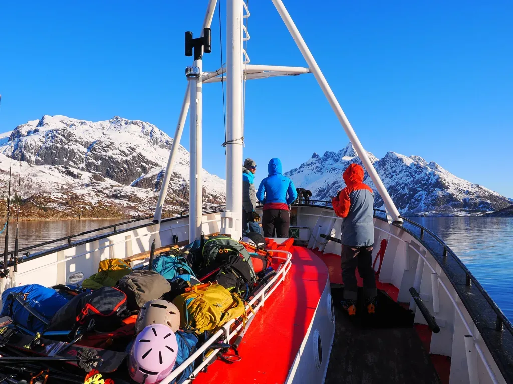
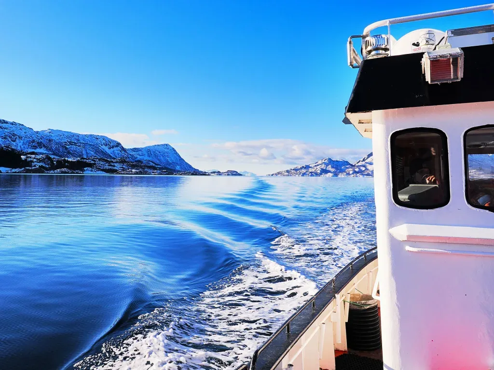
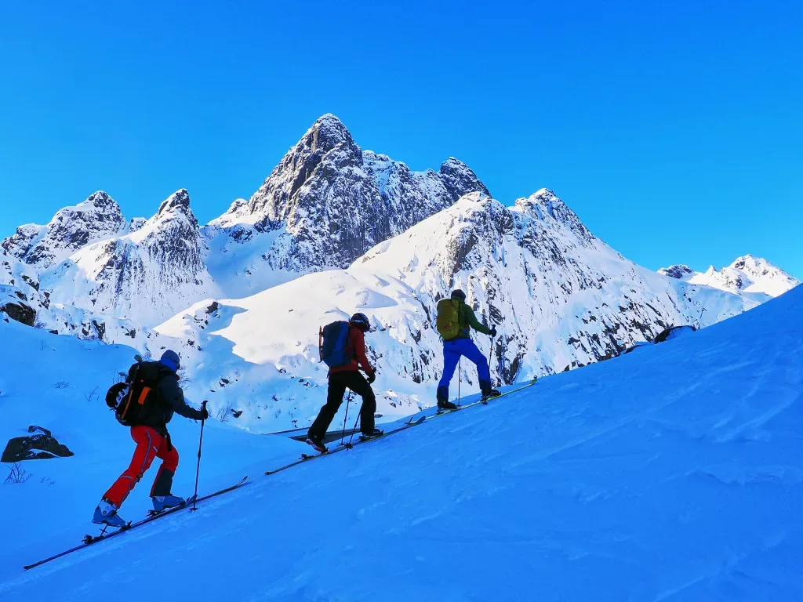
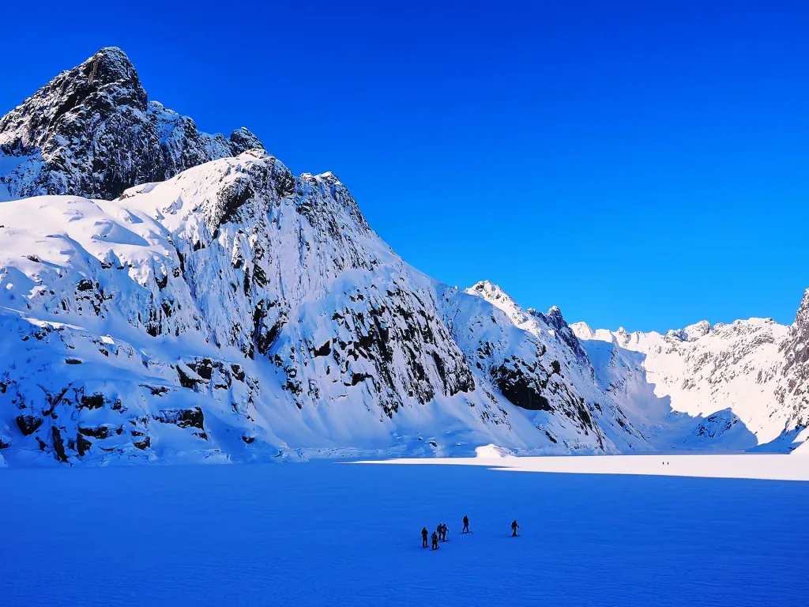
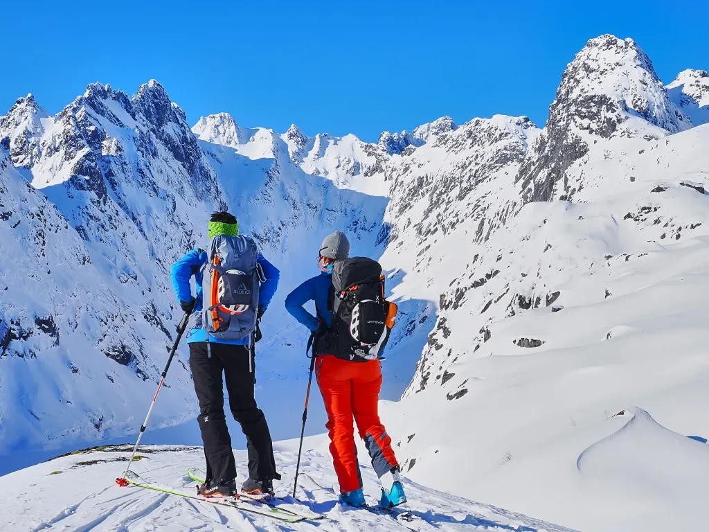
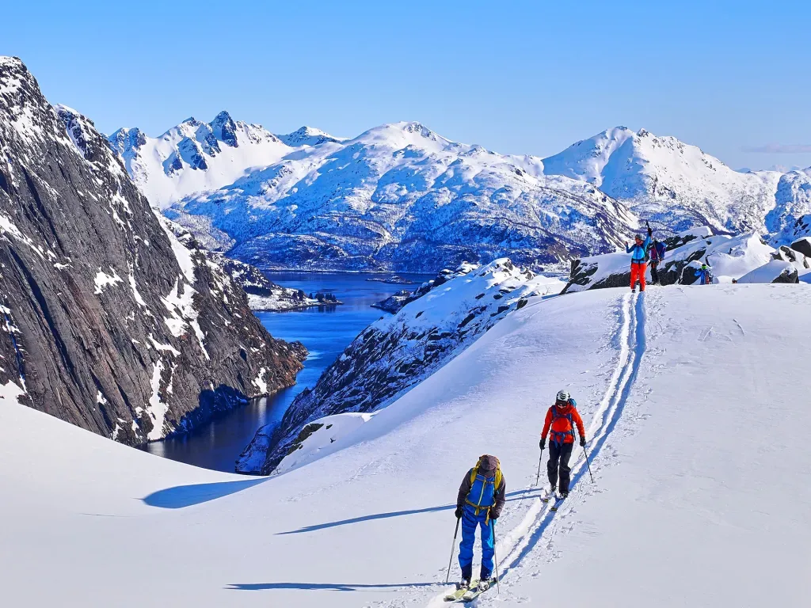

El tercer dí­a la meteo mejora y todo empieza a ser espectacular. Las tarjetas de memoria van que echan humo, acumulando material gráfico para varios meses... De nuevo AlbertoEpic sale con todo: cámara y dron. El peso extra es lo de menos.

La ruta de hoy comienza en el fiordo del Troll, Trollfjord, que sólo es accesible por mar. Nuestros especialistas suben a un barco en el puerto de Svolvaer que les llevará al punto de partida de la ruta. En este caso no buscan ninguna cima concreta, simplemente hacer un recorrido circular a modo de exploración de la zona.

## El Track

<iframe class="alltrails" src="https://www.alltrails.com/es/widget/map/map-7ef605f-10?scrollZoom=ó&u=m&sh=w4k06q" width="100%" height="400" frameborder="0" scrolling="no" marginheight="0" marginwidth="0" title="AllTrails: Trail Guides and Maps for Hiking, Camping, and Running"></iframe>

El principal aliciente del dí­a es calcular bien el tiempo de la ruta:
- Si llegas demasiado pronto al barco de regreso, allí­ no hay nada que distraiga la espera, y te tocará pasar frí­o a la sombra esperando.
- Si llegas más tarde de la hora estipulada... no estamos seguros de si el barco se habrá ido o si te caerá una monumental bronca del capitán vikingo...

## Vídeos desde el dron

Uno de los momentazos del dí­a fue cruzar por encima del lago helado y despegar el dron para jugar con las sombras que produce el sol del mediodí­a en estas latitudes... Puedes verlo en el Reel a continuación:

 [Ver esta publicación en Instagram](https://www.instagram.com/reel/C5oQUibAJ4f/?utm_source=ig_embed&utm_campaign=loading)[Una publicación compartida de @albertroid](https://www.instagram.com/reel/C5oQUibAJ4f/?utm_source=ig_embed&utm_campaign=loading) 

Y como era un dí­a muy 'escénico', en SQLP hemos preparado otro Reel para sintetizar el dí­a en un minuto:

 [Ver esta publicación en Instagram](https://www.instagram.com/reel/C6yC60yAAPQ/?utm_source=ig_embed&utm_campaign=loading)[Una publicación compartida de @albertroid](https://www.instagram.com/reel/C6yC60yAAPQ/?utm_source=ig_embed&utm_campaign=loading) 

## Las Fotos

*Por la mañana, en el barco hacia el Trollfjord.*

*Y volviendo la vista atrás.*

*La primera parte de la ruta es a la sombra, hace una mañana heladora!*

*Sobre el embalse helado de Trollfjordvatnet. Todos a buscar el sol por fin!*

*Aquí­ encontramos un buen 'photocall'...*

*Disfrutando por la loma, al solecito... pero siempre bajo cero! Al pie de las paredes de roca, el fiordo del Troll.*

---

Puedes volver al í­ndice general [haciendo click aquí­](skimo-en-las-lofoten/).

