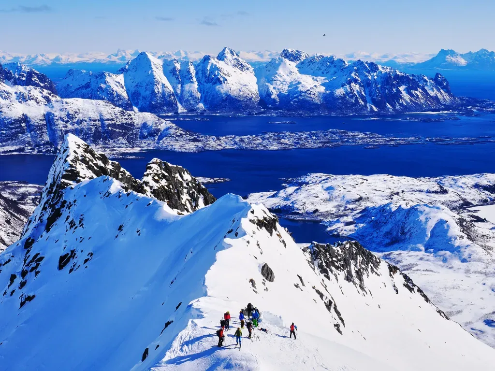
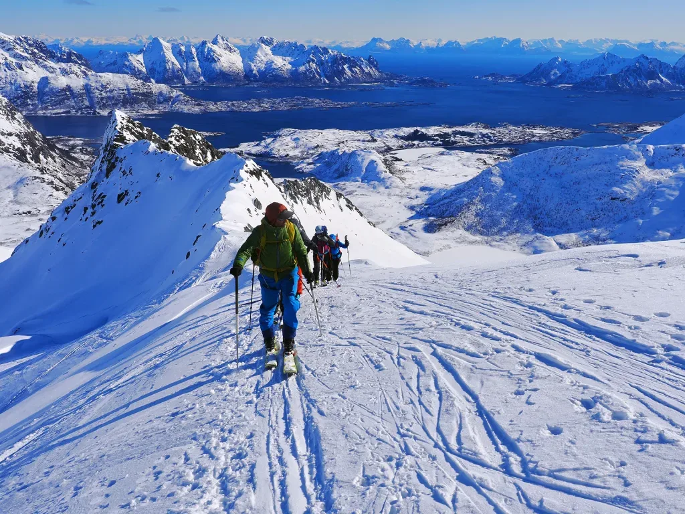

Esto no hace nada más que mejorar dí­a tras dí­a... El quinto dí­a de actividad en las Lofoten nos sorprende con la mejor meteo hasta la fecha. Frí­o, para que la nieve esté perfecta todo el dí­a, y por fin un dí­a totalmente despejado y con un viento razonablemente 'menos fuerte' como para poder volar el dron!

<iframe class="alltrails" src="https://www.alltrails.com/es/widget/map/map-26751be-9?scrollZoom=ó&u=m&sh=w4k06q" width="100%" height="400" frameborder="0" scrolling="no" marginheight="0" marginwidth="0" title="AllTrails: Trail Guides and Maps for Hiking, Camping, and Running"></iframe>

De esta manera, nuestro especialista pudo recrearse con las fotos a la subida, y adelantarse en el último tramo para esperar al grupo en la cima con el dron en el aire. Además, le dio tiempo a sacar una foto esférica que ha sido debidamente procesada por el equipo Pano360 de SQLP para ofrecerte este [panorama esférico con las cimas etiquetadas](https://pano360.soloquedalopeor.com/panorama/rundjfellet-803m-islas-lofoten-noruega/).

*Hoy sí­ que sí­, meteo perfecta!*

*Uno no puede permanecer impasible ante semejantes paisajes...*

*China-chana...*

*Tras un rato de sólo ver nieve en una vaguada, salimos a una arista y... buaaaaalaaaa!*

*Resulta que avanzamos por unos montes rodeados de 'charcos' por todas partes...*

*Otro buen 'photocall', de camino al collado final.*

*Esperando en la cima es el momento para una foto-homenaje al 'Albertdrón'...*

*Pisoteando bien el área de la cima, para que se note que hemos estado.*

---

Puedes volver al í­ndice general [haciendo click aquí­](SKIMO-en-las-LOFOTEN).

