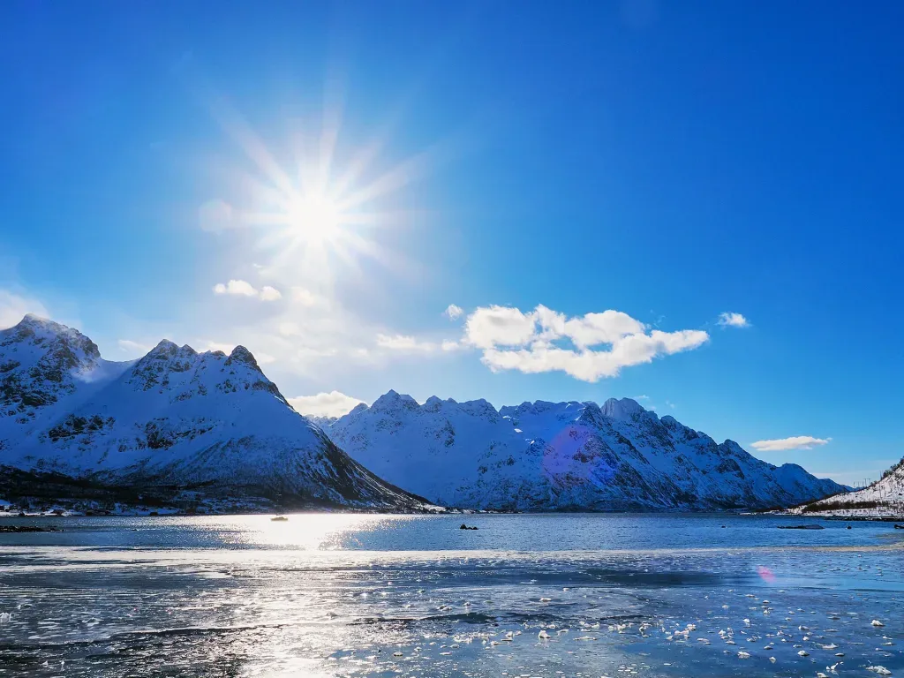
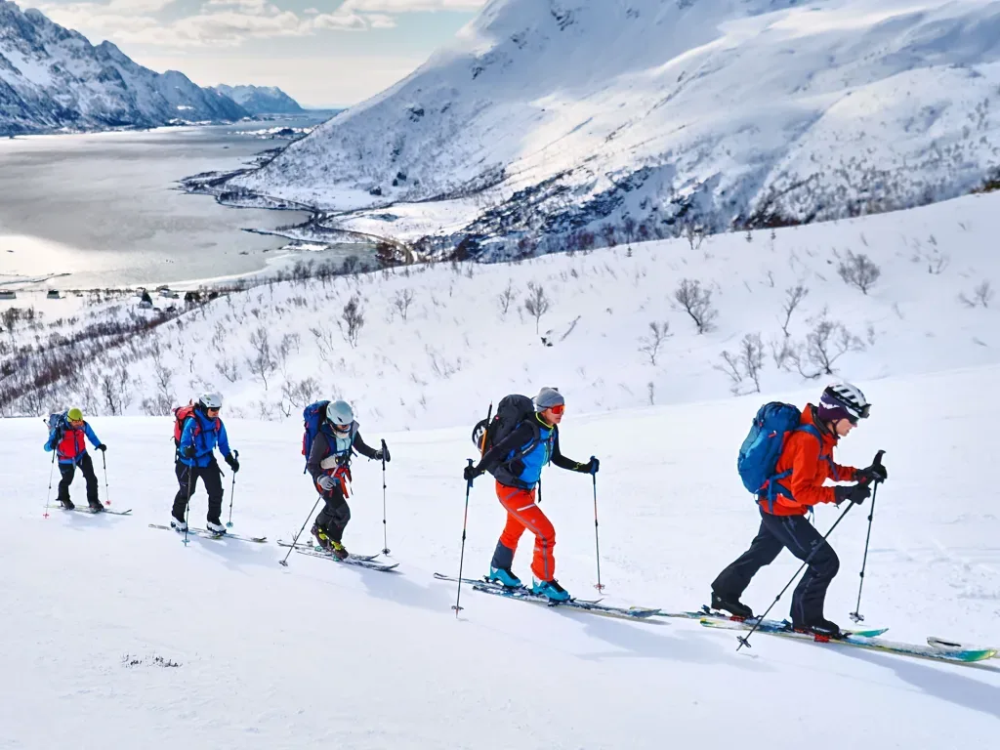
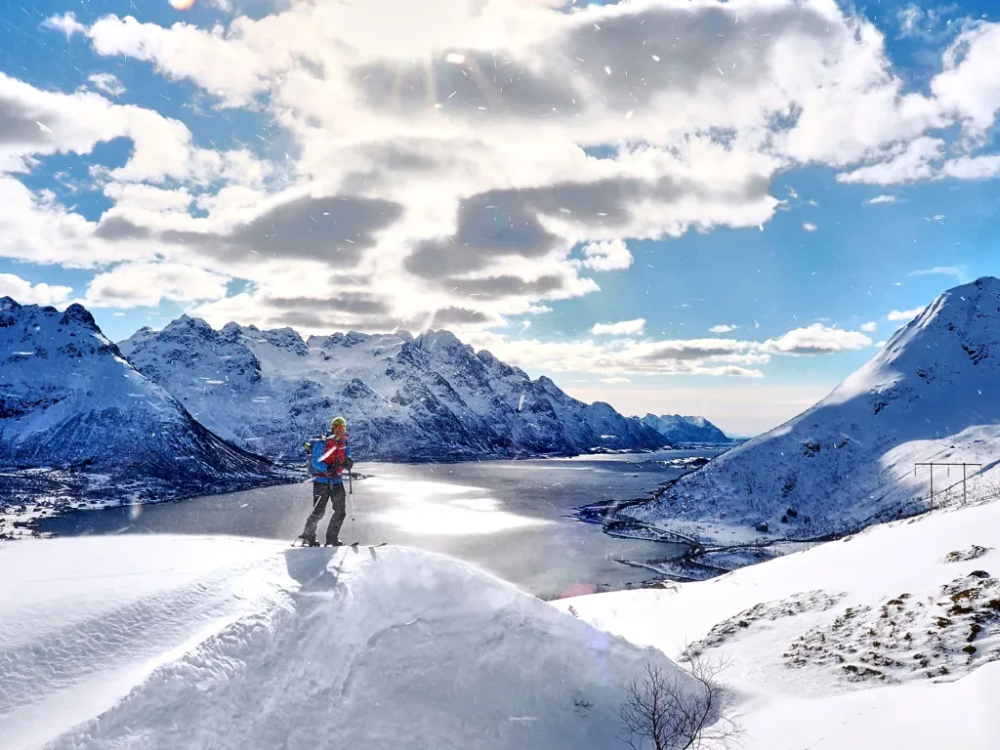
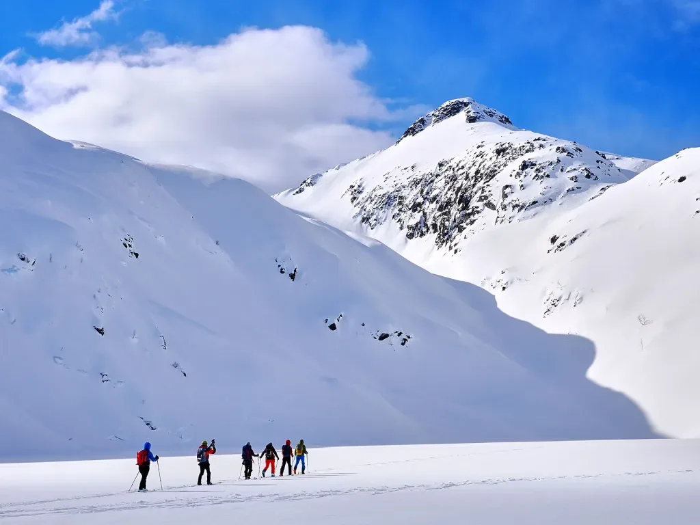
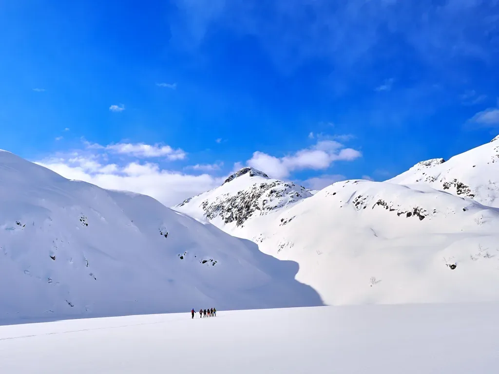
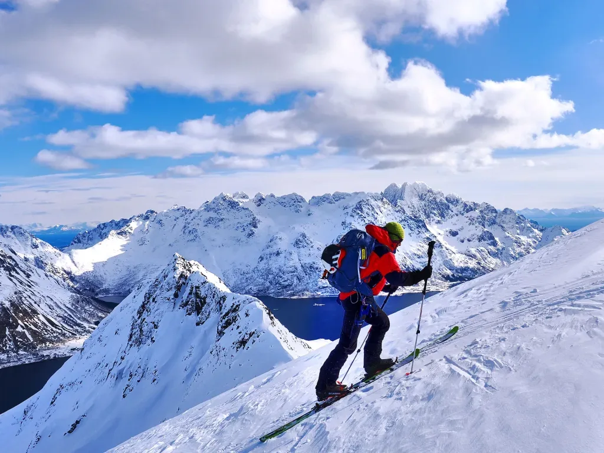

Esta es nuestra última actividad en Noruega. Mañana toca avión y para casa. El grupo se deja llevar, y lleno de espí­ritu explorador, decide dejar la ascensión prevista e improvisar una ruta circular en busca de unas buenas palas de bajada (En realidad, en este lugar y en estos dí­as, la bajada siempre es espectacular en cualquier orientación y a cualquier hora!)

<iframe class="alltrails" src="https://www.alltrails.com/es/widget/map/map-ff450ba-11?scrollZoom=ó&u=m&sh=w4k06q" width="100%" height="400" frameborder="0" scrolling="no" marginheight="0" marginwidth="0" title="AllTrails: Trail Guides and Maps for Hiking, Camping, and Running"></iframe>

Un dí­a más, buenas condiciones para fotos y drone, el pobre AlbertoEpic va sobrepasado por los acontecimientos... Ascienden al Store Kvittind, desde donde se aprovecha para sacar una nueva foto esférica desde el dron. Como siempre, procesada debidamente por [Pano360](https://pano360.soloquedalopeor.com/) para obtener esta [foto esférica con cimas etiquetadas](https://pano360.soloquedalopeor.com/panorama/store-kvittind-696m-islas-lofoten-noruega/).

*Desde el borde de la carretera, en el lugar donde comenzamos hoy.*

*Nosotros a lo nuestro, ignorando nubes, ventisca, y demás meteoros pasajeros...*

*Otro de los muchos 'photocalls' del viaje.*

*Se van alternando planos (Lagos helados) con pequeños repechos, todaví­a con vegetación en la parte baja.*

*Un dí­a más, la calidad de la nieve es excepcional!*

*El cruce de este lago helado resultó estar más resguardado y la ventisca nos dio una pequeña tregua.*

*La ruta continúa más o menos siguiendo la lí­nea sol-sombra...*

*En el tramo final de ascenso al collado. Ganando los últimos metros de desnivel+ en este viaje...*

---

Puedes volver al í­ndice general [haciendo click aquí­](skimo-en-las-lofoten/).

