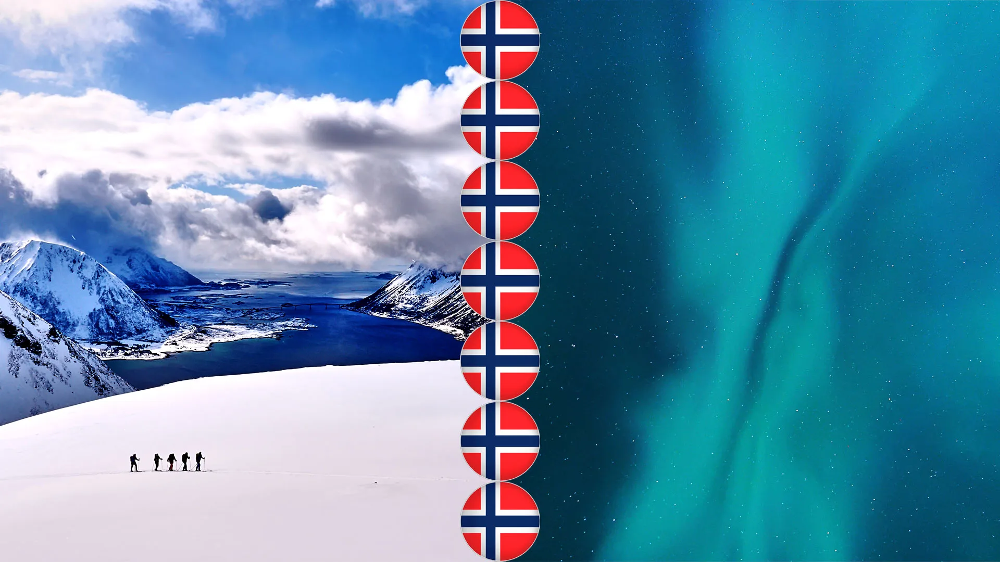
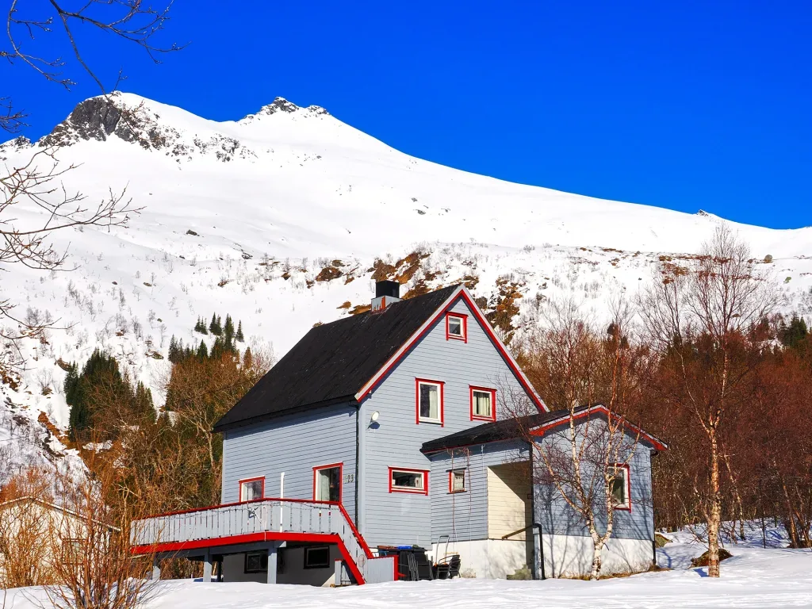
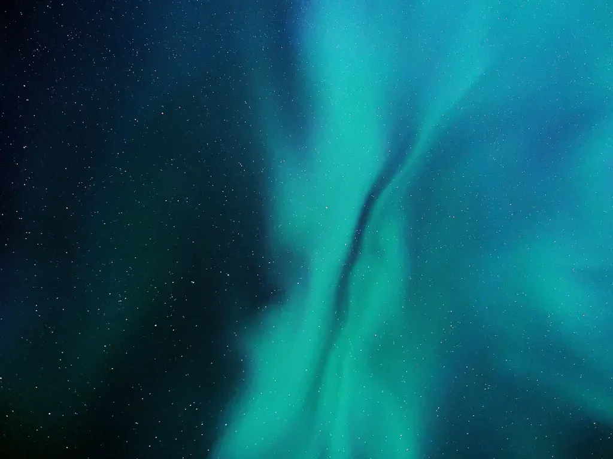
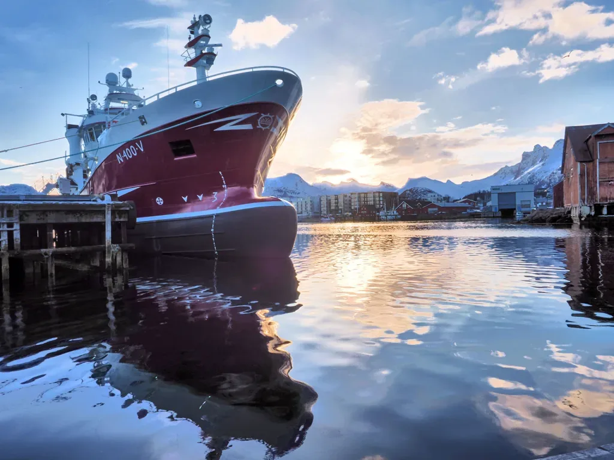

## SkiLof24

Con esta entrada pretendemos unificar una serie de información acerca del viaje de nuestro especialista AlbertoEpic a Noruega, a las islas Lofoten, para salvar la temporada de skimo. Comenzamos con su escalofriante testimonio:

"La temporada de esquí­ de travesí­a '23-'24 hasta mediados de febrero estaba siendo un auténtico fracaso. Directamente, no habí­a nieve. Así­ que cuando mi amiga Almu me llamó y me tentó para unirme a un viaje de skimo en las Lofoten para las vacaciones de Semana Santa... No pude negarme a semejante proposición indecente!

Era un plan más turí­stico que deportivo, lo cual me permitirí­a moverme sin agobios con todos mis gadgets a cuestas, a pesar de encontrarme entonces en un estado de forma deplorable debido a mi cuasi nulo rodaje a falta de 2 meses para el viaje. Era, sin lugar a dudas, una situación 'win-win', a pesar de que no conocí­a al resto de los integrantes del viaje.

Como habí­a predicho Almu, era un grupo de gente encantadora y la convivencia no pudo haber sido más fácil. Fue, en definitiva, un exitazo de viaje en todos los sentidos!" :-)
AlbertoEpic

## El vídeo
Y bueno, tras sus palabras, aquí­ va un ví­deo resumen de la semana, con imágenes del dron y la cámara:

<iframe width="560" height="315" src="https://www.youtube.com/embed/1A2mVnLzIYE" title="YouTube video" frameborder="0" allow="accelerometer; autoplay; clipboard-write; encrypted-media; gyroscope; picture-in-picture" allowfullscreen></iframe>

## El índice
A continuación detallamos brevemente las actividades, dí­a a dí­a. En una serie que vamos a llamar 'SkiLof' (Skimo en las Lofoten):

- [SkiLof 1 - Varden (700m)](skilof-1-varden-700m/)
- [skilof-1-varden-700m](skilof-1-varden-700m.md)

- [SkiLof 2 - Torksmannen (755m)](skilof-2-torksmannen-755m/)
- [SkiLof 2 - Torksmannen (755m)](posts/skilof-2-torksmannen-755m.md)

- [SkiLof 3 - Paseo desde el Trollfjord](skilof-3-un-garbeo-desde-el-trollfjord/)

- [SkiLof 4 - Svarttinden (736m)](skilof-4-svarttinden-736m/)

- [SkiLof 5 - Rundfjellet (803m)](skilof-5-rundfjellet-803m/)

- [SkiLof 6 - Store Kvittind (696m)](skilof-6-store-kvittind-696m/)

## Las fotos

*Allí­ lo más normal son las casas de madera. A saber qué tipo de barnices utilizan para que eso aguante...*

*Hay que contar que, si el cielo está despejado, las auroras boreales te van a quitar horas de sueño...*

*Svolvaer, con el Fløya, o también Flaøyfjellet (590m) detrás. Esperando la aurora boreal...*

*La iglesia de Vagan, construí­da en madera, y conocida como la catedral de Lofoten.*

*Pesquero en el puerto de Svolvaer.*

*A esas latitudes, los atardeceres duran varias horas...*

*Unos eslabones de cadena sobre la nieve, en el puerto de Svolvaer.*

