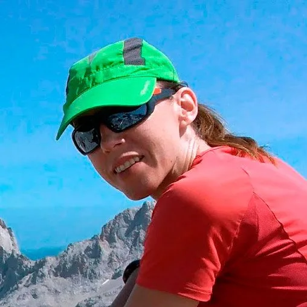

## Y qué bien cuando todo sale bien...

Cheles, jR y AlbertoEpic hicieron coincidir sus coordenadas espacio-temporales para hacer algo de esquí de travesía este pasado domingo. Tener lugares más cercanos con nieve hace que la decisión de ir hasta la boca norte del túnel de Bielsa sea más difícil de tomar... pero bueno, es sabido que la pereza es uno de nuestros peores enemigos!

Así que la decisión estaba tomada: el pico Bataillence era el elegido. Un clásico de la zona, con el objetivo sin más pretensiones que pasar un buen rato... y claro, conseguir una nueva [foto esférica para nuestra sección](https://soloquedalopeor.com/panosphere/)! :-)
"Imaginaba el tramo inicial mucho peor, pero al final con las cuchillas no ha habido ningún problema, dan mucha seguridad"

Cheles
Equipo SQLP

Cheles y jR progresando por fin al sol, tras superar la parte inicial de la ruta, más comprometida, bordeando el barranco.

Dejan a la derecha el camino hacia el puerto de Bielsa, y hacen un flanqueo hacia el E para situarse bajo el pico.

Luego toca retomar rumbo N y ascender hasta el cordal. Esta última pala era casi como estar en una estación de esquí...

En el cordal, con el pie derecho en España 'et le pied gauche en France' ya solo faltan unos minutos hasta la cima...

jR, Cheles y AlbertoEpic en la cima del pico Bataillance, con el valle de Bielsa detrás.
"Esta ha sido la ascensión más agradable, relajada y sin imprevistos de la temporada. Todo está saliendo bien!"

AlbertoEpic
Superhéroe de todo a 100
En general, puede decirse que el día fue perfecto. Buena meteo, buena compañía y buena nieve. Con los esquís puestos de coche a coche. Si la cosa no cambia y nieva más, probablemente este haya sido el último finde de la temporada en el que se ha podido, pues ya asomaban hierba y piedras entre la nieve en algunos puntos.

En la cima, AlbertoEpic aprovechó para sacar una nueva foto esférica. Está en proceso de elaboración, permanece atento a las actualizaciones...

Foto esférica en elaboración...
Terminada!
100%
Ver panorama esférico desde la cima del [pico Bataillence](https://soloquedalopeor.com/producto/pico-bataillence-2-604m/).

Hemos añadido el track a nuestra base de datos. A continuación puedes consultar el track y descargarlo. ¿Te interesa una actividad sin compromisos que deja un gran sabor de boca? Esta es la tuya!
<iframe src="https://www.gpsies.com/mapOnly.do?fileId=eeoeaovgtphetusb" width="100%" height="400" frameborder="0" scrolling="no" marginheight="0" marginwidth="0"></iframe>
Y también puedes ver la simulación en 3D del recorrido:

https://video.relive.cc/9256914022_strava_1552242226956.mp4

