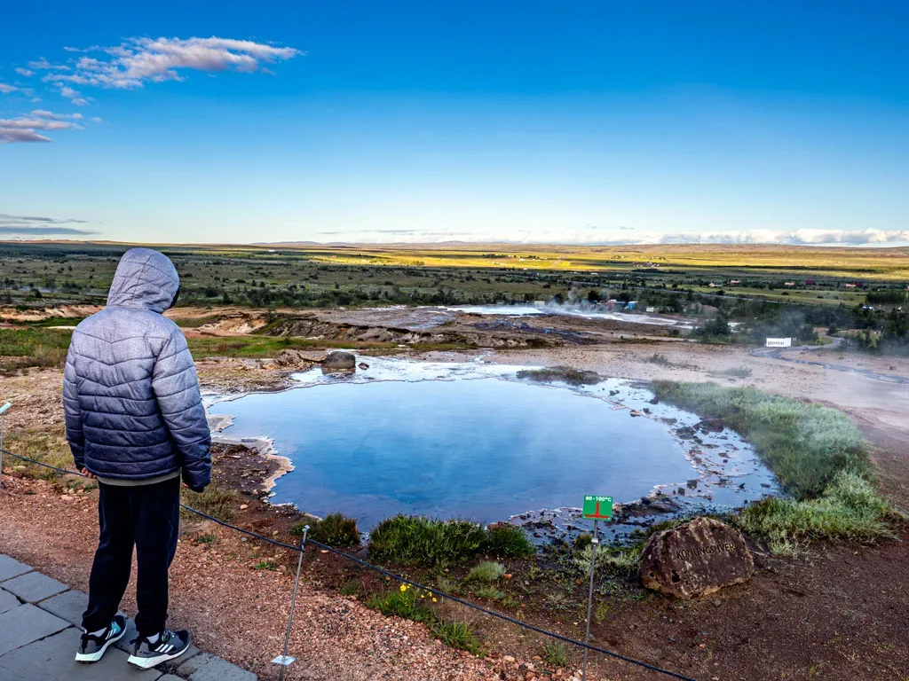

## El vecino más activo de Geysir

## Geysir: La fuente termal que da nombre a todas las demás

Geysir, ubicado en la región geotérmica de Haukadalur, es un géiser en Islandia que ha dado su nombre a todos los demás. Se cree que ha estado activo durante 800 años. Aunque una vez expulsó agua hasta una altura de 80 metros, ha experimentado períodos de baja actividad desde 1916. A veces, los terremotos pueden estimularlo, pero las erupciones son raras.

Strokkur: el vecino más activo de Geysir

Afortunadamente, los visitantes de Geysir no tienen que esperar mucho para presenciar un espectáculo geotérmico. Junto a Geysir se encuentra Strokkur, un géiser que entra en erupción con mucha más frecuencia, generalmente cada 5 a 10 minutos. Las erupciones de Strokkur son impresionantes, lanzando agua hasta 15-30 metros de altura.

[https://www.flickr.com/photos/12672771@N06/albums/72177720320024080](https://www.flickr.com/photos/12672771@N06/albums/72177720320024080)

Arriba puedes ver una secuencia de fotos de la erupción del Strokkur.

Y a continuación, Sami contemplando otra de las múltiples fuentes termales o respiraderos geotérmicos de la zona de Haukadalur, que experimentan fluctuaciones en actividad.

