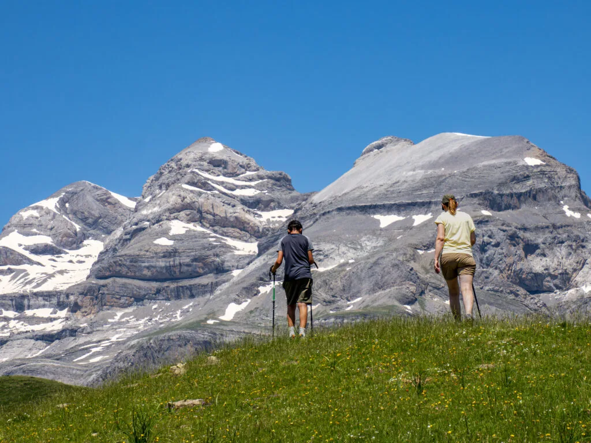
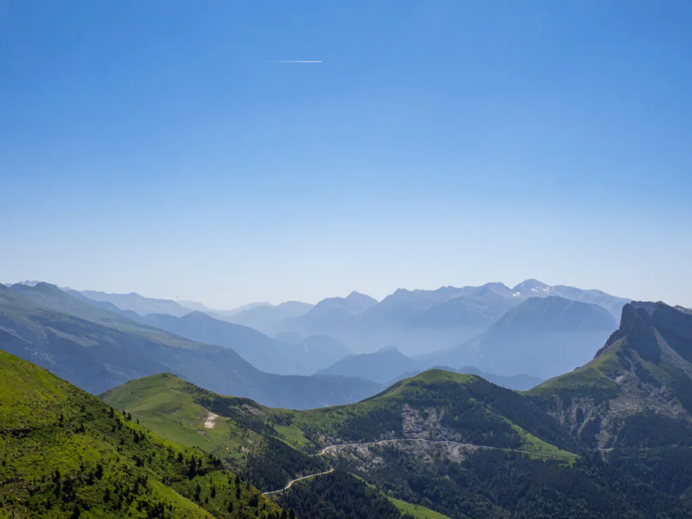
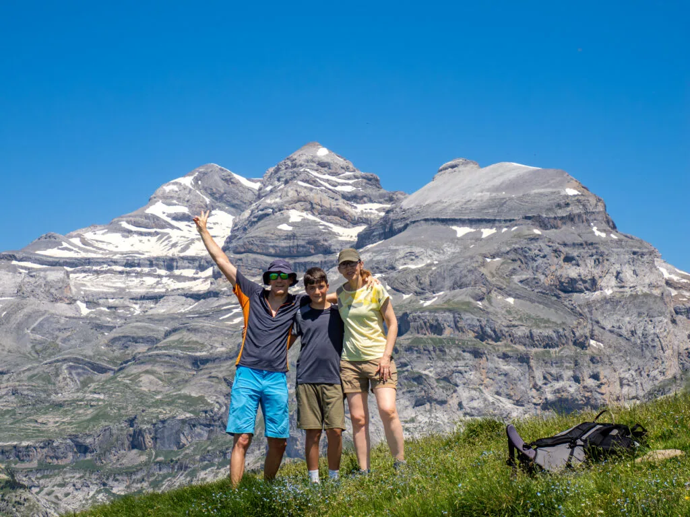

## Disfrutando de unas perspectivas de primer orden sobre el macizo del Monte Perdido...

Hoy proponemos una de esas rutas que, vayas desde donde vayas, siempre caen lejos, a contrapié... Llegar con el coche al punto de partida de esta excursión hoy en día, cuando estamos acostumbrados a la inmediatez y comodidad de las carreteras en otros valles pirenaicos, resulta un auténtico tostón, y quitaría las ganas de repetir si no fuera porque EL PANORAMA DE ESTA RUTA ES APABULLANTE!!!

Por longitud, desnivel acumulado y dificultad técnica es una ruta perfectamente adecuada para entrar en nuestra sección de rutas con niños, [SQLP-kids](https://soloquedalopeor.com/category/sqlp-kids/).

A continuación puedes consultar el track de la ruta propuesta:

<iframe class="alltrails" src="https://www.alltrails.com/widget/map/map-48db715-20?scrollZoom=ó&u=m&sh=w4k06q" width="100%" height="400" frameborder="0" scrolling="no" marginheight="0" marginwidth="0" title="AllTrails: Trail Guides and Maps for Hiking, Camping, and Running"></iframe>

Dejamos el coche en el collado de Plana Canal, justo en el límite del PN de Ordesa, y subimos caminando por prados hacia la Forqueta de Sorripas. A continuación seguimos por el verde cordal al Tozal del Basón y el Tozal de San Vicenda, punto más cercano de la ruta al Monte Perdido. Desde allí sólo nos queda perder altura por los prados hasta la pista de regreso al coche.

> [!todo]+ Pano360º
> Como no podía ser de otra manera, el equipo SQLP arrastró toda la ruta el pesado equipo necesario para poder ofrecerte ahora esta foto esférica con cimas etiquetadas, y que puedas opinar por tí mismo de un lugar único así...
>
> **[Haz click aquí](https://pano360.soloquedalopeor.com/panorama/tozal-de-bason-2-132m/)**
>

*En el tramo inicial de la subida desde el collado de Plana Canal.*

*Primero vemos las Tres Marías, pero enseguida aparecen a su izquierda las Tres Sorores.*

*Las vistas hacia el SE. Se aprecia la larga pista por la que subimos hasta el collado de Plana Canal.*

*La FOTO en la cumbre del Tozal del Basón. Cimas de Monte Perdido, Añisclo y Punta de las Olas al fondo.*

*'Bodegón' con mochila y pluma de buitre en la cima del Tozal de San Vicenda.*

 a la izquierda...](attachments/P6210134-Mejorado-NR-1024x768.webp)

*Regresando por la pista desde el refugio de San Vicenda al cuello de Plana Canal. Características formaciones geológicas del Cañón de Añisclo, con los Sestrales a la izquierda...*

