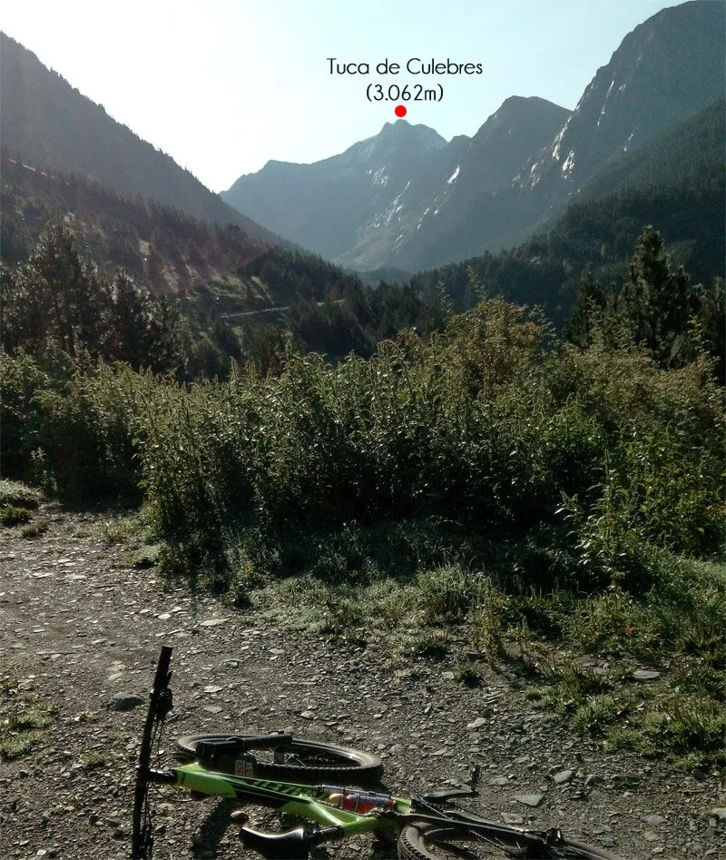
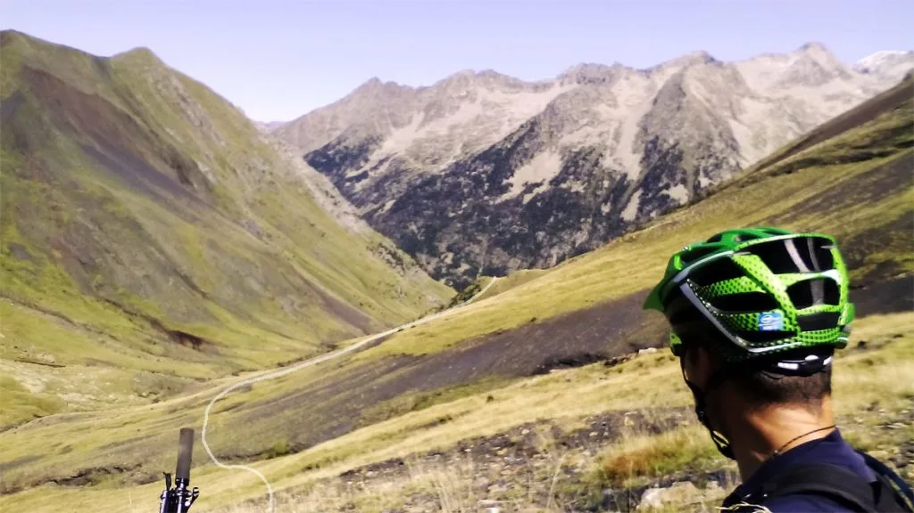
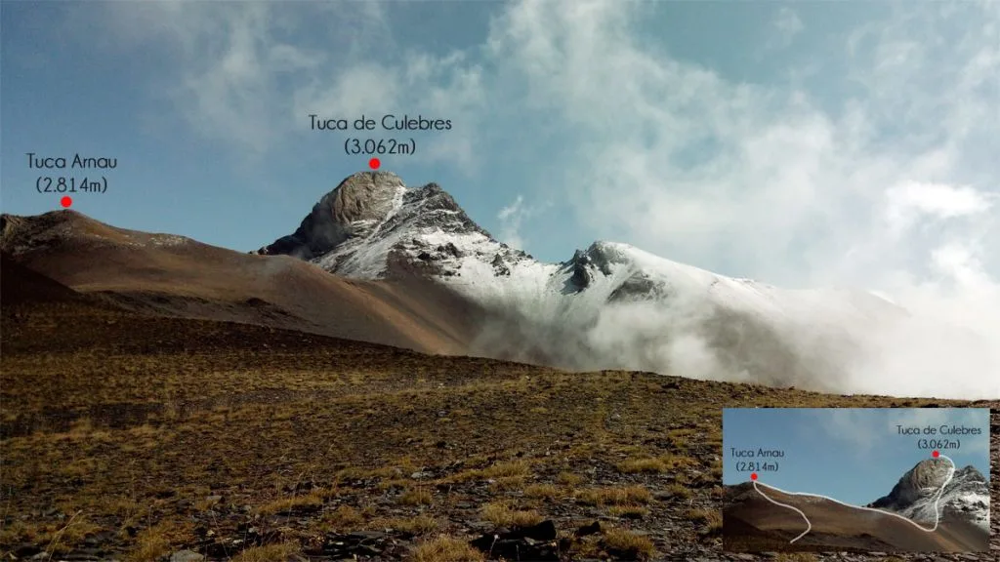
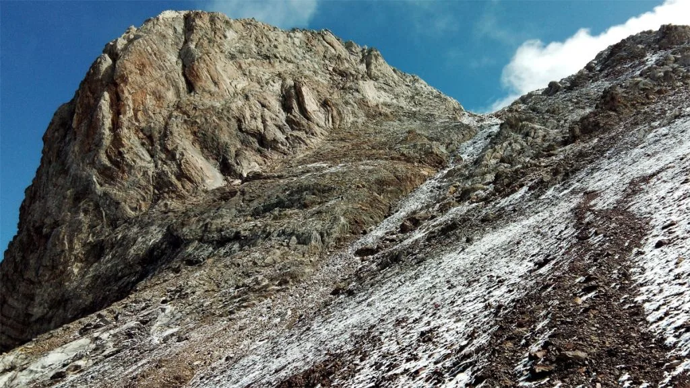
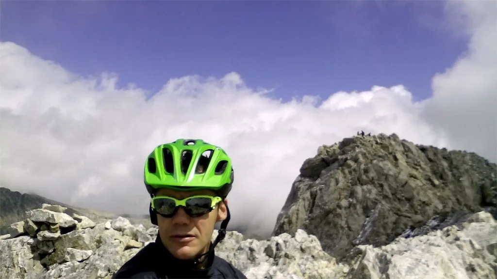
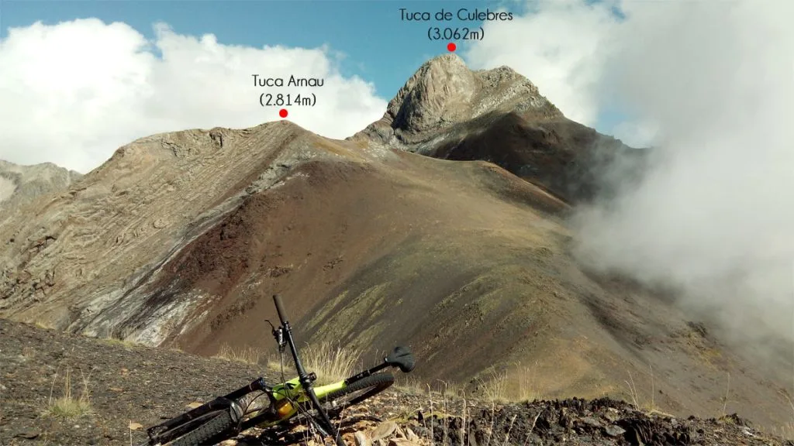
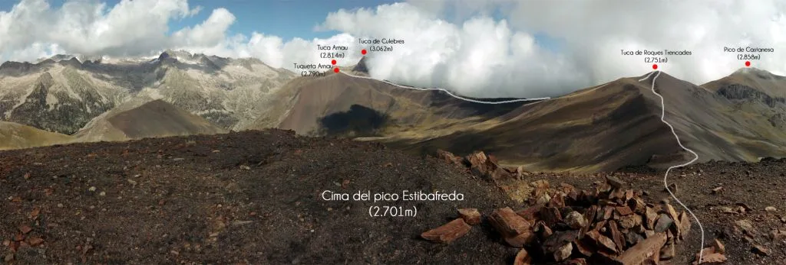
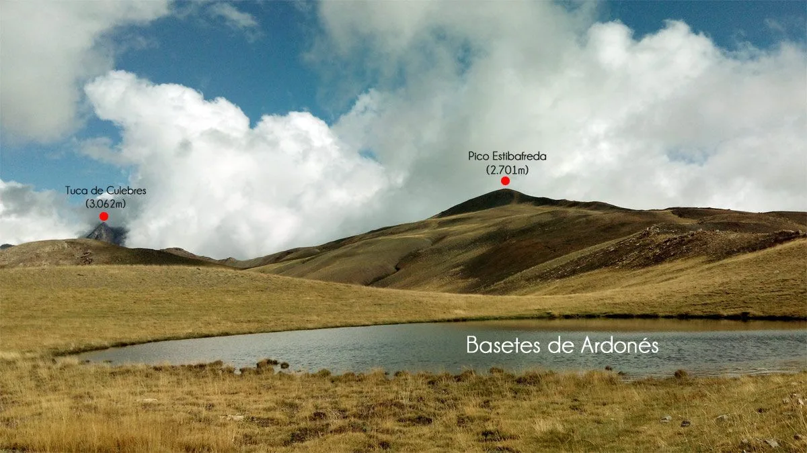

Hace un año realizamos con Morenetti la mí­tica [Integral de Sierra Negra](cicloalpinismo-integral-de-sierra-negra/). Entonces me quedé con ganas de acercarme a los picos Culebres y Vallibierna, dos tresmiles que parecen más cerca de lo que en realidad están€¦

El pasado sábado tuve la oportunidad. Buscaba a algún avezado que le apeteciera venir a la Integral, pero como al final me quedé solo, no tuve más remedio que recuperar aquellas ganas y probar un poco de Duathlpinismo (Duathlon de alpinismo: Bici + trail running de alta montaña). Así­ que a las 8am partí­a de Linsoles con la bici y las zapatillas de monte en la mochila. Esta vez sin gps con track, para desempolvar mi intuición... :-)

Después de 1h 30min de pedaleo, sin prisa pero sin pausa, por fin aparece mi objetivo. Estoy a mitad de la pista que asciende por el valle de Vallibierna. Después de las lluvias de ayer, el monte está impoluto, 'recién fregado', y con la gotita de colonia escurriendo por el cuello. :-)

Como decí­an por ahí­, "No Clouds, No Wind, Summit Days". No hay tiempo que perder, que la ruta es larga. Paro lo justo para sacar 4 fotos con el móvil.

Llegado al final de la pista, empiezo con las torpezas que me retrasan bastante: me tomo mi tiempo para cruzar el rí­o sin mojarme los pies... pero no me sirve de nada porque la hierba alta de la otra orilla está totalmente empapada! Llevaré los pies muy muy frí­os todo el dí­a, primero por el agua de la hierba y más arriba por la nieve.

Una mirada atrás, hacia el macizo de Las Maladetas, a mitad del porteo hacia lo alto de Sierra Negra. El dí­a sigue perfecto. En la parte alta del porteo, otra pequeña torpeza que me retrasa: dejo la subida normal hasta el collado para desviarme a la izquierda, hacia la Tuqueta Arnau, para salir sobre el cordal más cerca del Culebres. La idea era buena, pero el tramo final de ascenso es penoso. Empinado, de mucha piedra suelta, un paso pa'delante y dos pa'trás!

Ya sobre el cordal, la cosa se pone interesante: puedo empezar a imaginar por dónde va el itinerario hasta el Culebres, desconocido para mí­. Pero aquí­ arriba el tiempo está revuelto. Debido al efecto Foehn (?) en la vertiente norte hace sol, pero la sur está completamente oculta por las nubes. Unas nubes que pasan rápidamente por el cordal, haciendo que en un momento disfrute de un dí­a como el de las fotos y en unos segundos esté envuelto en la niebla.  Esto me genera dudas mientras no veo nada, pero cada vez que se despeja continúo un poco más.

Dejo la bici en las inmediaciones de la Tuqueta Arnau, después de portear unos 800m de desnivel+. Desde allí­ habrá un buen bajadón hasta enlazar con la clásica Integral de Sierra Negra. En la foto superior se ve la parte final de la subida a la Tuca de Culebres. Básicamente una subida por una canal de roca descompuesta aliñada con 2 dedos de nieve, culminada con una trepadita final con roca limpia y seca de cara S.

Por fin llego a la cima de la Tuca de Culebres. La idea original era pasar el famoso paso del caballo para 'tachar' también el pico Vallibierna, pero decido no arriesgar. Llámalo prudencia o llámalo miedo, como quieras, pero el flanqueo es cara norte y está lleno de nieve patinosa...

Nos saludamos con la gente de la otra cima, ellos tampoco se animan a cruzar hacia aquí­. Permanezco en la cima más tiempo del esperado. Quiero disfrutar del paisaje, pero hay que ser paciente y mirar deprisa en los huecos de sol: 80% del tiempo niebla, 20% huecos despejados.

Cuando empiezo a tener frí­o en la cima, me pongo en marcha. Cuesta abajo es fácil, pequeño destrepe en la niebla, y luego a correr! Paso por la Tuca Arnau, remonto hasta la Tuqueta Arnau y encuentro la bici donde la dejé, ufff! Todo este tramo lo he hecho sin visibilidad, pero mientras me preparo para la bajada en bici de repente despeja y puedo sacar esta foto (Arriba).

La bajada desde aquí­ es buena, buena, y todaví­a sabe mejor después de correr a pie... Enseguida enlazo con la ruta de la Integral de Sierra Negra, volviendo así­ a pisar terreno conocido.

Arriba puedes ver una panorámica de la Sierra Negra desde la cima del pico Estibafreda, con el itinerario recorrido. Ya que estamos de cimas, pues continúa y voy ascendiendo a todas las cotas hasta llegar a Ardonés...

Voy mirando atrás de vez en cuando, observando lo curioso de la meteo: sol en la cara norte, y temporal en la sur. Y finalmente, ya con ganas de llegar a merendar a casa, espectacular descenso por un resbaloso y pendiente sendero hasta las inmediaciones del camping Ixeia, por PR hasta Benasque y llegada a Linsoles a las 6pm, 10 horas después de la salida.

Para los que quieran más detalles de la Integral de Sierra Negra, pueden ver [un video en la ruta del año pasado](cicloalpinismo-integral-de-sierra-negra/). Y aquí­ puedes [consultar el track](http://www.gpsies.com/map.do?fileId=zsiarvsrkcdlqvab).

Para los 'datófilos', esta ruta:

10h

45km

2.500m desnivel+

