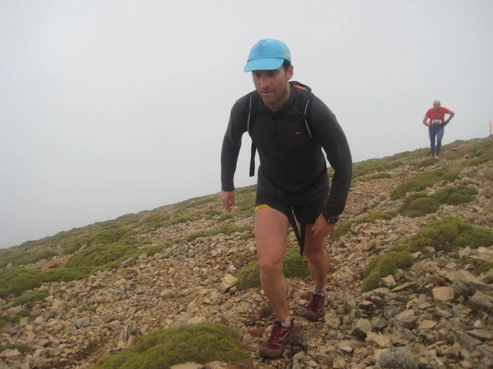

Este último finde los globeros han tenido abundante actividad: 

por un lado, el sábado se disputó la carrera por montaña "Tozal de Guara", con el duelo fraticida entre globeros provocado por la porra propuesta por jR. Rafa y Christian quedaron empatados a 8 votos, y el desempate era el sábado en Nocito... 

Al final, la explosiva salida de Christian (Arriba, en la foto) le sirvió para tomar una ventaja que aguantó para cruzar la linea de meta por delante de Rafa (Abajo).

Carlos Ciria (Abajo) pudo, pero no quiso adelantarlos porque en la porra habí­a quedado por detrás, y no querí­a desencantar a sus aficiones...

Puedes ver muchas fotos y la crónica en el blog '[Corriendo por la sierra](http://monrasin.blogspot.com/2008/10/1-carrera-tozal-de-guara.html)'.

Y el domingo se disputó la carrera de orientación a pie de Caldearenas. Hubo quien no se habí­a cansado lo suficiente en Guara, así­ que repitió en Caldearenas...

