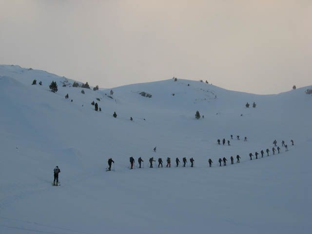

¿Quién dijo que el esquí­ de montaña era un deporte minoritario?

Nada más y nada menos que 35 personas del cursillo provincial organizado por [Peña Guara](http://www.p-guara.com/), foqueamos el domingo desde el refugio de La Renclusa al accesible pico Paderna. El tiempo, aunque empeorando a mediodí­a, se portó relativamente bien, y los cursillistas í­chapó!, majo grupo se ha formado, sí­ señor, a pesar de algún revoltosillo infiltrado por ahí­...
