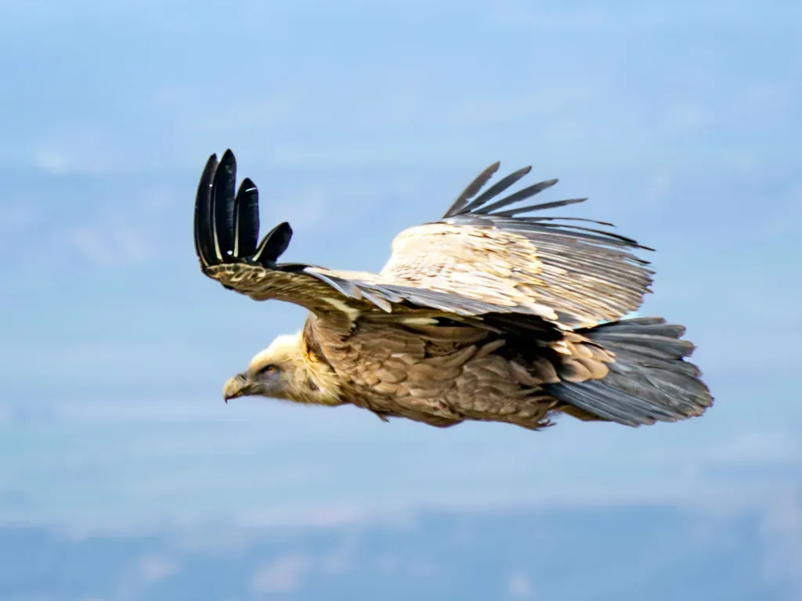
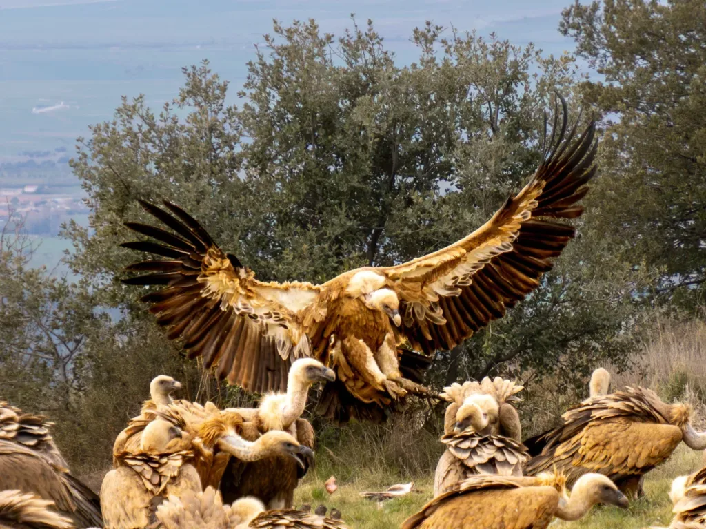
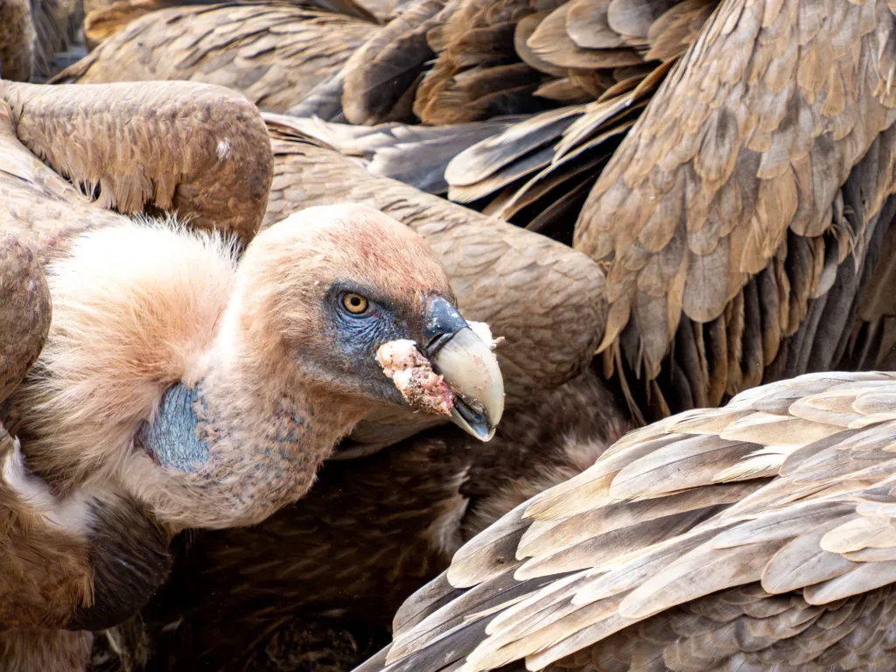
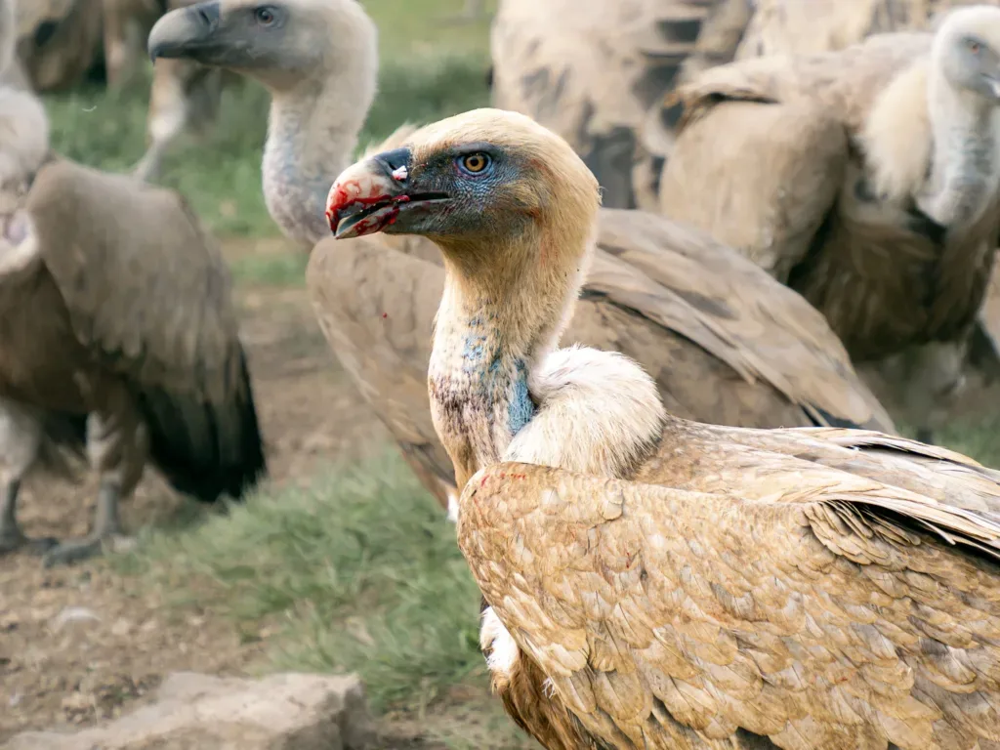
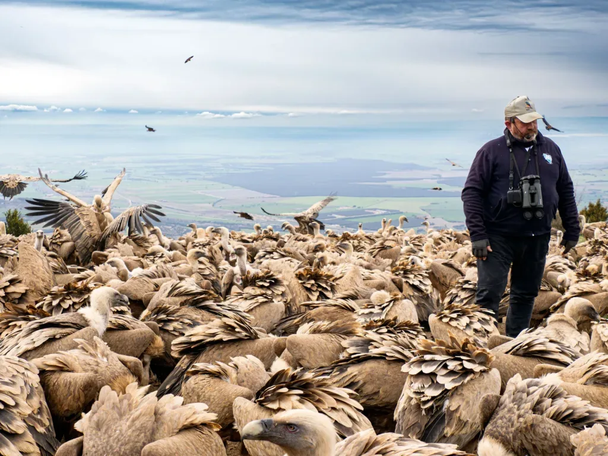
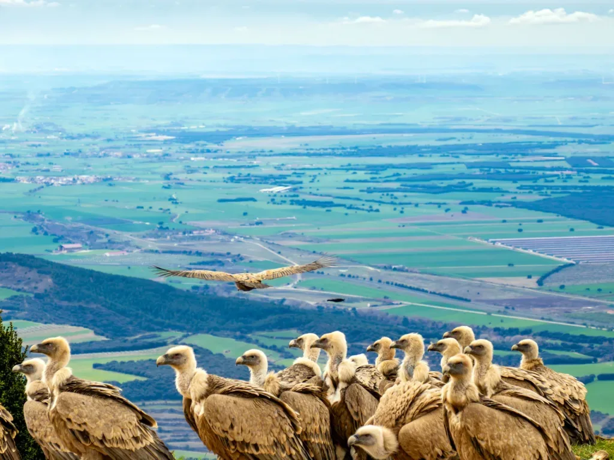
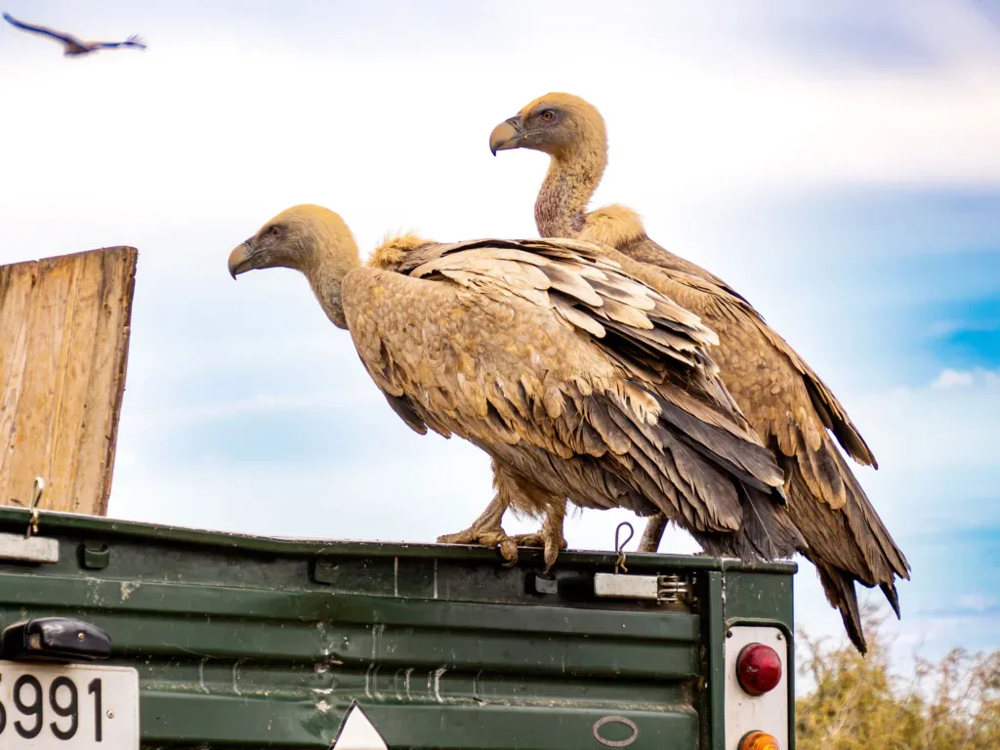
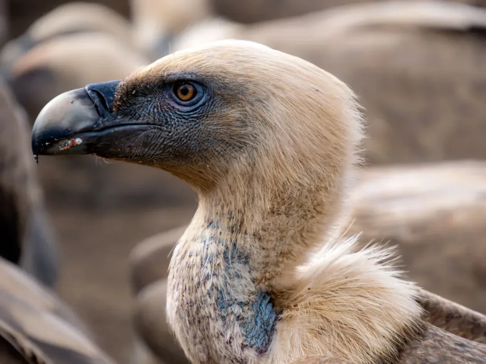

## Conociendo de cerca buitres y otras aves carroñeras

El otro dí­a estuvimos en el muladar del Tiacuto, asistiendo a un aporte de comida para el buitre leonado, el quebrantahuesos, el alimoche, el cuervo y otras aves... Resultó ser una actividad muy recomendable para gente inquieta y niños curiosos (¿Quién no ha querido ser biólogo en su infancia?).

Se trata de una actividad organizada por el [Grupo Ornitológico Oscense](https://avesdehuesca.com/proyectos-goo/comedero-para-aves-carroneras-en-tiacuto-nueno/). Accedimos de paseo desde Santa Eulalia de la Peña, y ya que estamos, para satisfacer esa irracional ansia por subirnos a sitios altos, completamos la jornada con la visita a la cercana cima del Tiacuto. Como en circular siempre mola más, el retorno lo hicimos por otro sendero. Puedes ver el track a continuación:

<iframe class="alltrails" src="https://www.alltrails.com/es/widget/map/18547188952-activity-251d52a?scrollZoom=ó&u=m&sh=w4k06q" width="100%" height="400" frameborder="0" scrolling="no" marginheight="0" marginwidth="0" title="AllTrails: Trail Guides and Maps for Hiking, Camping, and Running"></iframe>

La jornada se podrí­a completar aún más con la visita a los pozos de hielo y el abrigo con pinturas rupestres, pero aquella mañana la meteo era regulera, se puso a nevar y tocó retirada!

AlbertoEpic estaba emocionado, no paraba de sacar fotos... Y claro, entre tantas, alguna sale decente! Te dejamos con unas cuantas del espectáculo...

*Sobrevolando el almuerzo...*

*Bien estudiado el terreno, es hora de tomar tierra!*

*Zampando a dos carrillos...*

*Aunque entre ellos se respetan, las riñas por cada pedazo de carroña son intensas!*

*Un miembro de G.O.O. nos ilustra con curiodidades de estos bichos.*

*Terminado el almuerzo, toca elevar el vuelo: 'dispérsense, aquí­ ya no pintan nada'*

*Algunos no pueden creer que ya no quede comida y marujean el coche donde ha venido el manjar...*

*Mirados de cerca... ¿No le dan un aire a un velociráptor?*

Si eres más moderno que las fotos y prefieres un reel, pues aquí­ lo tienes!

 [Ver esta publicación en Instagram](https://www.instagram.com/reel/DHRPsjmAZ32/?utm_source=ig_embed&utm_campaign=loading)[Una publicación compartida de @albertroid](https://www.instagram.com/reel/DHRPsjmAZ32/?utm_source=ig_embed&utm_campaign=loading)

