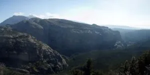
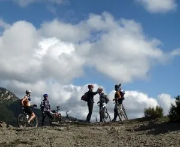
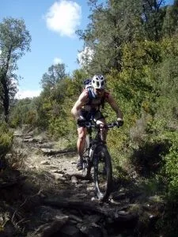
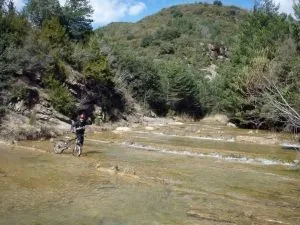
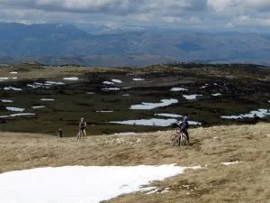
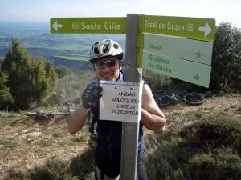

Subimos tranquilamente a Cuello Bail por una pista en buen estado. Las vistas son muy chulas.

Bajada cómoda al Mesón de Sescún con parada para fotear.

Después ruta trialera (p'arriba y p'abajo) hasta el rí­o Guatizalema que cruzamos en cuatro ocasiones para activar la circulación sanguí­nea de las piernas.

En Nocito recuperamos fuerzas y llenamos bidones de agua hiperclorada (como dijo Toño, sabí­a a piscina). El arranque resultó incómodo pero poco a poco nos fuimos entonando. Una gran nube tapó el Sol y en seguida llegamos al refugio de Fenales donde cambiamos el agua para evitar que el agua de Nocito nos arrasara la flora intestinal.

De allí­ al collado de Vallemona nos faltaba una fuerte subida (bastante rato a pie) y la travesí­a por los llanos de Cupierlo, con sus caracterí­sticos hoyos rellenos de nieve.

En el cuello nos abrigamos y nos comemos nuestras últimas viandas (otra vez me llevaré más comida, que hice corto, menos mal que Esme repartió frutos secos).

Bajada por una trialera bastante arreglada, o igual es que la vemos mejor al bajarla con las dobles. Rafita se "despendola" tratando de seguir a un dibujo animado llamado José (cómo baja el tí­o). Al final de la bajada un cartel nos llama la atención, ¿quién lo habrá colgado?

Llegamos a la pista que nos llevará a Vadiello, pero como seguimos con ganas de trialera, tras pasar el barranco Yara cogemos la senda de acceso a la Virgen de Arraro. Así­ nos evitamos subir  100 metros de desnivel por la pista. A cambio, subimos 50 metros empujando la bici, algo muy de "agradecer" tras 9 horas de ruta, jeje. Como a Rafa y a Toñito les pareció poco, aún se acercaron (con sus bicis) hasta la ermita de Arraro (320 metros de longitud, y otros 66 metros de desnivel adicionales). La senda enlaza con la pista que habí­amos dejada a la altura del Molar, pasada la casa dera Fueba. Bajada cómoda hasta la cola del pantano de Calcón y subida a la Tejerí­a, donde Rafa, Jose y yo nos picamos echando el resto (y el bofe).

Reagrupación, nos encontramos a Javier y llegada a Vadiello con el previsible esprint final casi once horas después de la salida.

El GPS indica que hemos recorrido casi 66 kilómetros con un desnivel de 2.200 metros en un tiempo neto de 6h50'.

