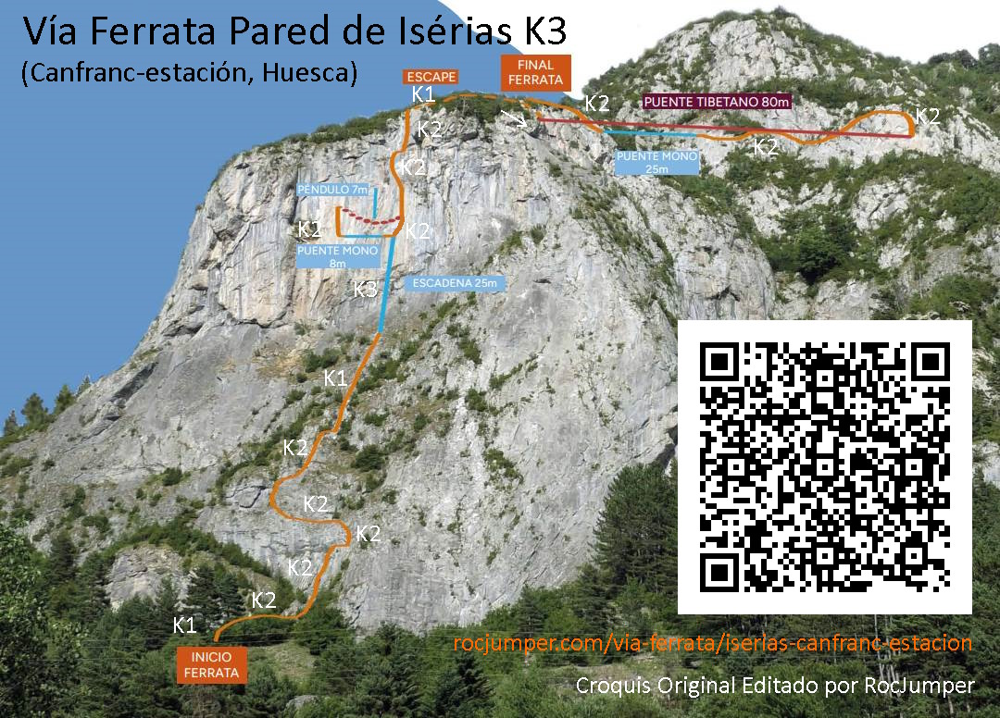
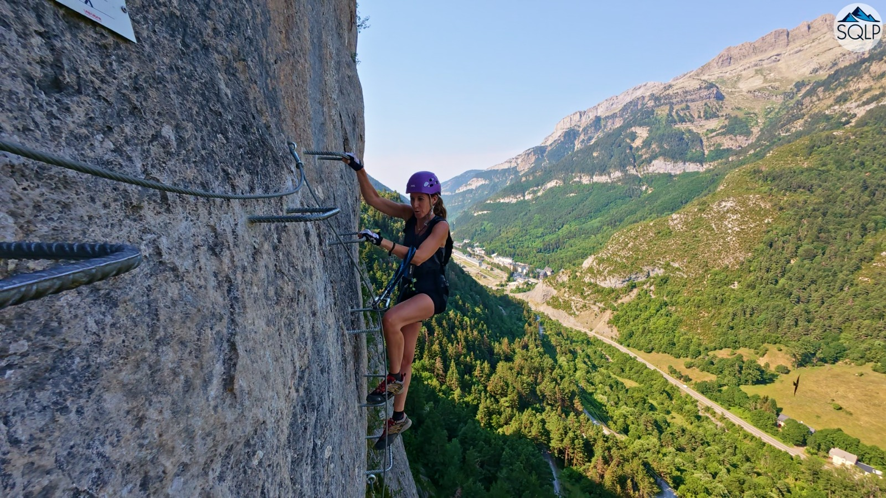
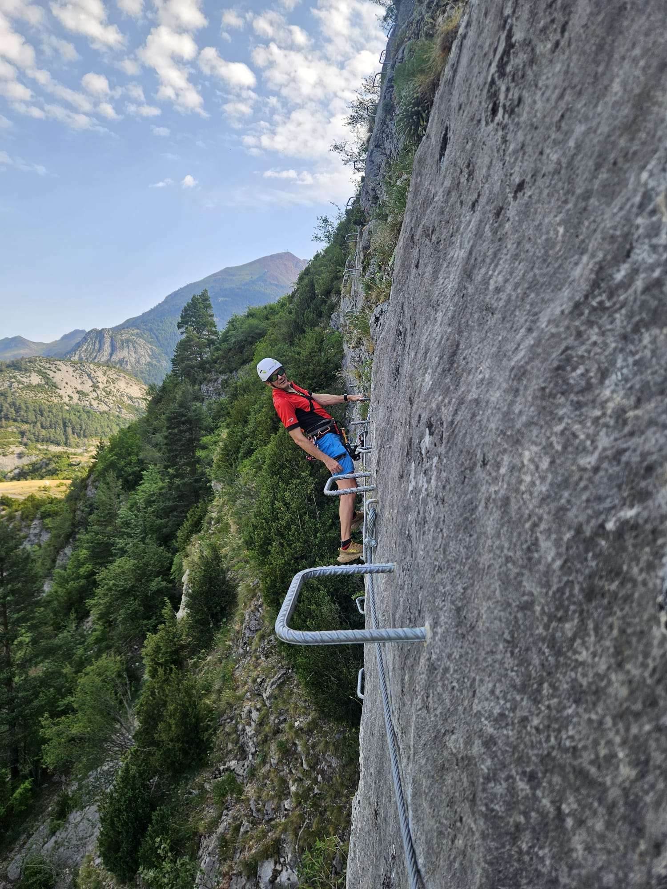
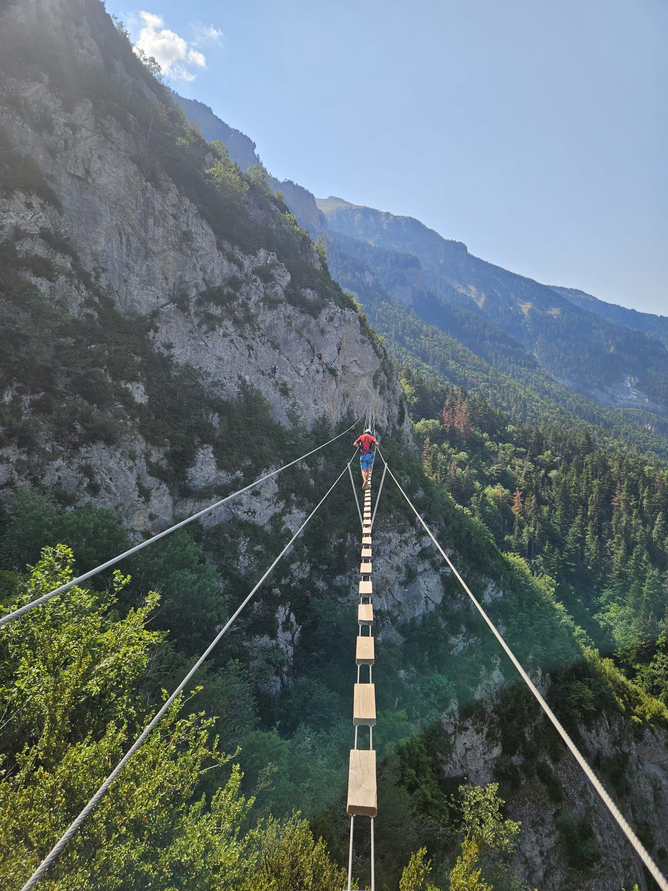

El otro día, los especialistas del equipo SQLP Julie y AlbertoEpic se desplazaron hasta Canfranc (Estación) para conocer la ferrata Pared de Iserías, que había tenido bastante repercusión desde su 'reciente' apertura. Lo hacemos constar así en la bitácora de SQLP.

## El Croquis

A continuación puedes ver el croquis editado por RocJumper:

AlbertoEpic manifestaba al terminar que esperaba algo más de esta ferrata. Como parque de atracciones está muy bien, tienes concentrado en poco terreno escalera, péndulo, puentes,...  pero a él le gustan más las ferratas tipo dolomíticas, que tienen un sentido, son para llegar a algún sitio, recorrer alguna cresta, salvar una pared...
Pero vamos, a gustos, colores! La ferrata en sí es muy variada y entretenida. Han conseguido sacar todo el jugo posible a la pared de de Iserías.

## Las Fotos

## El Vídeo
A continuación, un pequeño videoreportaje de la ferrata, obra de Producciones SQLP:

## El Track
Y por último, en el mapa puedes ver/descargar el track de la actividad.