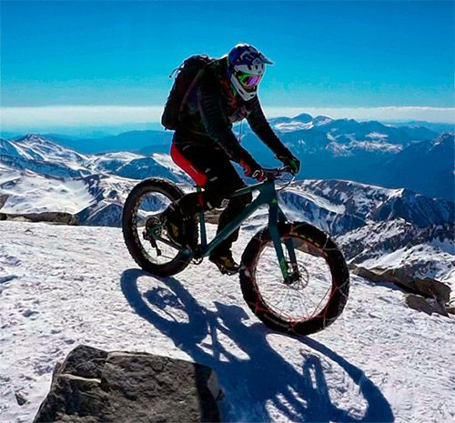
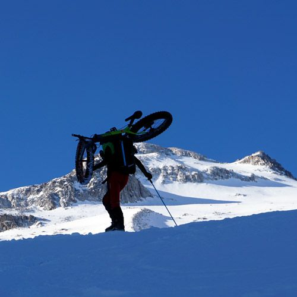
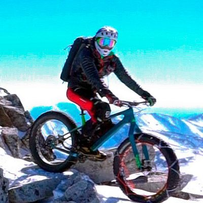
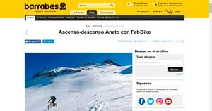
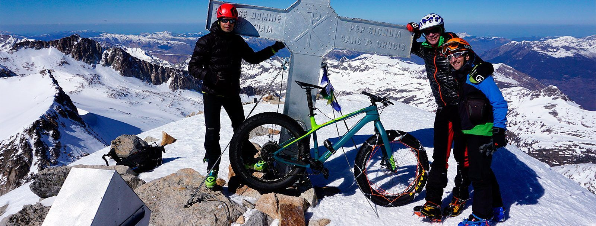
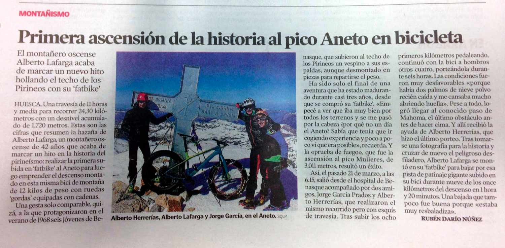
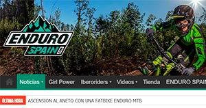
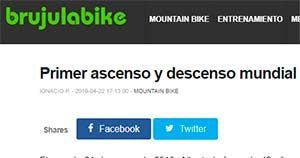

## 1ª ascensión mundial al Aneto en FatBike

"Se trata no tanto de ver lo que aún nadie ha visto, sino de pensar lo que aún nadie ha pensado sobre aquello que todos ven..."

### Nota de prensa

Aquí puedes consultar la crónica objetiva de la aventura. Simplemente horarios y datos.

[Ver nota de prensa](/projects/aneto-en-fatbike/nota-de-prensa/)

### Gestación de la idea

El Aneto en FatBike no ha sido una ocurrencia repentina de AlbertoEpic. Aquí repasamos brevemente la gestación de esta idea en su cabeza...

[Un poco de historia](/projects/aneto-en-fatbike/gestacion-de-la-idea/)

### Crónica de AlbertoEpic

La superheroicidad de AlbertoEpic, relatada por él mismo. Sus sensaciones, las dudas, reflexiones,...

[Así lo cuenta](/projects/aneto-en-fatbike/cronica-de-albertoepic/)

<!-- Valores de desnivel/distancia/horas/minutos pendientes de datos reales; no inventar cifras -->

## Los especialistas

Conoce a continuación a los especialistas que hicieron realidad este proyecto:

  <article class="specialist-card">
    
    <h3>Alberto Herrerías</h3>
    
<strong>El Alpinista:</strong> Alberto es un alpinista confirmado, se mueve por las crestas con la misma seguridad que por el pasillo de su casa. Gracias a él existe la foto de la FatBike en la cima, junto a la cruz. Fue el encargado de cruzar el Paso de Mahoma con la bici a cuestas.

  </article>
  <article class="specialist-card">
    
    <h3>Jorge García</h3>
    
<strong>Un figura:</strong> Igual te organiza la Ultra del Aneto que te sube a limpiar las pintadas de su cruz. Y si te descuidas, ¡entre medio te gana una carrera de orientación!

    
Principal reportero gráfico de la aventura y responsable de la difusión de la misma en tiempo real.

  </article>
  <article class="specialist-card">
    
    <h3>AlbertoEpic</h3>
    
<strong>El Visionario:</strong> Superhéroe de 'todo a cien', es la pieza fundamental de SQLP. Haciendo superheroicidades y excentricidades desde el siglo pasado.

    
El portador del Anillo hasta el monte del destino, ¡no, espera!, el portador de la fatbike hasta el Aneto.

  </article>

---

## El videoreportaje

https://youtu.be/NxAWBog9V-A?si=umRpD3XSZ3jDV9c2

## Los tres segmentos

  

    <iframe src="https://connect.garmin.com/modern/activity/embed/3484602697" title="Aneto en FatBike (1/3) - Pedaleando..." height="515" frameborder="0"></iframe>
  

  

    <iframe src="https://connect.garmin.com/modern/activity/embed/3484604279" title="Aneto en FatBike (2/3) - Porteo de la bici..." height="515" frameborder="0"></iframe>
  

  

    <iframe src="https://connect.garmin.com/modern/activity/embed/3484610050" title="Aneto en FatBike (3/3) - Descenso" height="515" frameborder="0"></iframe>
  

## La excentricidad de AlbertoEpic en la prensa

Esta aventura ha aparecido en cadenas de radio locales, periódicos en versión digital y en papel, y se está extendiendo por toda la red.

### [Ascenso-descenso Aneto en fatbike](https://www.barrabes.com/blog/noticias/2-10561/ascenso_descenso-aneto-fat_bike)

Barrabés, 3 abril 2019

### [Primera ascensión de la historia al Aneto en bicicleta (de ruedas gordas)](https://www.heraldo.es/noticias/aragon/huesca/2019/04/02/primera-ascension-al-aneto-en-bicicleta-de-ruedas-gordas-1306855.html)

Heraldo de Aragón, 2 abril 2019

### Primera ascensión de la historia al Aneto en bicicleta

Heraldo de Aragón, 2 abril 2019, versión en papel.

<iframe width="100%" height="135" scrolling="no" frameborder="no" allow="autoplay" src="https://w.soundcloud.com/player/?url=https%3A//api.soundcloud.com/tracks/601793778&color=%23ff5500&auto_play=false&hide_related=false&show_comments=true&show_user=true&show_reposts=false&show_teaser=true"></iframe>

33:30 - Entrevista Aragón Radio...

### [ASCENSIÓN AL ANETO CON UNA FATBIKE](https://www.endurospain.com/ascension-al-aneto-con-una-fatbike-enduro-mtb/)

Enduro Spain, 2 abril 2019

### [Primer ascenso y descenso mundial del Aneto en FatBike](https://www.brujulabike.com/primer-ascenso-descenso-fatbike-aneto/)

BrújulaBike, 22 abril 2019

### Y el divertido mundo de los 'jeiters' (haters, 'odiadores')

Bien sea como curiosidad, bien para echar unas risas,... desde SQLP os recomendamos que entréis en las noticias de FaceBook de Heraldo/Barrabés y os leáis los comentarios. Uno se queda perplejo: realmente hay tanto desprecio, tanto odio, y semejante nivel de ignorancia en la sociedad actual? Es realmente preocupante...

AlbertoEpic pensaba que lo más emocionante de su aventura había sido el primer descenso mundial desde la antecima en FatBike, pero no! Se está divirtiendo mucho más al leer los comentarios de los 'jeiters', todos esos infelices que habiendo leído sólo el titular, tiempo les falta para criticar algo de lo que no tienen ni idea...

En SQLP creemos que el mundo debería parar y hacer una profunda reflexión sobre esto. ¿Por qué tanto odio? Algo estamos haciendo mal...

<iframe src="https://www.facebook.com/plugins/post.php?href=https%3A%2F%2Fwww.facebook.com%2Fbarrabes%2Fposts%2F10156262838130668&width=450&show_text=true&appId=159104271360936&height=575" width="450" height="575" style="border:none;overflow:hidden" scrolling="no" frameborder="0" allowTransparency="true" allow="encrypted-media"></iframe>

<iframe src="https://www.facebook.com/plugins/post.php?href=https%3A%2F%2Fwww.facebook.com%2Fheraldodearagon%2Fposts%2F3165481493469336&width=450&show_text=true&appId=636391379898349&height=628" width="450" height="628" style="border:none;overflow:hidden" scrolling="no" frameborder="0" allowTransparency="true" allow="encrypted-media"></iframe>

©2019 SQLP
